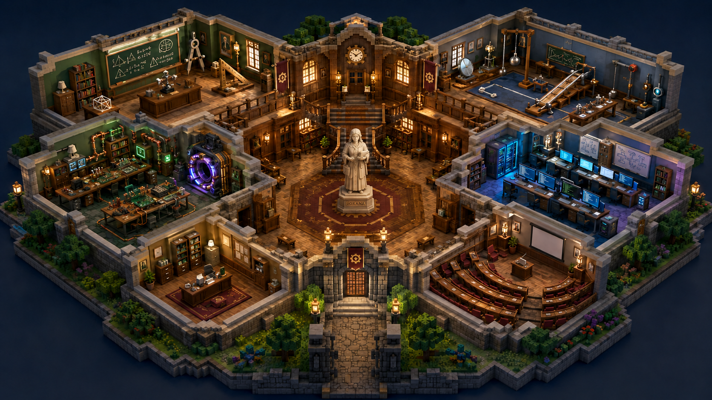

{width=92%}

# Resumen ejecutivo

El objetivo no es fabricar una maqueta 3D genérica ni demostrar que Three.js puede mostrar modelos. El objetivo es que la primera pantalla se sienta como una pieza de dirección de arte terminada: una escuela técnica en forma de diorama axonométrico, rica en detalles, coherente, cálida, legible y capaz de evolucionar con el progreso del usuario.

La conclusión central de esta investigación es directa:

> **La calidad visual asociada a Bruno Simon y a los mejores “3D rooms” no proviene de Three.js por sí solo ni de convertir una imagen completa en 3D con un botón. Proviene de combinar una dirección artística cerrada, cámaras restringidas, modelos preparados para esa cámara, iluminación horneada, texturas cuidadosamente construidas y una capa web optimizada.**

La ruta con mayor probabilidad de alcanzar el resultado es un pipeline híbrido:

1) **GPT Image 2** para fijar la dirección artística y producir referencias limpias, vistas múltiples, hojas de assets, texturas, decals y variantes de estado.

2) **img2threejs** para piezas geométricas, modulares y editables —arquitectura, muebles simples, puertas, barandas, máquinas hard-surface— y como prueba de reconstrucción procedural de una habitación, no como apuesta única para toda la escuela.

3) **Meshy y Tripo**, enfrentados en un pequeño “bake-off”, para generar props protagonistas desde vistas múltiples: portal, robots, instrumentos, trofeos y estatua. Meshy debe ser la primera opción operativa por la claridad de su pipeline, API, remesh y retexture; Tripo debe mantenerse como segunda fuente porque un generador puede resolver mejor que otro un asset concreto.

4) **Blender controlado por MCP o scripts** como taller de ensamblaje, normalización, limpieza, UV, atlas, materiales, horneado de iluminación y exportación. No como una máquina mágica a la que se le pide “haceme toda la escuela igual a esta imagen”.

5) **Three.js / React Three Fiber** para la cámara, interacción, progresión visual, carga por sectores, materiales de estado y optimización web.

6) **glTF/GLB + KTX2/Basis + Meshopt o Draco** como formato y compresión de entrega.

La ruta que **no** se recomienda es:

> imagen completa → un único modelo 3D generado → importar en Three.js → esperar calidad de portfolio.

Ese camino tiende a producir una masa difícil de editar, geometría fusionada, muebles pegados, escalas inconsistentes, superficies inventadas y ninguna separación útil para la evolución de la escuela.

# Parte I — Qué se quiere lograr

Esta parte describe el producto y la experiencia, no su implementación.

## 1. Identidad de la experiencia

La landing es la escuela. No existe una pantalla de marketing previa ni un menú convencional que tape la escena. Al ingresar, el usuario ve inmediatamente una maqueta 3D completa, como una casa de muñecas sofisticada observada desde una diagonal elevada.

La experiencia debe transmitir simultáneamente:

• institución antigua y prestigiosa;

• tecnología y conocimiento;

• calidez artesanal;

• misterio y descubrimiento;

• progreso visible;

• calidad de pieza artística, no de prototipo técnico.

No debe sentirse como:

• un configurador inmobiliario;

• un visor de Sketchfab;

• un mapa de videojuego genérico;

• una colección de modelos creados por diferentes IAs;

• una escena realista con materiales físicamente perfectos pero sin personalidad;

• un “low-poly” vacío usado como excusa para no terminar el arte.

## 2. Composición visual inicial

La escuela ocupa la mayor parte del viewport y queda recortada sobre un fondo azul noche profundo. La cámara observa el conjunto con una perspectiva axonométrica o una perspectiva muy comprimida, cercana a la referencia.

La composición tiene siete zonas visuales principales:

1) Hall central monumental.

2) Aula de Matemática.

3) Aula de Física.

4) Aula de Electrónica.

5) Aula de Programación.

6) Dirección u oficina institucional.

7) Auditorio o aula magna.

El hall funciona como centro emocional. Debe contener la estatua, la escalera, la madera cálida, vitrinas o espacios para recompensas y una arquitectura que conecte las materias.

Cada aula tiene un lenguaje cromático propio, pero todas comparten el mismo idioma formal:

• piedra clara y oscura;

• madera cálida;

• cobre o bronce;

• bordes suavizados;

• proporciones de maqueta;

• detalles técnicos estilizados;

• luces puntuales pequeñas;

• superficies ligeramente gastadas, nunca sucias de forma extrema.

## 3. Estado inicial de la escuela

Al comenzar, Electrónica es el único sector con vida parcial. El resto de las materias está presente —no son espacios vacíos ni placeholders—, pero se encuentra “dormido”.

Las aulas dormidas deben conservar suficiente información visual para despertar curiosidad:

• siluetas de máquinas o instrumentos;

• pizarrones apenas visibles;

• lámparas apagadas;

• colores desaturados;

• ausencia de emisiones y movimiento;

• puertas o portales sin energía.

Electrónica, en cambio, muestra señales de actividad:

• una o dos fuentes de luz;

• el portal visible pero no necesariamente completo;

• bancos de trabajo;

• pizarrón técnico;

• pequeñas emisiones verdes, violetas o cobrizas;

• objetos que anuncian que allí comienza la experiencia.

## 4. Interacción

No hay personaje caminable. La escuela se explora mediante puntero, toque y movimientos de cámara diseñados.

La interacción general debe sentirse así:

• al pasar el puntero por un aula, esa zona responde de forma elegante y mínima;

• al hacer clic, la cámara inicia un acercamiento cinematográfico;

• el resto de la escuela pierde protagonismo sin desaparecer abruptamente;

• el usuario termina en una vista de habitación preparada, no en una cámara libre;

• dentro del aula se pueden seleccionar pocos objetos importantes;

• existe una salida clara para volver al hall.

No se busca libertad total de cámara. La cámara debe proteger el arte. Las posiciones importantes están compuestas como planos cinematográficos.

## 5. Aula de Electrónica

Electrónica es el primer espacio completamente realizado y el patrón para las materias futuras.

Debe contener, como máximo, una docena de elementos visuales importantes:

• portal circular o dispositivo de acceso al mundo;

• pizarrón con contenido que cambia según el progreso;

• dos o tres bancos de trabajo;

• instrumentos de medición;

• placas y componentes;

• tuberías o conducciones de cobre;

• un pequeño robot;

• proyector o artefacto institucional;

• estantería con libros y piezas;

• luces de estado.

La riqueza debe surgir de la composición y de la iluminación, no de saturar el espacio con cientos de objetos.

## 6. Escuela persistente y evolución

La escuela es una representación física del progreso. Los cambios no deben limitarse a un porcentaje o a una insignia en una interfaz.

Al completar un arco de Electrónica, la escuela puede cambiar de varias formas simultáneas:

• aparece una resistencia simbólica en una vitrina;

• se agrega una placa o medalla en el hall;

• se enciende una nueva lámpara;

• cambia el dibujo del pizarrón;

• una sección del portal obtiene energía;

• aparece un robot construido durante el arco;

• se habilita un banco de trabajo;

• la estatua o el piso recibe un reflejo de color relacionado con la materia.

La regla de diseño es:

> Cada logro importante debe tener al menos una consecuencia visible en el aula correspondiente y una consecuencia visible en el hall.

Las evoluciones deben acumularse. El usuario tiene que reconocer la misma escuela y percibir que se está restaurando, llenando y encendiendo.

## 7. Calidad visual objetivo

“Calidad Bruno Simon” no significa copiar una estética concreta. Significa alcanzar estas propiedades:

• silueta memorable;

• cámara y composición intencionales;

• arte consistente de extremo a extremo;

• iluminación que parece render offline aunque corra en tiempo real;

• interacciones suaves;

• carga y rendimiento razonables;

• detalle suficiente al acercarse;

• ausencia de piezas genéricas que rompan el mundo;

• transiciones y microanimaciones que se sienten terminadas;

• un sistema visual preparado para crecer.

# Parte II — Qué enseñan los mejores ejemplos

## 8. Bruno Simon: la lección real

El portfolio de Bruno Simon es una referencia válida por su acabado, su interacción y su disciplina técnica. El repositorio público de su folio 2025 muestra una arquitectura de sistemas extensa y, de manera especialmente relevante, un pipeline explícito de Blender, exportación y compresión. Los modelos se exportan sin comprimir y luego se procesan con glTF Transform y KTX para generar texturas GPU-friendly. [S1]

En publicaciones de Bruno sobre su habitación voxel aparece una fórmula todavía más clara: modelado en MagicaVoxel, iluminación horneada en Blender y ejecución con React Three Fiber. [S3]

La enseñanza no es “usar voxel”. La enseñanza es que el resultado se prepara fuera del navegador y se entrega al navegador de una forma calculada.

### Principios transferibles

• El navegador no debería resolver toda la iluminación compleja en tiempo real.

• Los objetos repetidos y sistemas ambientales deben ser instanciados o agrupados.

• La paleta y los materiales pueden centralizarse.

• La compresión se considera parte del pipeline artístico, no una tarea final opcional.

• La cámara y la interacción se diseñan junto con el mundo.

## 9. Questopia: una habitación abierta y estudiable

Questopia es uno de los ejemplos más útiles porque su repositorio documenta una habitación 3D hecha con React Three Fiber, Blender, shaders y texturas horneadas. Declara explícitamente:

• texturas horneadas para estados de día y noche;

• mezcla de esos estados con un shader;

• mapas de luz para pantallas, lámparas y estantes;

• Draco y Basis;

• cámara limitada;

• eliminación de caras que nunca pueden verse.

El proyecto informa que, al eliminar caras redundantes y ocultas, redujo el modelo de 18 MB a 3 MB. También explica que no usa iluminación dinámica ni ray tracing en la habitación: colores y sombras están precalculados. [S4]

Este patrón es casi ideal para la escuela:

• una textura horneada para el estado dormido;

• otra para el estado activo;

• una máscara para emisiones;

• props separados que aparecen con el progreso;

• mezcla suave entre estados.

## 10. Room portfolios alojados en Vercel

Existen múltiples “3D room portfolios” alojados en Vercel y compartidos en X. Algunos repositorios abiertos muestran una combinación recurrente:

• Blender para los modelos;

• React Three Fiber y Drei;

• postprocesado;

• Leva durante el desarrollo;

• Zustand o estado React;

• GSAP para transiciones;

• objetos clickeables y overlays HTML.

El proyecto AT010303/Room_Portfolio es un ejemplo accesible de esa arquitectura. [S5] My-3D-Room muestra el patrón de una habitación completamente controlada desde Three.js. [S6] Un post de Aadarsh Gupta en X enlaza una habitación en Vercel y destaca el trabajo de texturizado. [S7]

Los clips de X son valiosos como inspiración, pero deben interpretarse correctamente: el hecho de que la experiencia se ejecute con Three.js no implica que la geometría, las UV, las texturas y la luz hayan sido creadas en Three.js.

## 11. img2threejs: por qué sus ejemplos sorprenden

img2threejs no es un “modelo de IA que escupe un GLB”. Es una skill para agentes que reconstruye una referencia mediante código TypeScript, primitivas, shaders procedurales y geometría generada. Produce una jerarquía editable con pivotes, sockets y colliders. Sus demos incluyen objetos hard-surface y un diorama isométrico. [S8] [S9]

El repositorio describe un pipeline con análisis previo, inventario de detalles, especificación estructural, validaciones y revisiones visuales. Eso explica por qué las demos se ven mucho mejor que un intento de “un prompt y listo”: el proceso itera y bloquea resultados insuficientes.

### Qué significa para la escuela

img2threejs es especialmente atractivo para:

• paredes y módulos arquitectónicos;

• puertas y ventanas;

• barandas;

• muebles simples;

• portal hard-surface;

• máquinas geométricas;

• trofeos;

• una habitación recortada como prueba.

No debería ser la única apuesta para la imagen completa porque:

• la referencia contiene cientos de formas pequeñas;

• la cantidad de código procedural puede crecer de forma poco manejable;

• cada detalle debe ser analizado y validado;

• no existe todavía una evidencia pública amplia de producción en escenas tan densas;

• es un proyecto emergente y sus mejores ejemplos son una galería curada.

La recomendación es realizar un ensayo controlado sobre **el aula de Electrónica recortada** y medir calidad, tiempo de iteración, cantidad de código, draw calls y facilidad para separar estados.

# Parte III — Evaluación de herramientas

## 12. GPT Image 2

OpenAI documenta GPT Image 2 como su modelo actual de generación y edición de imágenes, con entradas de texto e imagen, tamaños flexibles y alta fidelidad a referencias. [S16] [S17]

### Usarlo para

• fijar la dirección artística;

• limpiar y simplificar la referencia;

• generar vistas frontal, lateral, trasera y tres cuartos de cada asset;

• crear hojas de diseño consistentes;

• producir variantes dormida/activa de cada aula;

• crear decals, pizarrones, posters, circuitos y pantallas;

• generar texturas base y paletas;

• producir imágenes de evaluación para comparar el render 3D.

### No usarlo como

• conversor 3D;

• generador directo de mallas;

• fuente de medidas físicas confiables;

• generador independiente de vistas sin mecanismos de consistencia.

### Veredicto

**Es la mejor herramienta para controlar la identidad visual antes de fabricar los modelos.** Su función es reducir la ambigüedad para las herramientas 3D.

## 13. Meshy

Meshy ofrece text-to-3D, image-to-3D, multi-image-to-3D, remesh, retexture, UV y APIs. Su propia guía recomienda image-to-3D cuando existe una referencia clara y multi-view cuando se busca máxima fidelidad y mejor reconstrucción del reverso. [S10] [S11] [S12]

### Usarlo para

• portal;

• robot;

• proyector;

• instrumentos;

• trofeos;

• estatua, con múltiples vistas y revisión;

• componentes decorativos que no conviene programar a mano;

• retexturizar un modelo base para mantener el estilo;

• obtener rápidamente variantes y seleccionar la mejor.

### Riesgos

• topología más densa de lo necesario;

• detalles “derretidos” en piezas pequeñas;

• materiales y paletas inconsistentes entre generaciones;

• pivotes y escala arbitrarios;

• superficie trasera inventada en single-image;

• necesidad de limpiar y consolidar materiales.

### Veredicto

**Primera opción para props generados**, siempre desde hojas multi-vista cuando el objeto sea importante y siempre pasando por normalización y horneado.

## 14. Tripo

La documentación actual de Tripo ofrece texto, imagen y multiview, y una versión orientada a generación low-poly. [S13]

### Usarlo para

• competir contra Meshy con la misma hoja multi-vista;

• objetos donde Meshy no resuelva bien la silueta;

• variantes low-poly;

• generación rápida de prototipos.

### Veredicto

**Segunda fuente de generación, no reemplazo absoluto.** En IA 3D el ganador puede variar por tipo de asset. La decisión debe tomarse por asset, no por marca.

## 15. Blender con MCP

BlenderMCP conecta un agente con Blender y permite crear, modificar y eliminar objetos, controlar materiales, inspeccionar la escena, obtener capturas y ejecutar Python. También integra fuentes como Poly Haven y generadores 3D. [S14]

### Usarlo para

• importar GLB generados;

• medir y normalizar escala;

• centrar pivotes;

• separar piezas;

• renombrar objetos;

• aplicar materiales comunes;

• hacer UV y atlas;

• eliminar caras ocultas;

• crear LODs;

• montar una habitación;

• crear cámaras y luces de bake;

• hornear AO, sombras y luz;

• exportar GLB y validar resultados.

### No usarlo para

• esperar que un agente interprete una escena densa y la modele completa con calidad final sin supervisión;

• ejecutar instrucciones de fuentes no confiables;

• operar en un equipo con secretos sensibles o permisos innecesarios.

El repositorio expone ejecución de Python arbitrario dentro de Blender, y existen reportes públicos de seguridad asociados a esa capacidad. [S15] Debe ejecutarse de forma local, aislada, con el repositorio bajo control y sin credenciales sensibles disponibles al proceso.

### Veredicto

**Es el orquestador y taller de acabado. No es el artista principal.** Su mayor valor es automatizar tareas repetibles y verificables.

## 16. img2threejs

### Usarlo para

• reconstrucciones hard-surface;

• piezas con geometría legible;

• arquitectura modular;

• elementos que necesitan animación o cambio de materiales desde código;

• prototypes que deban seguir siendo editables por Codex.

### No usarlo para

• libros, plantas, cables y clutter de toda la escuela uno por uno;

• una escena completa sin una prueba previa;

• superficies orgánicas complejas como única ruta.

### Veredicto

**Herramienta estratégica y prometedora para el kit modular y el aula piloto.** Debe evaluarse con métricas concretas, no por el entusiasmo de las demos.

## 17. Tabla de decisión

**Paredes, pisos, columnas y barandas.** Ruta principal: img2threejs o Blender procedural. Alternativa: geometría R3F. Motivo: formas deterministas y editables.

**Puertas, ventanas y molduras.** Ruta principal: img2threejs. Alternativa: Blender MCP. Motivo: hard-surface repetible.

**Mesas, bibliotecas y bancos.** Ruta principal: img2threejs o un asset base retexturizado. Alternativa: Meshy/Tripo. Motivo: repetición y coherencia.

**Portal.** Ruta principal: GPT Image multivista → Meshy/Tripo → Blender. Alternativa: img2threejs. Motivo: hero prop con silueta y emisiones.

**Robot.** Ruta principal: GPT Image multivista → Meshy/Tripo → Blender. Alternativa: asset licenciado retexturizado. Motivo: formas complejas y carácter mecánico.

**Estatua.** Ruta principal: modelo base o Meshy/Tripo multivista → Blender. Alternativa: asset de escultura retexturizado. Motivo: riesgo alto en anatomía.

**Instrumentos científicos.** Ruta principal: Meshy/Tripo o asset base. Alternativa: img2threejs. Motivo: variedad de siluetas.

**Libros, papeles y cuadros.** Ruta principal: geometría mínima + texturas/decals. Alternativa: instancing. Motivo: no justifican generación individual.

**Pizarrones, pantallas y circuitos.** Ruta principal: planos y texturas GPT Image. Alternativa: decals procedurales. Motivo: el detalle es esencialmente 2D.

**Iluminación final.** Ruta principal: bake en Blender. Alternativa: lightmaps + shader. Motivo: calidad offline con costo bajo.

**Evolución por progreso.** Ruta principal: props separados + máscaras/texturas de estado. Alternativa: variantes de material. Motivo: debe poder activarse sin rehacer la escena.

# Parte IV — Pipeline recomendado

## 18. Principio de producción

La escuela debe construirse como una ilusión controlada para una cámara limitada. No se paga el costo de modelar lo que el usuario nunca podrá ver.

La estrategia es de dos niveles:

### Nivel A — Vista general

• silueta completa de la escuela;

• hall y aulas legibles;

• detalle suficiente para una captura 1920×1080;

• texturas horneadas;

• props simplificados;

• estados dormido/activo;

• interacciones de selección;

• cámara protegida.

### Nivel B — Vista de aula

• escena o subescena más detallada;

• modelos protagonistas con mejor textura;

• interacción puntual;

• portal y pizarrón;

• cámara más cercana pero igualmente restringida;

• carga diferida.

La transición puede simular un acercamiento continuo aunque se cambie de escena o nivel de detalle durante el movimiento.

## 19. Etapa 0 — Bloqueo de dirección artística

Antes de generar modelos, se produce un “art pack” cerrado:

• imagen maestra aprobada;

• plano simplificado de la escuela;

• recortes de cada habitación;

• paleta global;

• paleta por materia;

• tabla de materiales;

• hoja de arquitectura;

• hoja de muebles institucionales;

• hoja de props de Electrónica;

• estados locked, stage-1, stage-2 y complete;

• vistas múltiples de cada hero prop.

La salida no se considera válida si las hojas cambian de estilo entre sí.

## 20. Etapa 1 — Prueba comparativa obligatoria

Antes de construir toda la escuela se fabrica el mismo conjunto mínimo con distintos métodos:

• una pared con moldura;

• una biblioteca;

• un banco de trabajo;

• el portal;

• un pequeño robot;

• una lámpara;

• el recorte del aula de Electrónica.

Se comparan:

• img2threejs;

• Meshy;

• Tripo;

• Blender MCP procedural;

• un asset existente retexturizado, cuando corresponda.

La evaluación utiliza una rúbrica de 1 a 5:

• fidelidad de silueta;

• coherencia con la paleta;

• limpieza de geometría;

• facilidad de edición;

• cantidad de materiales;

• peso final;

• calidad al acercarse;

• tiempo hasta integración web;

• posibilidad de animación;

• consistencia con otros assets.

El resultado de esta prueba define la ruta por categoría.

## 21. Etapa 2 — Kit institucional

Se crea un kit pequeño reutilizable:

• muro interior;

• muro exterior;

• esquina;

• columna;

• cornisa;

• zócalo;

• baranda;

• escalera;

• ventana;

• puerta;

• arco;

• piso de madera;

• piso de piedra;

• biblioteca;

• mesa;

• silla;

• lámpara;

• cuadro;

• maceta;

• vitrina.

La escuela debe parecer rica por repetición, variación de escala, rotación, decals y luz. No por tener un modelo único para cada objeto.

## 22. Etapa 3 — Generación de hero props

Cada hero prop se procesa de forma independiente:

1) Imagen conceptual aislada.

2) Hoja de vistas coherentes.

3) Generación Meshy y Tripo con los mismos inputs.

4) Selección del mejor volumen.

5) Remesh o retopología automática razonable.

6) Separación de partes móviles o emisivas.

7) Materiales ajustados a la paleta.

8) UV y bake.

9) LOD si corresponde.

10) Exportación y validación web.

## 23. Etapa 4 — Texturas y materiales

Para esta estética, el mayor retorno visual proviene de una combinación de:

• **baked color/light atlas** para arquitectura y muebles;

• **emissive masks** para luces, pantallas y portales;

• **decals** para pizarrones, circuitos, números y desgaste;

• **PBR simplificado** para hero props cercanos;

• **palette/trim sheets** compartidos;

• **texturas tileables** para piedra, madera y pisos.

No se recomienda usar materiales físicos complejos en todos los objetos. Una habitación horneada puede utilizar un material básico con su textura final y verse mejor que una habitación con veinte luces dinámicas.

Blender permite hornear color, AO, sombras, normal maps y lightmaps para exportación a motores. [S24] Su exportador glTF admite materiales, texturas, cámaras, luces, animaciones y mapas de oclusión/normal/emisión. [S25]

## 24. Etapa 5 — Iluminación de estados

La evolución visual no debe obligar a hornear una textura por cada combinación posible.

Se propone una composición por capas:

• `baked_base`: arquitectura y luz ambiental estable;

• `baked_locked`: variante oscura/desaturada opcional;

• `baked_active`: variante cálida/activa opcional;

• `light_mask`: canales para lámparas, pantallas, portal y vitrinas;

• `progress_props`: modelos separados;

• `decals_by_stage`: pizarrones y placas;

• `particles_by_stage`: energía o polvo;

• `emissive_strength_by_stage`: intensidad programable.

El shader puede mezclar dos estados horneados y colorear máscaras, como demuestra Questopia con día/noche y lightmaps. [S4]

## 25. Etapa 6 — Montaje y bake en Blender

Blender contiene la escena maestra de arte, aunque el desarrollador no modele manualmente. El agente y los scripts deben:

• importar todas las piezas;

• ubicar según un archivo de layout;

• verificar colisiones y flotación;

• unificar escala métrica;

• limitar la cantidad de materiales;

• eliminar caras ocultas;

• generar atlas por habitación;

• crear UV2 si hace falta;

• configurar cámaras de control;

• hornear iluminación;

• exportar por chunks;

• producir capturas de revisión.

Las capturas deben compararse automáticamente con la referencia y con renders objetivo de cada habitación.

## 26. Etapa 7 — Entrega a Three.js

El formato recomendado es GLB/glTF. glTF está diseñado para entregar escenas y modelos de manera compacta y eficiente en tiempo de ejecución. [S26]

Three.js carga glTF y soporta extensiones de compresión Draco, Meshopt, KTX2/Basis, instancing y formatos de textura modernos. [S18]

El pipeline de entrega debe:

• comprimir geometría;

• convertir texturas a KTX2;

• conservar originales no comprimidos;

• generar tamaños desktop y mobile;

• dividir escuela base y aulas detalladas;

• precargar la vista inicial;

• cargar Electrónica durante el acercamiento;

• liberar recursos cuando corresponda.

Bruno Simon publica un proceso similar: exporta desde Blender y luego comprime GLB y texturas con glTF Transform/KTX. [S1] glTF Transform ofrece comandos para optimización, Meshopt y compresión de texturas. [S23]

# Parte V — Arquitectura de experiencia y progresión

## 27. Estructura conceptual de escena

```text
SchoolExperience
├── OverviewSchool
│   ├── ArchitectureBase
│   ├── Hall
│   ├── MathematicsRoom_LOD0
│   ├── PhysicsRoom_LOD0
│   ├── ElectronicsRoom_LOD0
│   ├── ProgrammingRoom_LOD0
│   ├── Office_LOD0
│   └── Auditorium_LOD0
├── DetailedRooms
│   └── ElectronicsRoom_LOD1
├── ProgressLayers
│   ├── HallRewards
│   ├── RoomDecals
│   ├── RoomProps
│   └── EmissiveStates
├── CameraRig
├── InteractionLayer
└── HTMLOverlay
```

## 28. Modelo de progreso visual

El progreso debe ser declarativo. La escena no pregunta cómo se completó una unidad; recibe un estado y determina qué capas están activas.

Ejemplo conceptual:

```json
{
  "electronics": {
    "unlocked": true,
    "completedArcs": 1,
    "completedUnits": ["resistance-basics"],
    "rewards": ["resistor-relic"]
  },
  "mathematics": { "unlocked": false },
  "physics": { "unlocked": false },
  "programming": { "unlocked": false }
}
```

Cada hito activa efectos definidos en datos:

```json
{
  "trigger": "electronics.arc.1.completed",
  "effects": [
    "hall.show.resistor_relic",
    "hall.light.trophy_case_01",
    "electronics.portal.ring_01_on",
    "electronics.blackboard.decal_arc_01",
    "electronics.show.basic_robot",
    "electronics.light.workbench_02"
  ]
}
```

## 29. Cámaras

La experiencia debe tener planos diseñados:

• overview principal;

• hover/focus ligero de cada aula;

• entrada a Electrónica;

• vista del portal;

• vista del pizarrón;

• vista de la vitrina del hall;

• retorno a overview.

Las cámaras pueden interpolarse con CameraControls y encuadrar objetos mediante bounds. Drei expone CameraControls y Bounds; React Three Fiber ofrece eventos de puntero sobre objetos 3D. [S20] [S21]

La libertad del usuario debe limitarse a pequeñas variaciones de órbita o parallax, no a romper el encuadre.

## 30. Rendimiento objetivo

Estos números son presupuestos de diseño, no leyes universales:

### Vista general

• 30 FPS mínimos en móvil medio; 60 FPS objetivo en desktop.

• Menos de 150 draw calls después de instancing y consolidación.

• Menos de 300–500 mil triángulos visibles en desktop.

• Versión mobile con menor DPR, LOD y texturas reducidas.

• Escuela base comprimida idealmente dentro de 10–20 MB; máximo inicial tolerable cercano a 25 MB si existe una carga visual cuidada.

• Texturas KTX2 y atlas limitados.

### Aula detallada

• Carga diferida de 5–10 MB como presupuesto inicial.

• Hero props con LOD o versión simplificada en overview.

• Postprocesado reducido en móvil.

• Sombras dinámicas solo para elementos que realmente lo necesitan.

React Three Fiber permite renderizado bajo demanda cuando la escena está quieta, evitando un loop constante innecesario. [S19] Three.js ofrece InstancedMesh para reducir draw calls en objetos repetidos. KTX2 permite texturas comprimidas en GPU. [S22]

## 31. Gates de calidad

Una entrega no se aprueba solo porque “funciona”. Debe superar gates visuales y técnicos.

### Gate de composición

• La escuela reproduce la silueta y jerarquía de la referencia.

• El hall se entiende como centro.

• Las aulas se diferencian sin parecer de universos distintos.

• Ningún objeto protagonista tapa el recorrido de cámara.

### Gate de coherencia

• Escala consistente.

• Bordes y bevels compatibles.

• Paleta controlada.

• Máximo razonable de familias de materiales.

• Texel density comparable.

• Cobre, madera y piedra se ven iguales en todas las habitaciones.

### Gate de geometría

• Nada flota.

• No hay intersecciones visibles.

• No hay caras negras o normales invertidas.

• Pivotes correctos.

• Nombres y jerarquía predecibles.

• Las piezas de progreso son separables.

### Gate de textura

• No hay texto inventado ilegible en superficies importantes.

• No hay costuras visibles desde cámaras válidas.

• No hay texturas borrosas al máximo zoom permitido.

• Las emisiones tienen máscaras limpias.

### Gate de web

• Carga con fallback y progreso.

• Interacción por mouse y touch.

• Navegación con teclado para las acciones principales.

• Respeta `prefers-reduced-motion`.

• No bloquea toda la página si WebGL falla.

• Libera texturas y escenas descargadas.

# Parte VI — Riesgos y decisiones difíciles

## 32. El mito de “imagen a escena 3D completa”

Las herramientas actuales son muy buenas generando objetos individuales y cada vez mejores con multiview. Pero una escuela completa exige simultáneamente:

• layout arquitectónico;

• separación semántica de habitaciones;

• cientos de props;

• oclusión correcta;

• escalas compatibles;

• superficies traseras;

• jerarquía editable;

• estados de progresión;

• iluminación consistente.

Una sola generación difícilmente entregue todo eso de manera utilizable. El problema no es solo la fidelidad visual: es la editabilidad posterior.

## 33. El riesgo de sobreusar modelos generados

Generar cada silla, libro y lámpara de manera independiente puede producir una escena rica en objetos pero pobre en dirección artística.

La escuela necesita menos familias de assets, más reutilización y más consistencia.

## 34. El riesgo de Blender MCP

El MCP puede automatizar mucho, pero también puede producir una falsa sensación de autonomía. Las mejores tareas para un agente son las verificables:

• “todos los objetos deben tocar el piso”;

• “ninguna textura supera 2048 px”;

• “aplicar este material a esta colección”;

• “eliminar caras orientadas hacia una pared cerrada”;

• “exportar estas colecciones con estos nombres”.

Las peores son ambiguas:

• “hacelo más lindo”;

• “modelá toda la escuela igual a la imagen”;

• “agregá muchos detalles interesantes”.

## 35. El riesgo de perseguir el clip de X

Un clip puede ocultar:

• tiempos de carga;

• rendimiento móvil;

• ángulos rotos;

• assets con licencia incierta;

• semanas de iteración;

• trabajo manual no mencionado;

• una cámara preparada para un único video.

La referencia debe servir para definir un estándar, no para asumir que existe una herramienta secreta que elimina el trabajo de dirección técnica.

# Parte VII — Plan de ejecución

## 36. Prueba de concepto correcta

La primera entrega debe contener:

• 30–40 % de la silueta total de la escuela;

• hall central;

• aula de Electrónica;

• una segunda aula dormida;

• cámara overview;

• zoom a Electrónica;

• portal seleccionable;

• botón o flag para simular Arco 1 completado;

• aparición de una resistencia en el hall;

• cambio de luz, pizarrón y portal;

• build desplegado en Vercel;

• medición de peso, draw calls y FPS;

• capturas desktop y mobile.

Esta prueba valida el sistema completo sin esperar a que las otras materias estén terminadas.

## 37. Hitos

### Hito A — Art lock

• referencia maestra;

• paleta;

• layout;

• sheets de Electrónica;

• estados de progreso;

• cámara aprobada.

### Hito B — Asset bake-off

• portal, robot, pared, banco y biblioteca producidos con rutas distintas;

• informe comparativo;

• pipeline elegido por categoría.

### Hito C — Vertical slice

• hall + Electrónica;

• bake;

• GLB optimizado;

• interacción;

• progresión.

### Hito D — Escuela base

• resto de habitaciones en LOD0 dormido;

• dirección y auditorio;

• responsive.

### Hito E — Producción continua

• agregar nuevos mundos como paquetes independientes;

• sumar props y estados al hall;

• mantener presupuestos de rendimiento.

# Parte VIII — Prompt maestro para Codex

El siguiente prompt está pensado para colocarse en la raíz del repositorio como `CODEX_SCHOOL_MISSION.md` y ejecutarse con la imagen disponible en `docs/references/school-reference.png`.

```text
Actuá como director técnico de arte, artista técnico 3D senior y creative developer especializado en Three.js, React Three Fiber, Blender, glTF y pipelines de assets asistidos por IA.

CONTEXTO DEL ENCARGO

Debés construir una experiencia web cuyo primer viewport sea una escuela técnica 3D completa en forma de diorama axonométrico/casa de muñecas. La referencia visual obligatoria está en:

    docs/references/school-reference.png

La referencia define la ambición de calidad, composición, densidad, paleta, iluminación y coherencia. No debe copiarse de forma literal objeto por objeto, pero el resultado tiene que pertenecer al mismo nivel de acabado visual.

La experiencia no tiene un jugador caminable. El usuario selecciona aulas con mouse o touch. Al seleccionar Electrónica, la cámara hace un acercamiento cinematográfico y habilita interacciones con el portal, pizarrón, mesas, instrumentos, robot y proyector.

La escuela es un hub persistente que evoluciona según el progreso. Al comenzar, solo Electrónica tiene actividad parcial. Matemática, Física y Programación existen pero están dormidas: oscuras, desaturadas y sin emisiones. Al completar el primer arco de Electrónica deben ocurrir, como mínimo, estos cambios:

• aparece una resistencia/reliquia en una vitrina o sala de trofeos del hall;

• se enciende una nueva luz del hall;

• se activa el primer anillo o sección del portal;

• cambia el contenido visual del pizarrón;

• aparece un pequeño robot o artefacto aprendido/construido;

• se activa un segundo banco de trabajo.

OBJETIVO DE CALIDAD

El resultado debe sentirse como una pieza de portfolio Three.js de alta gama: composición intencional, iluminación que parece offline, materiales consistentes, transiciones suaves, buena respuesta mobile y ausencia de assets que parezcan pertenecer a estilos distintos.

No aceptes como resultado final un blockout gris, una escena genérica low-poly, un único GLB generado desde toda la imagen, ni una colección de modelos de IA sin normalización visual.

PRINCIPIO DE DECISIÓN

El objetivo está por encima de una herramienta concreta. Sin embargo, usá como estrategia predeterminada este pipeline híbrido y desviate solo si una prueba medida demuestra una opción mejor:

1) GPT Image 2 para art direction, limpieza de referencias, hojas multi-vista, decals, pizarrones, paletas, materiales y estados visuales.

2) img2threejs para arquitectura modular, muebles hard-surface y piezas procedurales editables.

3) Meshy y Tripo en comparación A/B para props protagonistas desde vistas múltiples.

4) Blender mediante MCP o scripts Python para ensamblaje, normalización, UV, material consolidation, eliminación de caras ocultas, bake y exportación.

5) React Three Fiber + Drei para runtime, cámara, interacción y estados.

6) GLB/glTF con Meshopt o Draco y texturas KTX2/Basis para entrega.

No intentes convertir la imagen completa en una sola malla como ruta principal.

FASE 1 — INSPECCIÓN Y ESPECIFICACIÓN

Antes de modificar código:

• inspeccioná el repositorio, stack, scripts y assets existentes;

• analizá visualmente la imagen de referencia;

• creá docs/visual-target.md describiendo composición, habitaciones, cámara, paleta, materiales, iluminación y densidad;

• creá docs/asset-manifest.yaml con todos los módulos, props, LOD, estados, método de generación propuesto, presupuesto de triángulos y presupuesto de textura;

• creá docs/progression-visual-map.yaml con los cambios visuales por arco;

• creá docs/tool-bakeoff-plan.md con la prueba comparativa de img2threejs, Meshy, Tripo y Blender procedural;

• no comiences la escuela completa hasta completar una prueba de hall + Electrónica.

FASE 2 — GENERACIÓN DE REFERENCIAS

Si existe acceso configurado a GPT Image 2, generá y guardá en docs/generated-reference-pack/:

• un recorte limpio del hall;

• un recorte limpio del aula de Electrónica;

• una versión locked y otra stage-1 del aula;

• hojas frontal/lateral/trasera/tres cuartos del portal;

• hojas del robot;

• hojas del banco de trabajo;

• hoja de materiales: piedra, madera, cobre, piso verde, vidrio, emisión verde y violeta;

• decals del pizarrón y circuitos, sin texto ilegible.

Todas las imágenes deben conservar la misma dirección artística. Usá la referencia original como image input cuando sea posible. No inventes una segunda estética.

FASE 3 — BAKE-OFF DE ASSETS

Producí como mínimo:

• módulo de pared con columna y cornisa;

• biblioteca;

• banco de trabajo;

• portal;

• robot pequeño;

• lámpara institucional.

Para cada pieza, generá o reconstruí candidatos con los métodos aplicables. Guardá resultados y métricas en artifacts/asset-bakeoff/. Evaluá cada candidato por fidelidad, peso, materiales, topología, editabilidad, consistencia y tiempo de integración.

No selecciones una herramienta por preferencia previa. Seleccioná el mejor resultado por categoría.

FASE 4 — BLENDER Y BAKING

Creá una escena maestra de Blender para el vertical slice. Automatizá mediante MCP o scripts:

• importación;

• escala: 1 unidad = 1 metro;

• pivotes;

• nombres;

• colecciones por habitación y estado;

• eliminación de caras nunca visibles desde cámaras válidas;

• atlas y UV;

• materiales institucionales compartidos;

• bake de color, luz y AO;

• máscara de emisiones separada;

• exportación de school-overview.glb y electronics-room.glb;

• capturas de validación desde las cámaras finales.

Ejecutá Blender MCP en un entorno local aislado. No expongas secretos al proceso y no ejecutes código proveniente de fuentes no confiables.

FASE 5 — RUNTIME WEB

Implementá una experiencia con:

• React + TypeScript + React Three Fiber + Drei;

• vista inicial inmediata o loading screen visualmente integrada;

• cámara ortográfica o perspectiva con FOV bajo, decidida por comparación visual;

• posiciones de cámara diseñadas, sin cámara libre destructiva;

• zonas clickeables amplias;

• hover sutil;

• acercamiento a Electrónica;

• regreso al hall;

• carga diferida del aula detallada;

• estado global declarativo de progreso;

• props, decals, máscaras y emisiones activados por estado;

• fallback HTML si WebGL no está disponible;

• soporte touch;

• prefers-reduced-motion;

• debug route /dev/scene-editor con TransformControls/Leva para ubicar objetos y exportar transformaciones.

FASE 6 — OPTIMIZACIÓN

Automatizá:

• validación glTF;

• compresión Meshopt o Draco;

• conversión de texturas a KTX2;

• versiones desktop/mobile;

• reporte de triángulos, draw calls, materiales, texturas y peso;

• screenshot tests en 1920x1080, 1440x900 y viewport mobile;

• captura de estados initial y electronics-arc-1-complete.

Usá instancing para libros, lámparas, sillas, columnas u otros elementos repetidos. No mantengas sombras dinámicas costosas cuando el bake pueda resolverlas.

GATES DE ACEPTACIÓN

No declares terminado el vertical slice hasta que:

• la silueta de hall + Electrónica recuerde claramente a la referencia;

• el estilo de todos los assets sea coherente;

• no existan objetos flotando o atravesados;

• la cámara nunca exponga caras sin terminar;

• el zoom permitido conserve detalle suficiente;

• el cambio de progreso sea visible tanto en el hall como en Electrónica;

• exista una build desplegable en Vercel;

• se documenten peso, FPS aproximado y limitaciones;

• se incluyan capturas antes/después;

• tests, typecheck y build pasen.

ENTREGABLES

• experiencia funcional;

• escena Blender y scripts de automatización;

• GLB originales y comprimidos;

• referencias generadas;

• manifiesto de assets;

• mapa de progresión;

• informe de bake-off;

• reporte de performance;

• instrucciones reproducibles;

• lista de decisiones y compromisos.

FORMA DE TRABAJO

Trabajá de manera autónoma, iterativa y verificable. Tomá screenshots frecuentes. Compará contra la referencia. Cuando un resultado no alcance el gate visual, no lo maquilles con una explicación: iteralo o cambiá de método. Priorizá un vertical slice excelente por encima de una escuela completa mediocre.
```

# Parte IX — Prompts auxiliares de generación

## 38. Prompt para hoja multivista de un asset

```text
Usá la imagen de la escuela adjunta únicamente como dirección artística.

Generá una hoja de referencia técnica coherente del siguiente objeto:

[OBJETO: por ejemplo, portal circular de Electrónica]

El mismo objeto debe aparecer exactamente con el mismo diseño en cuatro vistas separadas:
1) frontal ortográfica;

2) lateral derecha ortográfica;

3) trasera ortográfica;

4) tres cuartos elevada.

Dirección artística:
• diorama 3D estilizado de alta calidad;

• mezcla de academia técnica antigua, madera oscura, piedra y cobre;

• proporciones compactas de maqueta;

• bordes biselados y suaves;

• materiales mate o semimate;

• detalles legibles y no ruidosos;

• paleta coherente con el aula de Electrónica: verde profundo, cobre, violeta y pequeñas emisiones verdes;

• sin escenario, sin piso complejo, sin otros objetos;

• fondo liso neutro;

• iluminación de estudio uniforme;

• el objeto completo no debe quedar cortado;

• sin texto, logos ni marcas de agua;

• no cambiar piezas, colores ni proporciones entre vistas.

La hoja será utilizada como input multi-image para reconstrucción 3D. Priorizá consistencia geométrica por encima de dramatismo cinematográfico.
```

## 39. Prompt para material tileable

```text
Creá una textura cuadrada seamless/tileable para producción 3D web.

Material: [piedra institucional clara con juntas levemente oscuras]
Estilo: diorama 3D estilizado de alta calidad, coherente con una escuela técnica antigua de madera, piedra y cobre.

Requisitos:
• vista completamente frontal y plana;

• iluminación neutra y uniforme, sin sombras direccionales fuertes;

• repetición perfecta en los cuatro bordes;

• escala de detalle media, legible desde una cámara isométrica;

• variación moderada, sin manchas únicas que delaten el mosaico;

• sin perspectiva;

• sin objetos;

• sin texto;

• sin marco;

• acabado mate;

• resolución máxima disponible.

Entregar una imagen de base color limpia. No simular reflejos pintados intensos porque la iluminación final será controlada y horneada en Blender.
```

## 40. Prompt para decal de pizarrón

```text
Generá un diseño de tiza para un pizarrón verde oscuro de un aula de Electrónica.

Tema educativo visual: resistencia, corriente, voltaje y un circuito serie muy simple.

Estilo:
• dibujo manual con tiza blanca, amarilla y verde pálido;

• composición clara y elegante;

• símbolos eléctricos correctos y simples;

• pocas fórmulas, grandes y legibles;

• sin párrafos largos;

• sin texto inventado o ilegible;

• fondo transparente;

• sin marco de pizarrón;

• pensado para usarse como decal en un modelo 3D visto en perspectiva isométrica.

```

# Conclusión

La escuela puede alcanzar una calidad visual cercana a los portfolios Three.js más destacados, pero no mediante una única herramienta. La apuesta ganadora es combinar la capacidad visual de GPT Image, la generación de volumen de Meshy/Tripo, la editabilidad procedural de img2threejs, la automatización de Blender y una entrega horneada/optimizada en Three.js.

La decisión que más impactará en el resultado no es “Meshy o Tripo”. Es esta:

> **Tratar la escuela como una producción de arte técnico con gates visuales, no como una demo de generación automática.**

La primera inversión debe ser un vertical slice de hall + Electrónica con un cambio de progreso real. Si esa porción alcanza el estándar, el resto de la escuela se vuelve un problema de producción repetible. Si esa porción no lo alcanza, construir las seis habitaciones solo multiplicará la inconsistencia.

# Fuentes y ejemplos

• **[S1] Bruno Simon — Folio 2025, repositorio y pipeline de compresión.** https://github.com/brunosimon/folio-2025

• **[S2] Bruno Simon — Portfolio.** https://bruno-simon.com/

• **[S3] Bruno Simon en X — habitación voxel: MagicaVoxel, bake en Blender y React Three Fiber.** https://x.com/bruno_simon

• **[S4] Questopia — habitación con texturas baked día/noche, shader, Draco/Basis y cámara limitada.** https://github.com/GlintonLiao/questopia

• **[S5] AT010303 Room Portfolio — R3F, Drei, postprocessing, Leva, Zustand, GSAP y Blender.** https://github.com/AT010303/Room_Portfolio

• **[S6] My 3D Room — entorno controlado en Three.js alojado en Vercel.** https://github.com/houssemlachtar/My-3D-Room

• **[S7] Aadarsh Gupta en X — 3D Room en Vercel.** https://x.com/AadarshGupta80/status/1657605794622492673

• **[S8] img2threejs — reconstrucción procedural desde una imagen para Codex/Claude/OpenCode.** https://github.com/img2threejs/img2threejs

• **[S9] img2threejs Showcase — demos ejecutadas en el navegador.** https://img2threejs-showcase.pages.dev/

• **[S10] Meshy — comparación Text/Image/Multi-view/3D Agent.** https://docs.meshy.ai/en/webapp/guides/choosing/generation-method

• **[S11] Meshy — Multi-Image to 3D API.** https://docs.meshy.ai/en/api/multi-image-to-3d

• **[S12] Meshy — remesh, retexture, UV y postprocesado.** https://docs.meshy.ai/en/webapp/guides/choosing/post-processing

• **[S13] Tripo — generación text/image/multiview y low-poly.** https://platform.tripo3d.ai/docs/generation

• **[S14] BlenderMCP — control de Blender desde agentes.** https://github.com/ahujasid/blender-mcp

• **[S15] BlenderMCP — reporte sobre ejecución arbitraria de Python.** https://github.com/ahujasid/blender-mcp/issues/201

• **[S16] OpenAI — guía oficial de generación de imágenes.** https://developers.openai.com/api/docs/guides/image-generation

• **[S17] OpenAI — GPT Image 2.** https://developers.openai.com/api/docs/models/gpt-image-2

• **[S18] Three.js — GLTFLoader y extensiones soportadas.** https://threejs.org/docs/pages/GLTFLoader.html

• **[S19] React Three Fiber — scaling performance y frameloop demand.** https://r3f.docs.pmnd.rs/advanced/scaling-performance

• **[S20] React Three Fiber — eventos e interacción.** https://r3f.docs.pmnd.rs/tutorials/events-and-interaction

• **[S21] Drei — CameraControls.** https://drei.docs.pmnd.rs/controls/camera-controls

• **[S22] Three.js — KTX2Loader.** https://threejs.org/docs/pages/KTX2Loader.html

• **[S23] glTF Transform — optimización y compresión.** https://gltf-transform.dev/

• **[S24] Blender Manual — render baking.** https://docs.blender.org/manual/en/4.5/render/cycles/baking.html

• **[S25] Blender Manual — exportación glTF 2.0.** https://docs.blender.org/manual/en/4.2/addons/import_export/scene_gltf2.html

• **[S26] Khronos — especificación glTF 2.0.** https://registry.khronos.org/glTF/specs/2.0/glTF-2.0.html
