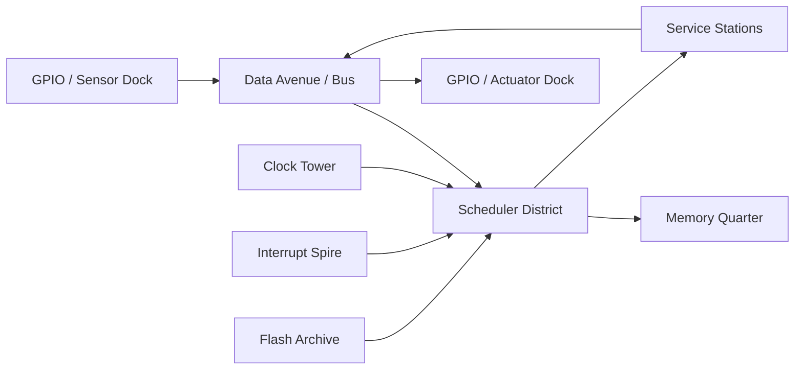
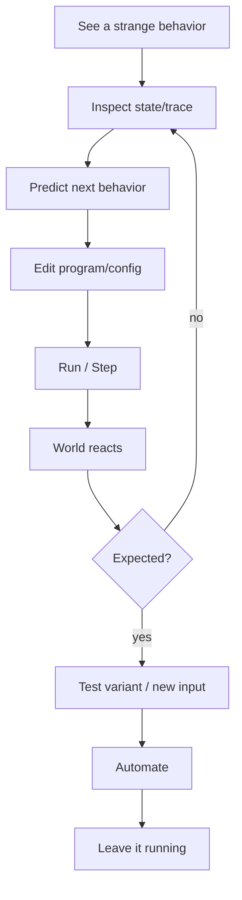

# BITLAND — MASTER GDD AAA · PCB-CITY EXECUTABLE WORLD · v2 candidate

> **One-sentence pitch:** *Factorio-like observable automation + the physical legibility of a PCB + the semantic clarity of Human Resource Machine + an explorable miniature city where every program literally makes the world behave.*

> **North Star:** **THE WORLD IS EXECUTABLE.**

Bitland is not “a programming course with a game skin.” It is a living machine-city inside a microcontroller. Streets carry packets. Buildings expose services. Warehouses hold state. The clock can be seen and heard. Processes continue to run after the player walks away. When the player changes a program, the city changes its behavior.

The game should be enjoyable even if the player never says “I am learning programming.” The educational result is a side effect of repeatedly **reading systems, predicting behavior, editing rules, observing consequences, debugging mistakes and generalizing solutions**.

---

## 0. Executive product definition

### Genre
- Systems puzzle adventure.
- Automation / programming sandbox.
- Exploration-light, observation-heavy.
- No generic combat.
- No trivia gates.
- No “correct / incorrect” as primary feedback.

### Player fantasy
> “I can look at a machine-city that seems incomprehensible, figure out what keeps it alive, rewrite its routines and eventually make whole districts run under systems I understand.”

### Nuclear verb
**PROGRAMAR.**

Derived verbs:
- observe;
- predict;
- sequence;
- condition;
- iterate;
- remember;
- abstract;
- coordinate;
- communicate;
- validate;
- debug;
- automate;
- secure;
- route;
- optimize.

### Target audience
Primary:
- 10–16 years old, no prior programming required.

Secondary:
- 8–10 with guided/scaffolded mode;
- teens/adults who enjoy systems puzzles;
- teachers using the game as a shared discussion object.

### Platform target
- Web-first desktop + tablet/touch.
- Keyboard/mouse and touch parity.
- Controller is desirable but not allowed to compromise programming UI.
- 1920×1080 baseline; scales upward cleanly.
- Offline-capable after first load is desirable for schools.

### Typical session
- 15–35 minutes.
- Campaign chapter: 45–90 minutes.
- Micro-challenges: 5–15 minutes.
- Sandbox: open-ended.

### Completion philosophy
Campaign mastery is **not** “write the shortest code.”
Campaign completion asks:
1. Does the system behave correctly?
2. Is the behavior safe enough?
3. Can the player explain the causal chain?

Optimization is optional mastery.

---

# 1. The design constitution for Bitland

Bitland inherits Roxana’s global pillars and sharpens them into six local laws.

## BL-L1 — Behavior before terminology
The player sees a thing happen before seeing the name for it.

Do:
- show a process repeating;
- let the player interrupt it;
- let them replace copied instructions with a loop;
- only then name “iteration”.

Do not:
- present a card titled “Lesson 3 — Loops”.

## BL-L2 — Every concept must become observable behavior
If a concept cannot be seen, heard, inspected or manipulated, it is not yet gameplay.

Examples:
- state → a visible memory slot that changes;
- event → a signal arriving at a listener;
- queue → packets physically accumulating;
- race condition → two agents contend for one resource and the result changes with timing;
- deadlock → both agents visibly wait forever;
- exception → an execution path diverts into an error handler;
- permission → a resource rejects an unauthorized operation;
- null → an expected referent is absent.

## BL-L3 — The metaphor is honest, not cute
The city exists to make computing legible, not to fabricate false electronics.

Honest mappings:
- street/bus → route for data;
- warehouse → memory/state;
- station → function/service;
- packet → data/message;
- clock pulse → execution tick;
- bridge → interface between modules;
- gate → validation/access control;
- process/citizen → executable agent.

When a mapping becomes misleading, use a **technical sign** instead of forcing the city metaphor.

## BL-L4 — Failure reveals state
A failed program must answer:
- what executed;
- which state was read;
- where the consequence diverged;
- what remains inspectable.

## BL-L5 — The program remains alive
The strongest reward is leaving a process running correctly and seeing the city continue without the player.

## BL-L6 — Humor may anthropomorphize the situation, never the machine’s reasoning
Systems do not “understand,” “want,” “get bored” or “decide for themselves” unless the story explicitly establishes an agent with those capacities.

The joke should expose the opposite:
> the machine is funny because it obeys exactly what it was told.

---

# 2. Learning architecture

Bitland’s pedagogy is deliberately aligned with research-backed patterns while preserving game-first pacing.

## 2.1 Core learning cycle

The default micro-loop is:

**OBSERVE → PREDICT → RUN → INSPECT → MODIFY → RUN AGAIN → EXPLAIN → GENERALIZE → LEAVE IT RUNNING**

This synthesizes:
- **PRIMM**: Predict, Run, Investigate, Modify, Make;
- **Use–Modify–Create**;
- Roxana’s own “phenomenon → action → consequence → hypothesis → new test → formalization → reuse”;
- **productive failure**: let a plausible first attempt produce informative evidence;
- **ICAP**: shift the player from passive observation to active manipulation, constructive explanation and, in classroom/co-op contexts, interactive reasoning;
- **constructionism**: understanding emerges through building artifacts that behave;
- **notional machines**: the world itself becomes a mental model for execution.

### Mandatory implementation implication
Every new mechanic spec must contain:
- what the player first observes;
- what they can predict before touching it;
- what they can modify;
- how the world exposes causality;
- what transfer case proves understanding.

---

## 2.2 Scaffolding ladder

1. **Witness** a working or broken process.
2. **Trace** it step-by-step.
3. **Modify** one parameter/instruction.
4. **Repair** a local behavior.
5. **Generalize** across varying inputs.
6. **Build** a fresh behavior.
7. **Automate** it.
8. **Debug** a hidden edge case.
9. **Optimize** optionally.
10. **Transfer** the same idea to another district/device.

Scaffolds fade:
- early: explicit affordances, highlighted current instruction, visible sensor values;
- mid: fewer highlights, more simultaneous state;
- late: player chooses which instrumentation to open.

---

## 2.3 Formalization ladder

The same concept has three representations:

| Layer | Representation | Required? |
|---|---|---|
| Lived | physical cards / routes / state / agents | Yes |
| Formal | pseudocode in Bitácora | Optional but surfaced after evidence |
| Textual | code-like syntax | Optional / mastery |

The concept does not change when representation changes.

Example:

**World**
- Agent sees package.
- Agent picks it up only if slot is free.

**Blocks**
- `IF SLOT_FREE`
  - `PICK`

**Pseudocode**
```text
IF slot_free:
    pick()
```

**Text view**
Can later map to a real language profile, but this is never the only way to progress.

---

## 2.4 Productive failure rules

A failure is “productive” only if:
- the player had enough prior knowledge to make a plausible attempt;
- the failed behavior remains visible;
- the system does not erase state;
- a comparison between expected and actual behavior is possible;
- the next attempt can use evidence from the failure.

Never create “gotcha” inputs that could not be inferred.

---

# 3. Curriculum: from first instruction to systems thinking

Bitland should map cleanly to contemporary CS education without becoming curriculum-driven.

The 2026 CSTA PK–12 Standards organize foundational CS around:
- Algorithms & Design;
- Programming;
- Data & Analysis;
- Systems & Security;
- Computing & Society.

Bitland’s strongest direct coverage is:
- Algorithms & Design;
- Programming;
- Systems & Security.

Secondary coverage:
- Data & Analysis through observability/metrics;
- Computing & Society through responsibility, automation consequences, access and maintenance.

## 3.1 Campaign content progression

### Arc 0 — Boot / “Algo sigue corriendo”
Concepts:
- program as ordered behavior;
- execution;
- input/output;
- trace;
- human intent vs machine execution.

### Arc I — Instructions
Concepts:
- sequence;
- direct actions;
- branching/selection;
- repetition;
- basic sensors;
- first automation;
- first debugging.

### Arc II — State
Concepts:
- variables;
- state;
- initialization;
- counters;
- booleans;
- simple finite-state behavior;
- bounded loops;
- null/absence as a state possibility.

### Arc III — Abstraction
Concepts:
- functions;
- parameters;
- return/result;
- reuse;
- call stack;
- decomposition;
- contracts at a small scale.

### Arc IV — Many at once
Concepts:
- concurrency;
- scheduling;
- events;
- messages;
- queues;
- synchronization;
- race conditions;
- deadlocks;
- interrupts.

### Arc V — Systems & Security
Concepts:
- permissions;
- input validation;
- trust boundaries;
- malicious or harmful routines;
- least privilege;
- failure containment;
- defensive programming;
- logging/auditing;
- safe defaults;
- null checks / missing references where appropriate.

### Arc VI — Architecture
Concepts:
- services;
- interfaces;
- dependencies;
- routing;
- resilience;
- fallbacks;
- resource budgets;
- observability;
- maintainability;
- optimization under trade-offs.

### Epilogue — “La ciudad entiende nada. Vos sí.”
The board runs coherently again, but the final lesson is not “the machine became smart.”

It is:
> **Humans give systems goals, constraints and meaning. Systems execute. Responsibility stays with the people who design and maintain them.**

---

# 4. The world: a real PCB turned into a city

## 4.1 Visual thesis

At first glance the player should think:
> “This is a city built on a circuit board.”

At second glance:
> “No — the circuit board itself is the city.”

Avoid generic cyberpunk:
- no neon city pasted over electronics;
- no skyscrapers unrelated to function;
- no hacker rain as filler;
- no meaningless holograms.

The PCB topology must drive the composition.

## 4.2 Material language

Base board:
- solder mask plane;
- exposed copper;
- plated vias;
- component pads;
- silkscreen markings;
- test points;
- component packages;
- headers;
- connectors;
- traces;
- ground/power planes suggested visually, not literally simulated unless needed.

City translation:
- wide bus traces → avenues / transit arteries;
- fine traces → side streets;
- vias → lifts/shafts between visual layers;
- IC packages → districts/buildings;
- pins → gates/terminals;
- headers → external-world ports;
- RAM/flash packages → archive/warehouse zones;
- crystal/clock source → Clock Plaza / Pulse Tower;
- GPIO bank → city edge docks;
- sensors/actuators → “outside world” devices beyond the MCU core.

## 4.3 Scale model

Recommended camera fantasy:
- isometric/light top-down;
- 35–55° pitch;
- orthographic or weak perspective;
- tactical readability before cinematic drama.

The player avatar should be small enough that:
- traces feel like streets;
- packages feel like architecture;
- the clock structure feels monumental;
- a single district can fit as a readable system diagram.

But not so small that:
- character acting disappears;
- Null loses personality;
- contextual interaction becomes pixel hunting.

### Camera states
1. **Explore** — follow avatar, gentle framing.
2. **Inspect** — center on process/system.
3. **Program** — freeze/slow relevant simulation, expose program UI.
4. **Trace** — camera can follow a packet or agent.
5. **System view** — zoom out to show dependencies/flow.
6. **Cinematic restore** — short, earned camera move after a systemic transformation.

---

# 5. Spatial computing metaphor



This is not meant to imply a literal instruction-level MCU microarchitecture in every puzzle. It is the macro-world grammar.

## 5.1 Districts

### Boot Yard
- entry/tutorial;
- sequence and first program;
- visibly dormant process;
- external I/O demonstration.

### Clock District
- ticks;
- pause/step;
- timers;
- delayed events;
- scheduling setup.

### Courier Grid
- packets/messages;
- routing;
- conditions;
- queues.

### Memory Quarter
- state;
- counters;
- variable slots;
- initialization;
- persistence vs reset.

### Callstack Tower
- functions;
- parameters;
- nested calls;
- visible stack frames.

### Interrupt Spire
- events;
- interrupts;
- asynchronous behavior;
- priority;
- “what runs next?”

### Parallel Works
- multiple agents;
- shared resources;
- race conditions;
- synchronization.

### Perimeter / Permission Gates
- permissions;
- validation;
- trust boundaries;
- access control;
- malformed inputs;
- malware arcs.

### Service Ring
- interfaces;
- dependencies;
- fault containment;
- routing across districts.

### External Device Belt
Applied computing lives here:
- temperature sensor;
- light sensor;
- buttons;
- LED matrix;
- servo/motor;
- fan;
- speaker/buzzer;
- display;
- traffic-light actuator;
- simple radio/message endpoint.

The crucial effect:
**player programs inside Bitland → a visible external device responds.**

---

# 6. Applied-computing promise

Bitland must constantly answer:
> “Why does programming matter outside an editor?”

Every arc ends with a real/applied behavior.

Examples:
- sequence → move a delivery arm through exact steps;
- condition → fan activates when a temperature sensor crosses a threshold;
- loop → LED pattern repeats;
- state → traffic light remembers phase;
- function → multiple doors call the same validation routine;
- event → alarm handler reacts to sensor input;
- concurrency → two transport systems share a crossing;
- security → malformed input is rejected instead of propagating;
- architecture → multiple districts use one resilient routing service.

This is where Bitland differentiates itself from pure coding puzzles.

---

# 7. Main companion: NULL

## 7.1 Role

**Null** is the world companion analogous in emotional function to Ohm in Ohmdal, but never a professor.

Null is:
- curious;
- dry;
- observant;
- useful;
- literal;
- hard to “address”;
- a walking reminder that absence is itself meaningful state.

Null should be memorable even for players who never learn the technical term.

## 7.2 Technical honesty

A null reference generally represents the absence of a valid referent/object/address; exact semantics vary by language.

Therefore:
- do not claim “null can never be infected” universally;
- do claim that **a specific old malware routine cannot act on a target unless it resolves a valid object/reference**;
- when it tries Null, its target lookup returns no valid referent.

That makes the joke true inside the established system.

## 7.3 The malware gag

Scene:
- security sweep targets all registered active agents.
- malformed/hostile routine traverses the registry.
- every referenced process shows contamination artifacts.
- Null stands untouched.

Player:
> “¿A vos no te agarró?”

Null:
> “Me buscaron.”

Beat.

Null:
> “No encontraron nada.”

Inspector:
```text
target: null
operation: skipped
reason: no valid referent
```

Null:
> “Por una vez, estar ausente fue bastante útil.”

This is funny **and** teaches:
- null as absence;
- target/reference resolution;
- systems execute predicates literally;
- malware is still just code following conditions.

## 7.4 Recurring Null jokes

### Null and inventory
Player: “¿Qué tenés en esa mochila?”
Null: “Nada.”
Player: “¿Nada importante?”
Null: “No. Nada.”

### Null and identity
Gate: `IDENTITY REQUIRED`
Null walks into the gate.
Gate: `NO OBJECT`
Null: “Qué poco personal.”

### Null and optional values
A panel says `OWNER: null`.
Null:
> “No soy yo. No todo lo que no tiene dueño soy yo.”

Teaches that `null` is a value/state, not a character identity.

### Null and dereference
Player tries to “inspect property” on Null.
Panel:
```text
Cannot read property from null.
```
Null:
> “Eso fue bastante invasivo.”

Use sparingly and only after the player has conceptually experienced missing references.

## 7.5 Null’s gameplay utility
Null can:
- highlight the last state change;
- point to a pending message;
- anchor the rewind marker;
- show “what changed” between two traces;
- remember **player-facing history** in the Bitácora without pretending the process itself remembers.

Null must not:
- solve puzzles;
- tell the exact card to place;
- recite definitions before experience;
- become a magical omniscient debugger.

---

# 8. Humor grammar: comedy as conceptual reinforcement

## Rule H1
The joke must survive technical review.

## Rule H2
The system is funny because it is literal.

## Rule H3
Humans provide interpretation; code provides execution.

## Rule H4
Do not teach “computers are stupid.” Teach:
> computers do not infer unprogrammed intent.

### Infinite loop character
A municipal cleaner repeats:
1. walk to marker;
2. sweep;
3. return;
4. repeat while `maintenance_enabled == true`.

The target no longer exists.

Each lap:
> “Última vuelta.”

Again:
> “Última vuelta.”

Again:
> “Última vuelta.”

Null:
> “No miente.”
> “Para él, cada vuelta es la última instrucción antes de volver al principio.”

Later the player sees:
```text
WHILE maintenance_enabled:
    go_to(old_marker)
    sweep()
    return()
```

The comedy establishes:
- loops do not “get tired”;
- iteration has no human sense of “enough” unless encoded;
- “forgot what it did” is not literally memory loss; the routine has no state that counts/terminates.

### Off-by-one gag
Courier:
- delivers 9 of 10 boxes because loop is `REPEAT(9)`.

Null:
> “Buenas noticias: dejó exactamente una para mañana.”

Player fixes count.

Later introduce 0-based indexing only if the textual language profile supports it. Do not conflate off-by-one with zero-based indexing too early.

### Boolean guard
Door has:
```text
IF authorized == true:
    open
```
A corrupted service sets `authorized = "true"` as text.
Door remains closed.

Null:
> “Dice ‘true’. No es true.”

This teaches type/value distinction only when types are formally in scope.

### Race condition gag
Two couriers both read `slot_free = true`, then collide trying to reserve it.
Null:
> “Los dos tenían razón.”
Beat.
> “Al mismo tiempo.”

### Deadlock gag
Two agents:
- each holds one key;
- each waits for the other.

Null:
> “Están siendo extremadamente pacientes.”

### Garbage collector gag
A cleaning process removes unreferenced packages.
Null carefully steps aside.
Null:
> “No hagamos contacto visual.”

Only use when garbage collection/reachability is actually in the curriculum or optional mastery.

---

# 9. Narrative premise

Bitland was built by the Institute as a persistent executable learning environment. It continued operating after maintenance ceased.

The city is not “broken.”
It is **running old intent**.

Consequences:
- routes deliver to retired addresses;
- services invoke missing endpoints;
- schedules overlap;
- queues grow;
- maintenance cleans obsolete targets;
- old permissions remain active;
- optimization from one district starves another;
- malicious educational test routines / malware samples escaped intended containment and still obey their old directives.

## 9.1 Malware policy

Malware is allowed, but:
- it is not a demon;
- it is not a sentient villain;
- it does not “hate” Bitland;
- it follows instructions;
- its danger comes from permissions, propagation rules, trust assumptions and human negligence.

This makes security pedagogically consistent with the world theme.

Possible origin:
- historical security exercises;
- abandoned red-team training samples;
- malformed maintenance patches;
- scripts copied without understanding.

## 9.2 Antagonist
The antagonist is not a person.

It is:
- accumulated intent without maintenance;
- literal execution without context;
- automation without responsibility;
- systems whose original purpose is no longer aligned with present reality.

---

# 10. Prologue — entering Bitland

## 10.1 Institute transition
Inside the Computing Lab:
- old rack still pulses;
- oscilloscope-like clock trace;
- board under glass;
- one header pin blinking.

The player interacts with it.

Transition should visually “scale into” the board:
1. macro shot of PCB;
2. camera dives toward traces;
3. silkscreen becomes street markings;
4. vias become shafts;
5. packages become buildings;
6. clock pulse becomes citywide sound/light;
7. player lands at Boot Yard.

No menu saying “Welcome to Bitland.”

## 10.2 First 90 seconds
No lecture.

Player sees:
- a package;
- a stopped courier;
- a destination;
- a 3-card program;
- a blinking output LED outside the board that is currently off.

Null appears only after the player executes something.

First successful sequence:
- courier delivers packet;
- packet reaches GPIO;
- external LED lights;
- distant district wakes for one pulse.

Null:
> “Eso estaba apagado desde antes de que yo…”
Beat.
> “No importa. Yo tampoco tengo fecha.”

---

# 11. Core moment-to-moment gameplay



## Exploration mode
- move;
- follow routes;
- inspect agents;
- enter stations;
- listen to ambient signals;
- open physical panels.

## Programming mode
- contextual;
- tied to a process/device/service;
- no abstract full-screen IDE by default;
- supports drag/drop;
- keyboard editing;
- undo;
- version history;
- run/pause/step/rewind.

## Trace mode
- highlights current instruction;
- sensor inputs;
- state diffs;
- message path;
- call stack;
- queue state;
- locks;
- event ordering.

---

# 12. Programming language progression

Preserve the existing 8-stage design, with one refinement: **security and validation become explicit applied content across stages 4–8 instead of a detached lecture.**

## Stage 1 — Instructions
Primitives:
- MOVE
- TURN
- PICK
- DROP
- WAIT
- ACTIVATE

Learning:
- deterministic order;
- preconditions;
- execution trace.

## Stage 2 — Decision
- IF / ELSE;
- sensors;
- comparisons;
- predicates.

## Stage 3 — Repetition
- REPEAT;
- WHILE;
- BREAK;
- termination.

## Stage 4 — Memory
- LET;
- READ;
- INCR/DECR;
- counters;
- booleans;
- labels/state;
- null/empty references introduced contextually.

## Stage 5 — Abstraction
- DEF;
- CALL;
- parameters;
- return values;
- stack frames.

## Stage 6 — Concurrency
- SPAWN;
- JOIN;
- shared clock;
- shared resources;
- locks.

## Stage 7 — Communication
- SEND;
- ON;
- EMIT;
- WAIT_FOR;
- channels;
- queues.

## Stage 8 — Architecture
- SERVICE;
- INTERFACE;
- REQUIRES;
- permissions;
- contracts;
- resource budgets;
- failure handling.

---

# 13. Puzzle grammar

Retain B1–B12 as the canonical working grammar:

| ID | Family | Core question |
|---|---|---|
| B1 | Sequence | “What order produces the desired state?” |
| B2 | Generalization | “Does this still work when input changes?” |
| B3 | Condition | “What should happen only when X is true?” |
| B4 | Repetition | “What work is redundant?” |
| B5 | Memory | “What must the system remember?” |
| B6 | Abstraction | “What repeated behavior deserves a name?” |
| B7 | Debugging | “What actually happened?” |
| B8 | Automation | “Can this run without me?” |
| B9 | Concurrency | “What changes when multiple processes run?” |
| B10 | Synchronization | “What must not happen at the same time?” |
| B11 | Routing | “Where should data go?” |
| B12 | Optimization | “Can it be better without becoming less correct?” |

## 13.1 New applied security puzzle tags

These are tags layered onto B-families, not a second puzzle taxonomy:

- `S-VALIDATE` — reject malformed/untrusted input;
- `S-PERMISSION` — limit who can touch resource;
- `S-NULL` — handle absent referent;
- `S-BOUNDARY` — distinguish trusted/untrusted side;
- `S-AUDIT` — reconstruct what happened from logs;
- `S-CONTAIN` — failure/malware should not cascade;
- `S-SAFEDEFAULT` — default behavior is safe when information is missing.

---

# 14. Campaign from beginning to end

## ARC 0 — BOOT: “Algo sigue corriendo”
Duration: 20–30 min.

Goal:
- establish execution;
- establish external I/O;
- establish Null;
- establish “machines execute; humans infer purpose.”

Set piece:
- wake one output LED via a delivery process.

Final beat:
- player walks away;
- LED continues blinking under their program.

---

## ARC I — INSTRUCTIONS: “La ciudad obedece”
Duration: 60–90 min.

### Chapter 1 — The courier
- sequence;
- step;
- trace.

### Chapter 2 — The changing street
- IF;
- sensor;
- branch.

### Chapter 3 — One hundred boxes
- loop;
- redundant work;
- termination.

### Chapter 4 — “Última vuelta”
- inherited infinite loop;
- the cleaner gag;
- debugging.

### Final — First autonomous route
- package intake drives courier automatically;
- external LED / actuator signals successful delivery.

Transformation:
- Boot/Courier district begins operating continuously.

---

## ARC II — STATE: “Recordar cambia todo”
Duration: 90–120 min.

### Core problems
- agent forgets how many items it carries;
- gate does not know whether it is armed;
- traffic signal resets incorrectly;
- uninitialized slot produces unpredictable/unusable state.

### Null’s story beat
The player encounters a missing owner/reference and Null becomes the natural emotional anchor for the concept of absence.

### Applied final
Program a temperature-control station:
- read sensor;
- remember hysteresis/mode;
- activate fan only when needed;
- avoid rapid on/off oscillation.

This introduces state as practical control, not a variable worksheet.

Transformation:
- Thermal Quarter stabilizes.

---

## ARC III — ABSTRACTION: “Dale un nombre”
Duration: 90–120 min.

### Core problems
- duplicated courier logic;
- repeated door validation;
- parameterized destinations;
- nested calls;
- readable stack.

### Set piece: Callstack Tower
Every function call creates a temporary visible floor/frame.
Returning collapses the floor.

Do not imply literal CPU stack hardware; frame tower is an explicit notional-machine sign.

### Applied final
One reusable validation routine controls multiple doors/devices with parameters.

Transformation:
- duplicated service panels collapse into shared modules.

---

## ARC IV — MANY AT ONCE: “Todos tenían razón”
Duration: 120–150 min.

### Core problems
- two couriers share a loading dock;
- scheduler interleaves agents;
- events arrive asynchronously;
- queue grows;
- race condition;
- deadlock.

### Signature scene
Two processes both inspect `slot_free == true` before either commits.

They collide.

Null:
> “Los dos leyeron la verdad.”
Beat.
> “La verdad cambió antes de que actuaran.”

### Applied final
Coordinate:
- sensor;
- conveyor;
- gate;
- actuator;
- alert process.

Transformation:
- Parallel Works operates with multiple services.

---

## ARC V — SYSTEMS & SECURITY: “Código dañino sigue siendo código”
Duration: 120–180 min.

### Premise
The player enters a district contaminated by old hostile/test routines.

They are dangerous because they:
- have permissions;
- replicate through trusted routes;
- assume invalid inputs;
- exploit missing validation.

Not because they “became evil.”

### Chapters
1. **Trust me** — invalid input accepted.
2. **Too much permission** — one process can modify unrelated resources.
3. **No target** — Null malware gag / absent reference.
4. **The log lies?** — compare audit trail to apparent behavior.
5. **Containment** — isolate a bad service.
6. **Safe default** — missing information should not open a dangerous path.

### Applied final
Secure an external access controller:
- validate request;
- check permission;
- handle missing identity;
- log decision;
- fail closed when needed.

Transformation:
- Perimeter district reconnects safely to the rest of Bitland.

---

## ARC VI — ARCHITECTURE: “Que funcione cuando algo falle”
Duration: 150–210 min.

### Core problems
- service dependencies;
- fallback;
- resource contention;
- queue backpressure;
- routing;
- partial failure;
- observability;
- replacement without total shutdown.

### Final architecture challenge
The player must reconnect:
- input devices;
- courier network;
- memory service;
- scheduler;
- security gate;
- external actuator belt.

Constraints:
- one service will intentionally fail during validation;
- another will become slow;
- input spike occurs;
- no fixed solution.

Success is condition-based:
- correct outputs;
- bounded queues;
- no unsafe access;
- graceful degradation;
- readable trace.

### Final transformation
The full PCB-city visibly enters coherent operation.

Not “perfect.”
Maintainable.

Null:
> “¿Terminamos?”

Player may answer:
- “Sí.”
- “Por ahora.”

Null:
> “Buen valor por defecto.”

---

# 15. Optional mastery layer

## Optimization
Metrics:
- throughput;
- latency;
- energy;
- memory;
- robustness;
- program size;
- maintainability proxy only if it can be measured honestly.

No leaderboard pressure in campaign.

## Sandbox
Player can:
- build small automations;
- connect sensors to actuators;
- create reusable services;
- share deterministic scenarios.

## Challenge seeds
- same task, different inputs;
- limited memory;
- limited energy;
- random event order from seeded deterministic schedules;
- one device offline;
- one queue capacity reduced.

---

# 16. Art direction

## 16.1 Visual identity keywords
- tactile;
- miniature;
- precise;
- warm electronics;
- living machine;
- readable flow;
- diorama;
- copper;
- silkscreen;
- luminous state;
- service architecture.

Avoid:
- generic neon cyberpunk;
- dark hacker clichés;
- green Matrix rain;
- excessive holographic UI;
- industrial grime that destroys legibility.

## 16.2 Readability layers

### Layer A — world geometry
The board must remain readable without UI.

### Layer B — system state
Use:
- motion;
- pulse;
- arrows;
- iconography;
- shape;
- limited color as redundant cue.

### Layer C — debug overlay
Only when requested:
- traces;
- route highlights;
- state labels;
- queue metadata;
- call stack;
- message ancestry.

### Layer D — formalization
Pseudocode/text only after player has lived the behavior.

## 16.3 Component art
Each functional building must be recognizable by silhouette:
- RAM warehouse;
- clock/crystal tower;
- GPIO dock;
- bus hub;
- function station;
- queue terminal;
- interrupt spire;
- permission gate.

## 16.4 Character art
Player:
- legible silhouette at zoomed-out scale;
- minimal clothing detail;
- grounded in Institute visual language.

Null:
- small;
- visually “missing” without being invisible;
- negative-space motif;
- outline/silhouette with an intentionally absent center or incomplete render;
- never visually broken like a glitch monster;
- movement can “skip” decorative occupancy checks, but never gameplay collision rules unless explicitly justified.

## 16.5 Animation
AAA bar means:
- every process has a readable anticipation/action/recovery;
- packets visibly enter/exit stations;
- doors show validation before opening;
- queues compress/expand;
- service startup has a short state transition;
- failure states are animated, not just text labels;
- automation success has world-scale motion, not confetti.

---

# 17. Sound direction

Sound is a second debugger.

## Clock
- subtle pulse;
- district offsets audible as phase differences;
- step mode produces a crisp single tick.

## Messages
- short directional chirp;
- queued messages produce a gentle layered texture;
- overflow becomes audibly crowded without becoming stressful.

## Execution
- instruction families have soft sonic signatures;
- branch taken/not-taken can be distinguished;
- function call/return have paired motifs.

## Null
- sparse;
- dry;
- perhaps tiny dropout/silence before line delivery;
- no “glitch voice” cliché.

## Accessibility
All gameplay-critical audio has visual redundancy.

---

# 18. UI/UX

## 18.1 Programming panel
Four zones:
1. target process/service;
2. program;
3. live state;
4. timeline/clock.

## 18.2 Interaction principles
- direct manipulation first;
- keyboard speed for advanced players;
- touch targets ≥ comfortable mobile size;
- no drag-only action without alternative;
- undo always visible;
- “run” and “step” never ambiguous;
- current instruction always locatable;
- state changes highlight briefly;
- tooltips describe meaning, not solution.

## 18.3 Hint ladder
1. camera/affordance;
2. replay of consequence;
3. highlight suspicious state;
4. Null points to trace fact;
5. explicit local hint;
6. worked example only after repeated opt-in.

Null should say things like:
> “La condición dio verdadero tres veces.”

Not:
> “Poné un ELSE.”

---

# 19. Accessibility / UDL

Follow multiple means of:
- engagement;
- representation;
- action/expression.

Mandatory:
- color never sole state indicator;
- text size scaling;
- reduced motion;
- adjustable simulation speed;
- pause always available outside specifically designed timing challenges;
- remappable keyboard;
- full keyboard path through programming UI;
- screen-reader-friendly DOM for panels;
- captions;
- audio cue visual equivalents;
- high-contrast mode;
- simplified effects;
- one-handed/touch-friendly interactions;
- language localization architecture.

Optional support mode:
- slower hint cadence;
- fewer concurrent visual effects;
- persistent state labels;
- “show next executed instruction” preview.

---

# 20. Assessment without exams

## 20.1 Evidence of understanding
A concept is considered understood enough for campaign progression when player can:
- predict;
- make it work;
- debug a misuse;
- transfer to a variation.

## 20.2 Explanation prompts
Short, optional/diegetic:
- “¿Qué leyó el sensor?”
- “¿Por qué tomó esa calle?”
- “¿Qué tendría que cambiar para que termine?”
- “¿Cuál proceso tenía el recurso?”
- “¿Qué pasa si el mensaje llega primero?”

Answer modes:
- point to trace;
- choose a state;
- manipulate timeline;
- short natural-language answer where appropriate.

No vocabulary quiz gate.

## 20.3 Telemetry
Privacy-minimal events:
- attempts;
- time to first prediction;
- step usage;
- trace usage;
- rewind;
- hint tier;
- successful transfer;
- reset usage;
- number of alternative solutions;
- failure reason categories.

Never collect unnecessary personal data.

---

# 21. Technical architecture

Preserve the current Bitland architecture principle:

```text
Pure TypeScript simulation core
  ├─ deterministic state
  ├─ tick scheduler / clock
  ├─ agents + programs + interpreter
  ├─ events/messages/shared resources
  ├─ snapshots + rewind
  └─ condition-based validators
          ↓
renderer adapter
          +
DOM programming/debug UI
```

## 21.1 Non-negotiable separation
The renderer never defines program semantics.

Visual frame rate:
- ideally 60 FPS or device-adaptive.

Simulation:
- deterministic logical ticks;
- independent from renderer timing.

## 21.2 Determinism
Required for:
- replay;
- rewind;
- debugging;
- testing;
- seeded variants;
- classroom reproducibility.

## 21.3 Event-sourced trace
Each logical action emits:
- tick;
- agent/process;
- instruction;
- reads;
- writes;
- messages;
- resource locks;
- result;
- error/exception if any.

Snapshots can checkpoint state for short rewind.

## 21.4 Renderer
Do not hard-lock engine prematurely.

Current repo already authorizes separate PixiJS and Phaser spikes.

AAA-quality decision criteria:
- clarity at scale;
- 2D/isometric layering;
- shader/VFX control;
- camera;
- animation tooling;
- touch;
- performance on school hardware;
- asset pipeline;
- maintainability.

Astra may recommend another renderer only with an explicit evidence-based spike, not preference.

## 21.5 DOM UI
Programming/debug UI should remain DOM-first for:
- accessibility;
- text rendering;
- keyboard;
- screen readers;
- responsive layout;
- automated UI testing.

## 21.6 Testing
Unit:
- interpreter;
- instructions;
- conditions;
- loop termination detection;
- state;
- calls;
- scheduler;
- message order;
- locks;
- permissions;
- validators;
- null/missing reference cases.

Property/invariant:
- no packet duplication unless specified;
- deterministic replay;
- rewind returns exact state;
- safety/liveness validators;
- permission boundaries.

Golden scenario tests:
- each campaign puzzle has multiple valid solutions where intended;
- known bad solutions fail for the intended observable reason.

---

# 22. AAA production bar

“AAA” here means **presentation, cohesion and polish**, not budget theater.

Each shipped beat requires:
- intentional composition;
- polished camera;
- unique readable asset set;
- contextual animation;
- audio feedback;
- systemic VFX;
- no placeholder UI;
- no developer-text dialogue;
- no debug labels in player view;
- no empty room;
- no silent success;
- no tutorial wall of text;
- responsive input;
- accessibility pass;
- automated regression coverage.

## 22.1 Vertical slice bar
The vertical slice must make a viewer understand Bitland in 30 seconds:
1. see PCB-city;
2. see a process;
3. edit behavior;
4. run it;
5. watch state travel through the city;
6. external device reacts;
7. Null lands one conceptually accurate joke.

If that sequence is not compelling, adding more curriculum will not fix it.

---

# 23. Production roadmap

## P0 — Visual/interaction spike
Compare renderers with identical simulation baseline.

Deliver:
- one district;
- one courier;
- one package;
- one IF;
- one loop;
- one external LED;
- Null;
- step/pause/rewind.

## P1 — Vertical slice
20–30 minutes:
- Boot;
- sequence;
- condition;
- loop;
- first debugging;
- first automation.

## P2 — State slice
- variable/state visual language;
- Null missing-reference beat;
- temperature/fan applied system.

## P3 — Abstraction slice
- functions;
- call stack;
- shared routine.

## P4 — Concurrency slice
- scheduler;
- messages;
- race;
- deadlock;
- synchronization.

## P5 — Security slice
- validation;
- permission;
- malware;
- containment;
- audit.

## P6 — Architecture finale
- services;
- dependencies;
- fallback;
- full board restoration.

Every phase ends with:
- usability test;
- pedagogical test;
- performance profile;
- accessibility check;
- canon/ADR decision.

---

# 24. Quality and playtest hypotheses

A successful Bitland player should spontaneously say things equivalent to:
- “I made that system run.”
- “It failed because this condition was still true.”
- “They both read the same state before either changed it.”
- “The process didn’t know what I meant.”
- “This can keep running after I leave.”
- “I can reuse this routine somewhere else.”

Red flags:
- “I guessed until the game accepted it.”
- “I had to remember what Null told me.”
- “It’s basically Scratch with a city behind it.”
- “I don’t know why it failed.”
- “The code says it’s right but nothing in the world changed.”
- “The computer decided to do something weird” when the trace does not support that interpretation.

---

# 25. Reference board — games, interaction and art

These are references, not templates to clone.

## 25.1 SHENZHEN I/O
Use for:
- PCB legibility;
- microcontrollers as programmable objects;
- hardware/data-sheet texture;
- signal flow.

Do not copy:
- assembly-first learning curve;
- dense engineering UI as mandatory novice experience.

Reference:
- https://zachtronics.itch.io/shenzhen-io

## 25.2 Human Resource Machine
Use for:
- program-as-worker;
- input/output physically represented;
- memory as visible slots;
- optional optimization.

Do not copy:
- isolated puzzle-room structure as entire world;
- boss/exam framing.

Reference:
- https://tomorrowcorporation.com/humanresourcemachine

## 25.3 Factorio circuit networks
Use for:
- automation as systemic power;
- signals controlling devices;
- state/conditions;
- circuits that remain running;
- pause/tick inspection as a useful systems-learning affordance.

Reference:
- https://wiki.factorio.com/Circuit_network
- https://wiki.factorio.com/Combinator_Tutorial

## 25.4 Opus Magnum
Use for:
- open-ended solutions;
- machine beauty;
- readable motion;
- optimization as optional mastery;
- shareable execution.

Reference:
- https://www.zachtronics.com/opus-magnum/

## 25.5 Baba Is You
Use for:
- rules becoming manipulable objects;
- immediate world consequences after rule change;
- conceptual purity.

Do not copy:
- language-as-world ontology; Bitland programs behavior rather than rewriting reality rules wholesale.

## 25.6 MakeCode + micro:bit
Use for:
- blocks-to-text transition;
- immediate simulator feedback;
- sensors and actuators;
- applied computing.

References:
- https://makecode.microbit.org/
- https://makecode.microbit.org/device/simulator
- https://makecode.microbit.org/courses/blocks-to-javascript/starter-blocks

## 25.7 Ben Eater 8-bit computer
Use as accuracy/inspiration reference for:
- clock;
- registers;
- bus;
- step-by-step execution visibility.

Do not turn Bitland into a digital logic course.

Reference:
- https://eater.net/8bit

## 25.8 User-provided visual North Star
Interactive electronics board / city-like circuit reference:
- https://x.com/techartist_/status/2091207824160534554
- https://x.com/techartist_/status/2091207824160534554/video/1

Core takeaway:
> PCB geometry itself should read like an inhabited city.

---

# 26. Video reference board

- TIS-100 teaser — corrupted code / debugging machine:
  https://www.youtube.com/watch?v=ZkUHGvy2pNU
- Human Resource Machine official page includes gameplay trailer:
  https://tomorrowcorporation.com/humanresourcemachine
- Ben Eater 8-bit computer videos:
  https://eater.net/8bit
- MakeCode micro:bit intro / hardware videos:
  https://makecode.microbit.org/

When reviewing video references, extract:
- camera rhythm;
- readability;
- execution feedback;
- time from edit → consequence;
- how much text is required before action.

Do not copy surface aesthetics.

---

# 27. Pedagogy / standards references

## 27.1 PRIMM
Sue Sentance — Predict, Run, Investigate, Modify, Make.
- https://suesentance.net/primm-project/
- https://suesentance.net/2017/02/20/exploring-pedagogies-for-teaching-programming-in-school/

Bitland mapping:
- Predict → player forecasts execution;
- Run → execute world process;
- Investigate → trace and inspect state;
- Modify → edit program;
- Make → automate/create new behavior.

## 27.2 Use–Modify–Create
- https://textbooks.cs.ksu.edu/tlcs/4-designing-cs-lessons/04-use-modify-create/

Bitland mapping:
- use inherited process;
- modify it;
- construct a new service from the same idea.

## 27.3 Productive Failure
Manu Kapur:
- https://lse.ethz.ch/research/productive-failure.html
- https://www.manukapur.com/the-research-project/

Bitland mapping:
- allow plausible first attempts;
- retain failed traces;
- compare;
- only then formalize.

## 27.4 ICAP
Chi & Wylie:
- https://doi.org/10.1080/00461520.2014.965823
- https://icap.education.asu.edu/research

Bitland mapping:
- passive: watch;
- active: manipulate;
- constructive: explain/predict;
- interactive: discuss/compare in classroom or co-op contexts.

## 27.5 Notional machines
Use the world as an explicit pedagogic model for program semantics, while marking where metaphor stops.

Reference:
- https://doi.org/10.1145/3688390
- https://doi.org/10.1145/3341525.3394988

## 27.6 Constructionism / creative learning
Use buildable systems and personally meaningful artifacts; preserve experimentation and iteration.

## 27.7 Universal Design for Learning
CAST UDL 3.0:
- https://udlguidelines.cast.org/

Apply:
- multiple means of representation;
- multiple means of action/expression;
- choice/autonomy;
- accessible interaction;
- transfer/generalization.

## 27.8 2026 CSTA PK–12 Standards
- https://csteachers.org/pk12standards/
- https://csteachers.org/pk12standards/about/
- https://csteachers.org/pk12standards/view/

Important 2026 direction:
- Algorithms & Design;
- Programming;
- Data & Analysis;
- Systems & Security;
- Computing & Society;
- programming includes reading, evaluating, modifying and debugging, not merely generating code.

Bitland should use CSTA as a crosswalk, not as a pacing script.

---

# 28. Concept truth table: metaphor vs actual concept

| Bitland representation | Concept taught | Honest boundary |
|---|---|---|
| Courier/process | executable process/agent | not a conscious worker |
| Street | route/bus/channel | not every real bus behaves like a road |
| Packet | data/message | data may not be physically packetized at every abstraction |
| Warehouse | state/memory | “memory is a box” is a notional model, not literal hardware |
| Clock tower | logical clock/tick | renderer FPS is never the program clock |
| Gate | condition/validation/permission | conditionals are not literally doors |
| Callstack tower | stack frames | explicit pedagogical visualization |
| External LED/fan | I/O actuator | closest applied mapping; preserve correctness |
| Null | absent referent | semantics vary by language; avoid universal claims |
| Malware | harmful code/routine | not sentient evil |
| Deadlock | cyclic waiting | not merely “a traffic jam” |
| Queue | FIFO waiting structure | identify when actual ordering differs |
| Garbage cleanup | GC/reachability | optional; only when taught explicitly |

---

# 29. Final design test

Before accepting any Bitland feature, ask:

1. What does the player **do**?
2. What computing concept does that action instantiate?
3. What changes in the world?
4. Can the player see why it changed?
5. Can a wrong attempt produce useful evidence?
6. Does the mechanic still make sense without dialogue?
7. Is the metaphor technically honest?
8. Can at least two solutions work where appropriate?
9. Is optimization optional?
10. Can the player transfer the idea to a new applied device/system?
11. Does the joke teach rather than distort?
12. Is this still fun if we never call it educational?

If answers 1–7 fail, do not ship.
