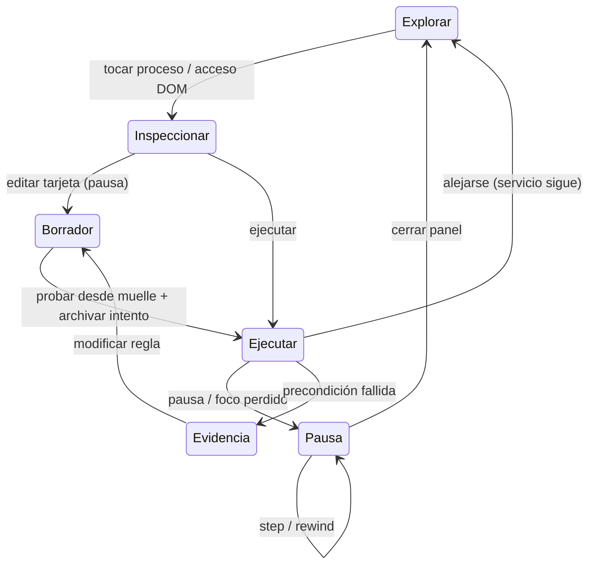

# BITLAND — VERTICAL SLICE · v1

## Target AAA P1 — 2026-09-08 (PROPOSED, sustituye el slice v1 de abajo)

Dirección autoral: GDD v2-candidate. Duración objetivo 24 minutos, rango 20–30,
no medida. Se entra y sale de un único distrito continuo. El primer target
implementado es P0 A/B, no estos ocho beats completos. Gate y evidencia viven
en `production/bitland-prototype-evaluation_v1.md` y el ADR P0.

### Beat sheet y contrato pedagógico

| Beat / tiempo | Conocimiento previo | Fenómeno inicial | Predicción posible | Manipulación / fallo que deja evidencia |
|---|---|---|---|---|
| 1 · inmersión · 1 min | tocar/click, sin programación | placa del laboratorio con un pulso | seguir visualmente qué ruta alcanzará | acercarse a la placa; se puede omitir movimiento de cámara, sin penalidad |
| 2 · courier · 4 min | causa y orden de acciones | agente detenido y paquete al alcance | señalar dónde estará luego de recoger / avanzar | ordenar 3 acciones semánticas; entrega sin carga muestra manos vacías y paso exacto |
| 3 · afuera · 1 min | recorrido del paquete | paquete sale por GPIO; LED aún apagado | anticipar qué dispositivo recibe | step/rewind del tránsito; pausar muestra mensaje pendiente y su llegada futura |
| 4 · Null · 1 min | primera ejecución observada | contorno vacío aparece junto al resultado | inspeccionar qué cambió realmente | abrir/cerrar registro; Null cita hechos disponibles, no evalúa respuestas |
| 5 · cruce · 5 min | secuencia y step | barrera cambia con sensor externo | señalar rama antes de ejecutar | cambiar regla de ruta; sensor cerrado bloquea ruta fija; traza conserva lectura |
| 6 · repetición · 4 min | misma secuencia, entrada observable | tres viajes descritos por copias de tarjetas | anticipar cuántos paquetes quedarán | envolver recorrido en repetición o conservar copias; una iteración de menos deja paquete visible |
| 7 · última vuelta · 5 min | condición y repetición | mantenedor vuelve a un marcador retirado; emite la misma frase desde instrucción SAY | predecir si el siguiente ciclo terminará y señalar guardia | inspeccionar condición estable; cambiar guardia que observa trabajo pendiente, no apagar a ciegas |
| 8 · automatización · 3 min | ruta robusta y guardia | nueva entrada después de terminar primer lote | anticipar si actuará sin intervención | instalar rutina, alejarse y volver; fallo vacío muestra PICK sin paquete; espera legítima visible |

| Beat | Nombre formal posterior (opt-in) | Transferencia | Consecuencia aplicada | Riesgo de misconception |
|---|---|---|---|---|
| 1 | modelo de ejecución | reconocer pads como puertos en otra placa | alcanzar el muelle | es modelo espacial, no anatomía literal del MCU |
| 2 | secuencia / precondición | espera extra o ruta más larga válida | entregar al puerto | el courier ejecuta, no infiere destino |
| 3 | entrada/salida, GPIO | cambiar LED por indicador de un brazo fuera de la placa en próximo slice | luz externa recibe señal real del core | el paquete visual modela dato; no afirmar que GPIO transporta cajitas físicas |
| 4 | traza | comparar otro intento sin pedir solución | evidencia accesible | Null-personaje no equivale a todos los valores null |
| 5 | condición | sensor verdadero, falso y cambio antes de lectura | dispositivo recibe por ruta alternativa | el IF lee en su tick; no predice futuros cambios del sensor |
| 6 | iteración / condición de fin | lotes 0,1,3,5; REPEAT fijo falla si cambia lote y no se adapta | muelle se vacía con N entregas reales | menos código no garantiza menos ticks ni energía |
| 7 | bucle no terminante / depuración | marcador presente y ausente | cesa trabajo obsoleto; vuelve disponibilidad del mantenedor | barrido no es GC; no atribuir aburrimiento; no prometer detectar toda no terminación |
| 8 | automatización | entradas separadas por espera vacía; tres ciclos al regresar | LED responde a nuevas entregas; ciudad permanece activa | espera de entrada no es deadlock ni proceso consciente |

Hint ladder común, siempre solicitada: (1) affordance espacial; (2) replay del
último efecto; (3) subrayar lectura relevante; (4) Null cita ese valor;
(5) pregunta local sobre la relación causa/efecto; (6) ejemplo separado, sólo
tras segunda solicitud explícita. Ninguna opción de respuesta bloquea avance.
En 2 la lectura relevante es carga; en 3 mensaje pendiente; en 5 sensor; en 6
cola restante; en 7 guardia idéntica en dos vueltas; en 8 ausencia de entrada.
En 1 y 4 no se exige resolver un puzzle ni se despliega ayuda escalonada artificial.

### Biblia visual operativa

**Actualización autoral posterior:** la dirección vigente es una metrópolis
interior al microcontrolador, cenital tipo primer GTA, saturada, concurrida y
neocyberpunk. Sustituye la paleta/escala cálida siguiente, que queda como
alternativa rechazada. Mantener funciones urbanas derivadas de buses, memoria,
procesamiento y GPIO; cámara cercana entre manzanas y vista global opcional.
Prioridad inmediata: densidad y tránsito inteligibles, sin ampliar contenido.

**Imagen elegida:** metrópolis cenital interior. Silicio `#080d23`, estructuras
`#162041`, distritos cian `#33f5e4`, magenta `#fc409d`, violeta `#8964ff`;
consecuencia activa ámbar `#ffc54a`. Memorias forman manzanas densas; buses,
avenidas; GPIO, límites y accesos al exterior. Courier: chasis claro, visor oscuro
y carga ámbar separada; Null: contorno marfil/violeta con centro abierto.
La señal añade forma y movimiento además de color. Silueta mínima en juego:
24 px; hit area mínima 44 px. El spike todavía debe superar la miniaturización
en teléfono antes de considerarse experiencia espacial final.

Jerarquía: ciudad densa y viva desde el inicio, ruta programada distinguible
por silueta, marcas y movimiento. 120 fixtures de tránsito ambiental en P0,
sin autoridad sobre gameplay; nunca contarlos como entregas. La vida urbana
sistémica completa sigue pendiente. Capas: silicio → buses → células y contactos
→ tráfico → courier/carga/Null → mensaje factual → DOM. Los buses no atraviesan
fachadas como una textura; reservar espacio real a circulación y puertos.

Cámara de producción: cenital tipo primer GTA; encuadre urbano cercano y vista
del encapsulado, con paneo. Programa ocupa hasta 30% del ancho en desktop; tablet
usa hoja contextual; teléfono necesita encuadre cercano con navegación visible.
No girar la ciudad al abrir el programa. Restauración: 2.5 s de pullback a la
misma placa, saltables y sustituidos por corte bajo reduced motion.

Animación target: recogida 120 ms de anticipación, 240 ms acción, 120 ms reposo;
entrega al pad con separación visible; mensaje viaja durante tres ticks; LED
responde sólo al consumir mensaje. Pose de fallo apunta al obstáculo, sin daño
ni vibración compulsiva. Límite de densidad: sólo un evento héroe a la vez.

Assets P0: geometría y tipografía del sistema, procedural original, sin terceros.
Assets P1 faltantes: mesa de laboratorio y lupa de inmersión; courier con manos,
giro y carga; Null con cinco poses silenciosas; mantenimiento con herramienta
que no parezca GC; actuador LED con soporte/cableado legible. Producir variantes
apagado/activo/fallo por estado, misma silueta, sin texto incrustado. No comprar
ni incorporar referencias gráficas como assets sin comprobar licencia.

### UI / estados

P0 permite ordenar, cambiar, añadir espera y quitar; deshacer edición difiere
de rewind lógico. Una modificación crea borrador, se aplica al iniciar intento
explícito y conserva traza anterior. No hay edición caliente peligrosa.
P1: separar «observar un servicio» de «instalar una nueva versión» sin perder
estado de mundo; guardar programas de usuario y ajustes con versión de esquema.
P0 no implementa persistencia entre cargas; no ofrecer icono de guardado falso.

### Audio

Reloj: click blando, 240 Hz, corto, volumen bajo. Rama: 390 Hz; entrega confirmada:
660 Hz; fallo: 140 Hz sin sirena. P0 usa síntesis local opt-in. Todo sonido nace
de tick/resultado y tiene indicador visual y texto equivalentes. P1 necesita
motivos más orgánicos con envolvente de madera/cerámica y silencio para Null;
sin voz robótica distorsionada. El ambiente crece por servicios realmente
activos, no por un contador de «progreso educativo». Validar mezcla sin audio
y con un solo canal; volumen y mute independientes antes de publicar.

### Crosswalk fundamentado, no pacing escolar

PRIMM orienta predicción, ejecución, inspección, modificación y creación de
rutina; es apoyo de diseño, no evidencia de que Bitland ya enseñe eficazmente.
[Sue Sentance](https://suesentance.net/primm-project/).
Use–Modify–Create se concreta en rutina heredada → reparación → servicio propio;
la construcción es un artefacto que queda activo. El intento fallido se conserva
y se compara antes de formalizar, consistente con Productive Failure;
no todo fracaso es automáticamente productivo.
[ETH Zürich](https://lse.ethz.ch/research/productive-failure.html).
Mirar es pasivo, manipular activo, predecir/explicar puede ser constructivo;
el juego individual no justifica afirmar interacción colaborativa ICAP.
[ICAP / ASU](https://icap.education.asu.edu/research).

UDL se aplica con texto, forma, ritmo ajustable y acciones sin arrastre;
screen reader requiere recorrido humano, no basta con aria-labels.
[CAST](https://udlguidelines.cast.org/).
Crosswalk 2026 verificado en fuente oficial: Algorithms & Design (2,5,6,7,8),
Programming (2–8), Data & Analysis (3,5,7), Systems & Security (I/O en 3,8;
seguridad se difiere), Computing & Society (responsabilidad de automatizar en 8).
Es una correspondencia de conceptos, no certificación ni cobertura completa.
[CSTA 2026](https://csteachers.org/pk12standards/).

### Estudio de referencias: tomar principio, rechazar copia

| Fuente consultada | Tomar | Rechazar | Firma propia de Bitland |
|---|---|---|---|
| [SHENZHEN I/O](https://zachtronics.itch.io/shenzhen-io) | programa controla circuito / señal | assembly y manual como entrada obligatoria | caminar el MCU y editar comportamiento físico |
| [Human Resource Machine](https://tomorrowcorporation.com/humanresourcemachine) | carga visible, entrada y salida | despacho de niveles y jefe evaluador | servicio persistente de ciudad |
| [Factorio circuit network](https://wiki.factorio.com/Circuit_network), [combinators](https://wiki.factorio.com/Combinator_Tutorial) | sensor controla dispositivo continuo | densidad industrial al inicio | una cadena pequeña, legible y habitable |
| [Opus Magnum](https://www.zachtronics.com/opus-magnum/) | ejecución hermosa y soluciones abiertas | mecánica alquímica literal | cobre y GPIO como soporte espacial |
| [Baba Is You](https://www.hempuli.com/baba/) | consecuencia inmediata de cambiar reglas | reescribir ontología universal | modificar programa de un proceso delimitado |
| [MakeCode simulator](https://makecode.microbit.org/device/simulator) | I/O aplicado y feedback inmediato | simulador aislado como juego completo | dispositivo externo responde a ciudad interior |
| [Ben Eater](https://eater.net/8bit) | hacer visible clock, bus y pasos | temario de lógica digital obligatorio | modelo de programación con límites explícitos |
| [North star autoral](https://x.com/techartist_/status/2091207824160534554) | geometría de placa como ciudad según brief humano | no inferir detalles del video inaccesible | composición original; fuente X no pudo abrirse en esta sesión |

Las páginas oficiales se consultaron; no se afirma haber jugado los juegos ni
visionado íntegramente sus trailers. El estudio de ritmo audiovisual queda
pendiente de material reproducible. No se descargaron assets de referencia.

> Documento de autoridad nivel 4. Diseño de contenido. Define el
> **vertical slice jugable** de Bitland: una experiencia de **15–20
> minutos** que debe demostrar la identidad del mundo y validar las
> hipótesis de diseño de esta sesión.
>
> El slice **es** jugable como una pieza independiente, no una demo
> de marketing. Se construye sobre el Arco I (capítulos 0–1–2–cierre
> parcial) y se cierra antes de entrar al capítulo 3.
>
> Todo lore introducido en este documento es **PROPOSED** y reutiliza
> los elementos ya listados en `bitland-arc-01_v1.md`. Aquí se decide
> *qué se muestra* y *qué se omite* del Arco I; no se introduce
> lore nuevo más allá del nombre de un fragmento adicional (el
> "Pasillo del Reloj"), que también es PROPOSED.

---

## 1. Propósito del slice

El vertical slice existe para **probar la fantasía del mundo**, no
para mostrarla. Cinco objetivos en orden de prioridad:

1. **¿Es divertido observar ejecución?** El jugador pasa tiempo
   viendo un agente correr y *no se aburre*.
2. **¿El jugador comprende estado?** Sabe decir qué tiene el
   agente, qué ve, qué decidió.
3. **¿Programar se siente como poder sobre el mundo?** Cada cambio
   produce una transformación observable en la ciudad.
4. **¿Se aprende generalización sin clase?** El jugador descubre
   que su solución funciona con un input distinto sin que se lo
   pidan como lección.
5. **¿Debugging genera satisfacción?** El bug se lee antes de
   corregirse; la corrección se siente ganada.
6. **¿El sistema escala sin UI abrumadora?** El panel sigue siendo
   legible con varios agentes y varias cintas en paralelo.

Si el slice responde "sí" a las seis, los cimientos de Bitland
sostienen el resto de la campaña.

---

## 2. Duración, alcance y restricciones

| Parámetro | Valor | Notas |
|---|---|---|
| Duración objetivo | 15–20 min | Hipótesis; se valida en prototipo. |
| Ritmo | Campaña (no speedrun ni tutorial). | El jugador no tiene presión de tiempo. |
| Cámara | Cenital o isométrica ligera. | Sin paneo libre en el slice. |
| Movimientos disponibles | Caminar, abrir panel, programar, inspeccionar, step. | Sin acceso a Bitácora completa; sí a una entrada mínima al final. |
| Familias de puzzle cubiertas | B1, B3 (B4 como preparación), B2 (transferencia), B7 (un bug simple). | B5–B12 se difieren. |
| Etapas del lenguaje cubiertas | 1, 2, 3 (preparación de REPEAT), 4 (sin variables, sólo como lectura), 7 (un evento simple). | 5–6, 8 se difieren. |
| Personajes | PATCH (observador). | Sin Operadores ni NPC humanos. |
| Lore mostrada | Acceso, Explanada, Calle del Cruce, Depósito del Muelle, Pasillo del Reloj (PROPOSED), Terminal del Reparto (vista lejana). | Sin misterio explícito sobre el Instituto. |

---

## 3. Estructura de beats

Diez beats en orden. Cada beat es una unidad narrativa + jugable. La
duración es orientativa.

| # | Beat | Concepto | Familias | Duración | Cierre sistémico |
|---|---|---|---|---|---|
| 1 | Acceso | El jugador entra a Bitland. | — | 1 min | El aula se transforma. |
| 2 | La Explanada detenida | El jugador conoce el mundo quieto. | — | 1 min | Una calle se ilumina con el primer paquete. |
| 3 | Secuencia: el mensajero | Programar un agente. | B1 | 2 min | Un paquete llega. |
| 4 | La calle cambia: aparece la condición | El jugador descubre que el camino varía. | B3 | 2 min | El Cruce se vuelve transitable siempre. |
| 5 | Cien cajas: aparece el loop | El jugador envuelve en REPEAT. | B4 | 2 min | El Muelle se vacía. |
| 6 | El servicio fantasma (PROPOSED) | Una automatización heredada entrega al vacío. | B2, B7 (intro) | 3 min | El servicio reescrito entrega al destino correcto. |
| 7 | El Pasillo del Reloj | Aparece un evento: el reloj del distrito se desincroniza. | B7 (lectura) | 2 min | El jugador ve *qué* se desincroniza sin tener que arreglarlo. |
| 8 | Terminal del Reparto (vista) | El jugador ve un servicio que ya corre solo. | B8 (vista, no jugable) | 1 min | La métrica de pedidos entregados se ve crecer. |
| 9 | Cierre: la ciudad se mueve | El jugador siente que el barrio responde. | — | 1 min | La Explanada ya no es estática. |
| 10 | Bitácora traduce | Una entrada mínima aparece. | — | 1 min | El jugador ve la formalización de Secuencia y Condición. |

**Total orientativo:** 16 minutos. Aceptable dentro del rango
15–20.

---

## 4. Beat a beat — descripción jugable

### Beat 1 — Acceso

- El jugador está en el Aula/Laboratorio de Computación del
  Instituto.
- Hay un terminal encendido. La luz del aula parpadea.
- La cámara se acerca al terminal. No hay cinemática larga.
- El jugador presiona una tecla. El aula se reconfigura: la luz
  cambia, el audio ambiente pasa de silencioso a run de sistema.
- La cámara sube a cenital. Aparece la Explanada.

**Qué se valida:** la transición diegética es legible en menos de
60 segundos.

---

### Beat 2 — La Explanada detenida

- La Explanada es un cuadrado con dos calles, un mostrador y un
  paquete en el suelo. Un agente de reparto está detenido.
- PATCH está cerca. No habla.
- El jugador puede caminar. Puede observar.
- No hay cinemática. La Explanada está detenida y el jugador lo
  nota: la luz del agente está apagada.

**Qué se valida:** el mundo "se siente quieto" y eso genera la
tensión de "algo hay que hacer".

---

### Beat 3 — Secuencia: el mensajero

- El jugador se acerca al agente. Se abre el panel.
- Aparecen las tarjetas: MOVE, TURN, PICK, DROP, WAIT, ACTIVATE.
- El jugador programa: PICK → MOVE → DROP.
- Step / play.
- El paquete llega al mostrador.
- PATCH emite un sonido breve.

**Qué se valida:** la primera programación se vive como
satisfactoria; el jugador dice "yo lo hice" sin que nadie se lo
diga.

---

### Beat 4 — La calle cambia: aparece la condición

- El jugador camina a la Calle del Cruce. Dos caminos, uno con
  paquete, otro vacío. El paquete cambia entre partidas.
- El jugador observa la cinta previa: PICK → MOVE → DROP.
- El sistema le dice: "tu programa sólo sirvió para 2 de 3
  casos" (PROPOSED, texto de sistema; se valida si el lenguaje es
  el adecuado o si debe ser visual).
- Aparece la tarjeta IF.
- El jugador agrega `IF(LLEVA_PAQUETE) { MOVE(E) } ELSE { MOVE(N) }`.
- El sistema prueba 3 inputs: el agente pasa los 3.

**Qué se valida:** la condición como herramienta de generalización
se vive *antes* de cualquier explicación.

---

### Beat 5 — Cien cajas: aparece el loop

- El jugador camina al Depósito del Muelle.
- 100 paquetes visibles. Un agente con una cinta larga que no entra
  en el panel.
- Aparece la tarjeta REPEAT.
- El jugador envuelve en REPEAT(100) o REPEAT mientras haya
  paquete.
- El Muelle se vacía.

**Qué se valida:** la incomodidad de la repetición manual es
*suficiente*; el loop aparece como alivio, no como lección.

---

### Beat 6 — El servicio fantasma (PROPOSED)

- Aparece un pequeño servicio de barrio: un portero que
  sistemáticamente entrega paquetes a un *mostrador vacío*.
- El jugador puede abrir el programa del portero: tiene un IF con
  la condición al revés.
- El jugador usa el step / pause / rewind para ver la traza.
- El jugador corrige la condición.
- El servicio empieza a entregar al mostrador correcto.

**Qué se valida:** debugging como acto de *lectura* antes que de
*edición*. La corrección se siente ganada.

> **Nombre del servicio y del barrio:** queda PROPOSED. Se propone
> **Servicio 12 — Portería del Suroeste**, pero se confirma en
> producción.

---

### Beat 7 — El Pasillo del Reloj (PROPOSED)

- Un pasillo corto, con un reloj de distrito visible.
- El reloj del distrito marca 12:03. El reloj central de Bitland,
  visible al fondo, marca 11:58.
- Aparece un evento: un agente se detiene porque su evento
  programado "para las 12:00" ya pasó.
- El jugador **no** tiene que arreglarlo. Se le muestra el
  fenómeno: el distrito está desincronizado.
- Aparece una UI de "diferencia horaria" mínima.

**Qué se valida:** la desincronización como *feature* del mundo,
no como bug. El jugador aprende que la ciudad tiene varios
relojes y que no coinciden.

> **Nombre del lugar:** Pasillo del Reloj (PROPOSED).

---

### Beat 8 — Terminal del Reparto (vista)

- El jugador llega a un balcón o pasarela que da al Terminal del
  Reparto. No entra.
- Abajo, un servicio automatizado corre: cada vez que llega un
  pedido al buzón, un repartidor sale.
- La métrica de "pedidos entregados / pedidos recibidos" se ve
  crecer de forma sostenida.
- El jugador observa sin tocar.

**Qué se valida:** la automatización como *espectáculo* del mundo.
El jugador entiende que "se puede dejar correr" antes de hacerlo.

---

### Beat 9 — Cierre: la ciudad se mueve

- La cámara panea: la Explanada ya no es estática. Hay varios
  agentes ejecutando.
- PATCH se queda inmóvil. La cámara vuelve al jugador.
- El audio del sistema se siente *más rico* que al inicio.

**Qué se valida:** el jugador siente que *algo cambió* en el
mundo.

---

### Beat 10 — Bitácora traduce

- Aparece una entrada mínima de Bitácora.
- La entrada muestra, en pseudocódigo, dos de los conceptos
  aprendidos:
  - **Secuencia:** `MOVE; PICK; MOVE; DROP`
  - **Condición:** `IF(LLEVA_PAQUETE) { MOVE(E) } ELSE { MOVE(N) }`
- La entrada no se presenta como lección. Se presenta como
  *registro*: "esto es lo que hiciste".
- El jugador puede cerrarla y volver al mundo.

**Qué se valida:** la formalización aparece *después* (P02, P06)
y se siente como mapa, no como clase (DL-§5).

---

## 5. Hipótesis de diseño que el slice valida

| # | Hipótesis | Cómo se valida en el slice |
|---|---|---|
| H1 | "Observar ejecución es divertido" | Beats 5, 8: el jugador pasa tiempo mirando sin tocar. |
| H2 | "El estado se lee sin abrir el panel" | Beat 7: el jugador ve la desincronización desde la ciudad. |
| H3 | "Programar se siente como poder" | Beats 3, 4, 5: cada cambio transforma un lugar del mundo. |
| H4 | "La generalización emerge sin clase" | Beat 4: el sistema prueba inputs y el jugador ve el resultado. |
| H5 | "Debugging da satisfacción" | Beat 6: el bug se lee antes de corregirse. |
| H6 | "La UI escala con varios agentes" | Beats 5, 8: dos o tres agentes en paralelo, panel legible. |
| H7 | "La formalización llega como mapa" | Beat 10: la Bitácora traduce, no enseña. |

---

## 6. Criterios de éxito del slice

El slice se considera **aprobado para promover contenido** si:

1. Un jugador externo completa los 10 beats en 15–20 min.
2. El jugador puede decir con sus palabras qué aprendió (no qué le
   enseñaron).
3. El jugador nombra al menos una *transformación* del mundo.
4. El jugador se detiene a observar al menos un beat (5, 7 u 8) sin
   que se le pida.
5. El jugador no necesitó leer pseudocódigo para completar el slice.
6. El jugador experimentó al menos un momento de *satisfacción por
   debugging* (Beat 6).
7. El panel sigue siendo legible en todo momento (no se rompe la
   UI).

El slice se considera **aprobado para promover a CANON** (PROMOTED)
sólo si pasa las 7 anteriores y el equipo de revisión valida con la
checklist de `ROXANA_DESIGN_REVIEW_CHECKLIST_v1.md` §2.

---

## 7. Lo que el slice NO incluye

- **Sin cinemáticas largas.** La transición (Beat 1) dura < 60 s.
- **Sin menús de tutorial.** Las affordances enseñan.
- **Sin diálogo expositivo.** PATCH no explica teoría.
- **Sin más de 3 agentes en pantalla** simultáneamente.
- **Sin variables (Etapa 4), funciones (Etapa 5), concurrencia
  (Etapa 6), arquitectura (Etapa 8).** Quedan para arcos
  siguientes.
- **Sin NPC humanos.** PATCH es el único personaje con agencia.
- **Sin texto instructivo directo.** Ningún cartel dice "ahora
  pulsa IF".

---

## 8. Riesgos específicos del slice

| Riesgo | Mitigación |
|---|---|
| El jugador se queda "atorado" en la transición del aula. | Cinemática < 60 s, sin texto, sin menú. |
| El IF se siente "magia" en lugar de herramienta. | El sistema prueba 3 inputs *y se ve* que pasa 3/3. |
| El REPEAT se siente "atajo" sin concepto. | El jugador ve primero la cinta larga que no entra. |
| El bug del Beat 6 se siente "trampa" en lugar de problema. | La traza se ofrece antes de la corrección. |
| El Pasillo del Reloj se siente "misterio sin sentido". | La desincronización se *muestra* sin pedir arreglo. |
| El Terminal del Reparto se siente "lejos" del jugador. | La métrica crece visiblemente. |
| La Bitácora final se siente "clase". | Se presenta como *registro*, no como lección. |

---

## 9. Lista explícita de lore introducida en este slice (PROPOSED)

- **Pasillo del Reloj** como lugar visible con un reloj de
  distrito (PROPOSED).
- **Servicio 12 — Portería del Suroeste** como servicio heredado
  con bug (PROPOSED).
- El resto del lore (Explanada, Calle del Cruce, Depósito del
  Muelle, PATCH) ya figura en `bitland-arc-01_v1.md` §11 y
  `bitland-narrative-bible_v1.md` §5.

> **Total de elementos nuevos:** 2 (Pasillo del Reloj, Servicio
> 12). Ambos PROPOSED.

---

## 10. Lo que este documento NO es

- No es un plan de producción (no elige motor, no define tareas).
- No es un plan de marketing.
- No es canon: es PROPOSED hasta ratificación.

---

## 11. Open questions del documento

Ver frontmatter. Resumen:

- **BL-VS-Q1.** Alcance: ¿termina en el Arco I o lo cubre completo?
- **BL-VS-Q2.** Cámara con paneo o siguiendo al jugador.
- **BL-VS-Q3.** Traza del agente defectuoso: cinemática o
  interactiva.
- **BL-VS-Q4.** ¿Incluye cierre del servicio automatizado?
- **BL-VS-Q5.** Bitácora final: cinemática o modal.
