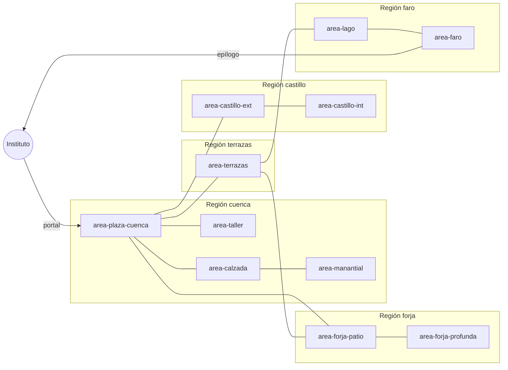

# Ohmdal Arco I — Room Graph (11 macroáreas)

> **Estado:** `CANON` (ratificado por `ADR-001`).
> **Generado:** 2026-08-17.
> **Acompaña:** `ARC1_SPATIAL_MAP.md`, `RECOVERY_AUDIT.md`, las 11
> fichas en `areas/`, y `ohmdal-arc-01_v1.md`.
>
> Este documento define el **grafo de áreas jugables** del Arco I. Es
> la fuente de verdad para:
> - qué áreas existen;
> - qué capítulos requieren qué áreas;
> - cómo se conectan (a pie, doorway, fade, cinematic);
> - qué locks las separan;
> - qué requisitos pedagógicos las abren;
> - qué caminos son opcionales.
>
> **NO** define la posición física (eso vive en
> `ARC1_SPATIAL_MAP.md`) ni el contenido narrativo de cada área
> (eso vive en `areas/<area>.md` y en `ohmdal-arc-01_v1.md`).

---

## 1. Convenciones del grafo

### 1.1 Tipos de conexión

| Tipo | Significado | Cuándo se usa |
|---|---|---|
| `walk` | El jugador camina dentro del mismo área. | Movimiento libre dentro de un área mayor que el viewport. |
| `doorway` | El jugador cruza un muro compartido entre dos chunks del mismo área. | Cuando un área se particiona internamente en technical chunks sin perder continuidad narrativa. |
| `fade` | Transición con fade corto (220–320 ms). | Cambio de interior ↔ exterior, o entrada a un interior del área. |
| `cinematic` | Transición con cinemática (3–7 s, sin input, con pan/audio). | Portal, puertas monumentales, cambios de distrito, WOW moments. |

> **Nota:** en versiones anteriores existía un tipo `locked` que
> representaba una conexión bloqueada. **Ya no existe como tipo
> separado.** Toda conexión bloqueada se modela como una
> arista de los tipos anteriores con un campo `Requires?` en la
> edge list canónica (§4). Si la conexión tiene un requisito, no
> cruza; si no, cruza. No hay ambigüedad entre "tipo" y "lock".

### 1.2 Identificadores

- `AreaId`: kebab-case del nombre de la macroárea. Ej.
  `area-castillo-ext`.
- `RegionId`: 5 regiones canónicas (`cuenca`, `castillo`, `forja`,
  `terrazas`, `faro`).
- `ChapterId`: prólogo, cap1, cap2, cap3, cap4, epílogo.

### 1.3 Símbolos en el grafo Mermaid

- `[]` macroárea principal
- `()` checkpoint narrativo (ej. despertar de Ohm, fin de puzzle)
- `{{}}` cinemática
- `[(Database)]` world state

---

## 2. Lista de las 11 macroáreas

| AreaId | Nombre | RegionId | Capítulo(s) | Salas originales que absorbe |
|---|---|---|---|---|
| `area-plaza-cuenca` | Plaza de Cuenca de Ohm | `cuenca` | Prólogo, Cap 1 | `plaza` (extendida: portal al sur, taller al este, puerta al norte, castillo al oeste, forja al sudoeste, terrazas al sur) |
| `area-taller` | Taller de Lumen | `cuenca` | Cap 1 | `taller` (interior) |
| `area-calzada` | Calzada y Puerta de Ohm | `cuenca` | Cap 1 | `puerta` (extendida: arco monumental + calzada + plaza alta) |
| `area-manantial` | Manantial de Ohm | `cuenca` | Cap 1 | `manantial_ohm` (extendida hacia arriba, escena icónica) |
| `area-castillo-ext` | Patio del Castillo de la Red | `castillo` | Cap 2 | `castle_gate` + `castle_gallery` (gran explanada) |
| `area-castillo-int` | Ramales y Corazón del Castillo | `castillo` | Cap 2 | `castle_branches` + `castle_heart` (interior del castillo) |
| `area-forja-patio` | Patio y Enfermería de la Forja | `forja` | Cap 3 | `forge_yard` + `forge_infirmary` (corredor industrial de entrada) |
| `area-forja-profunda` | Canal Largo y Nave de la Forja | `forja` | Cap 3 | `forge_longchannel` + `forge_hall` (corredor industrial profundo) |
| `area-terrazas` | Terrazas escalonadas | `terrazas` | Cap 3 | `terraces_top` + `terraces_mid` + `terraces_mural` + `terraces_aqueduct` (gran área vertical) |
| `area-lago` | Lago y Acueducto | `faro` | Cap 4 | (extensión sur de `terrazas_aqueduct` + nuevo sector del lago) |
| `area-faro` | Faro y Reloj | `faro` | Cap 4, Epílogo | `lighthouse_hall` + `lighthouse_bench` + `clock_tower` + `lighthouse_lantern` (complejo Faro) |

> **Nota sobre fusiones:**
> - Las **4 Terrazas** se fusionan en **1 área vertical**: el brief
>   lo permite y la experiencia mejora si la cámara puede bajar
>   continuamente por las terrazas.
> - Las **4 salas del Faro** se fusionan en **1 complejo**: el Faro
>   es el destino del Arco I, debe sentirse como un lugar, no como
>   4 pantallas.
> - La **Forja** se parte en **2 áreas** (Patio + Enfermería vs.
>   Canal Largo + Nave) para preservar el contraste
>   exterior/interior y el corredor industrial.

---

## 3. Mermaid — Grafo de áreas (vista topológica)

> El diagrama muestra la **conectividad** (qué área conecta con
> cuál). Los `Requires?` y `Cinematic?` por arista viven en la
> **edge list canónica del §4** (única fuente de verdad). El
> Mermaid **no** duplica esa información: hacerlo produciría
> contradicciones inevitables.



---

## 4. Edge list canónica (fuente única de verdad)

Esta es la **única** tabla de aristas del room graph. Reemplaza las
tablas separadas "siempre disponible" y "locked" que existían en
versiones anteriores. Cada arista declara opcionalmente un
`Requires?`; si está vacío, la conexión está siempre disponible
dado que el jugador esté en `From`. Cada arista puede declarar una
`Cinematic?` que se dispara la primera vez que se cruza en el
sentido indicado (o en ambos sentidos si se omite la flecha).

> **Convención importante sobre locks:** las áreas se desbloquean
> por **progreso narrativo acumulado** (flags globales en
> `state.flags` o región), no por puzzles internos. Por ejemplo,
> la entrada al Faro se desbloquea por `metFarero` (haber llegado
> al Lago y conocido a Nereo); los puzzles `clock` y
> `lighthouse` se resuelven **dentro** del Faro, no como
> prerrequisito de entrada. Cualquier intento de lockear un área
> por un puzzle que vive dentro de ella crea una dependencia
> circular y está prohibido.

| From | To | Type | Requires? | Cinematic? | Notas |
|---|---|---|---|---|---|
| `INSTITUTO` | `area-plaza-cuenca` | `cinematic` | — | `cinema.portal-arrival` (5–7 s) | pan S→N mostrando monolito, columnas, plaza, puerta al fondo |
| `area-plaza-cuenca` | `area-taller` | `fade` | — | — | doorway + fade 220 ms |
| `area-taller` | `area-plaza-cuenca` | `fade` | — | — | doorway + fade 220 ms |
| `area-plaza-cuenca` | `area-calzada` | `cinematic` (doorway monumental) | `ohmAwake` | `cinema.puerta-apertura` (3–4 s, primera vez post-unlock) | la Puerta monumental se abre tras el despertar de Ohm |
| `area-calzada` | `area-plaza-cuenca` | `cinematic` (doorway) | — | `cinema.puerta-apertura` (reverso, primera vez) | el regreso cinematográfico a la Plaza |
| `area-calzada` | `area-manantial` | `walk` | `puertaDone` | — | el agua del Manantial llega cuando la Calzada está abierta |
| `area-manantial` | `area-calzada` | `walk` | — | — | siempre, tras haber cruzado al menos una vez |
| `area-plaza-cuenca` | `area-castillo-ext` | `walk` | `puertaDone` | — | sin Calzada abierta, el Castillo no ha recibido el llamado |
| `area-castillo-ext` | `area-plaza-cuenca` | `walk` | — | — | siempre |
| `area-castillo-ext` | `area-castillo-int` | `fade` | — | — | doorway + fade 320 ms |
| `area-castillo-int` | `area-castillo-ext` | `fade` | — | — | idem |
| `area-plaza-cuenca` | `area-forja-patio` | `walk` | `castleRestored` | — | sin Castillo restaurado, la Forja no abre |
| `area-forja-patio` | `area-plaza-cuenca` | `walk` | — | — | siempre |
| `area-forja-patio` | `area-forja-profunda` | `walk` | — | — | cruzar el umbral del canal largo |
| `area-forja-profunda` | `area-forja-patio` | `walk` | — | — | idem |
| `area-plaza-cuenca` | `area-terrazas` | `walk` | `forgeRestored` | — | sin Forja restaurada, las Terrazas no abren |
| `area-terrazas` | `area-plaza-cuenca` | `walk` | — | — | siempre |
| `area-terrazas` | `area-forja-patio` | `walk` | — | — | descender por la pendiente oeste |
| `area-forja-patio` | `area-terrazas` | `walk` | — | — | ascender al este |
| `area-terrazas` | `area-lago` | `walk` | `valleyRestored` | — | sin Valle restaurado, el acueducto no tiene caudal y el Lago no abre |
| `area-lago` | `area-terrazas` | `walk` | — | — | siempre |
| `area-lago` | `area-faro` | `walk` | `metFarero` | `cinema.faro-reveal` (4–5 s, primera vez) | el Faro aparece por primera vez como destino al caminar por la costa. La cinemática se dispara **una sola vez** la primera vez que se cruza esta arista, y se omite en backtracking y revisitas. |
| `area-faro` | `area-lago` | `walk` | — | — | volver al muelle; sin cinemática de regreso |
| `area-faro` | epílogo | `cinematic` | `lighthouseRestored` | `cinema.faro-closing` (5–7 s) | Edda enseña a otra persona; el protagonista se va. **`lighthouseRestored` se setea DENTRO del Faro** (tras resolver `clock` + `lighthouse`), no es lock de entrada. |
| epílogo | `INSTITUTO` | `cinematic` | — | `cinema.instituto-return` (5–7 s) | el Instituto recuerda la partida |

### 4.2 Conexiones opcionales (backtracking)

| From | To | Notas |
|---|---|---|
| `area-forja-patio` | `area-terrazas` | revisita tras estabilizar la Forja |
| `area-faro` | `area-plaza-cuenca` | revisita: el Faro muestra la Plaza lejana al fondo (skyline) |
| Cualquier área | `area-plaza-cuenca` | revisita: el landmark del Portal es visible desde Terrazas, Forja y Castillo |
| `area-faro` | (cinematic-back) | opcional: cuando el Faro se restaura, aparece un ferry diegético al lago |

> Las conexiones opcionales **no son edges primarios**: no son
> parte del grafo de jugabilidad, no se testean en el critical
> path, y pueden existir o no según el playthrough.

---

## 5. World state por región

Cada región transita por 3 estados canónicos. Las áreas de una región
reflejan visualmente el estado de su región.

| Region | Estado inicial | `→ INTERVENTION` cuando… | `→ UNDERSTOOD` cuando… |
|---|---|---|---|
| `cuenca` | `DETERIORATED` (Portal apagado, cables sucios, sin agua) | `metLumen` (jugador llega al Taller) | `puertaDone` (Puerta abierta) **Y** `ohmAwake` (Ohm despierto) |
| `castillo` | `DETERIORATED` (rejas cerradas, Consejera en espera) | `enteredCastle` (jugador cruza la reja del Castillo) | `castleRestored` (repartidor calibrado) |
| `forja` | `DETERIORATED` (frío, sin producción) | `metForjadora` (jugador llega al Patio de la Forja) | `forgeRestored` (red de la forja completa) |
| `terrazas` | `DETERIORATED` (resecas, sin agua) | `metGuardiana` (jugador entra a Terrazas) | `valleyRestored` (riego y compuertas calibradas) |
| `faro` | `DETERIORATED` (lente apagada, sin señal) | `metFarero` (jugador llega al Lago y conoce a Nereo) | `lighthouseRestored` (Faro calibrado, lens encendida) |

**No hay lock circular.** `metFarero` se setea la primera vez que el
jugador llega al Lago, **antes** de entrar al Faro; por eso puede ser
requisito de la arista `area-lago → area-faro`. En cambio,
`lighthouseRestored` requiere haber resuelto `clock` y `lighthouse`
**dentro** del Faro, y por eso no es lock de entrada al Faro sino
requisito de la arista `area-faro → epílogo`. `solvedLighthouse`
(mencionado en `state.flags`) es un flag interno que se setea al
cerrar el puzzle `lighthouse` y forma parte de la cadena que lleva a
`lighthouseRestored`.

Cuando una región pasa a `UNDERSTOOD`:

- Los NPC de la región adoptan nuevas rutinas (no quedan estáticos).
- Los paths y diálogos cambian.
- La música de la región evoluciona (un cue más vivo).
- Aparecen documentos / esquemas en escena.
- Las máquinas de la región operan por sí solas (sin el
  protagonista).
- La revisita a la región **muestra** ese estado, no vuelve al
  inicial.

---

## 6. Critical path Portal → Faro

El camino mínimo jugable, en orden narrativo, es:

```text
1. area-plaza-cuenca          (Prólogo: llegada, Edda, Ohm)
2. area-taller                (Cap 1: Lumen, diagnóstico)
3. area-plaza-cuenca          (vuelta con Lumen)
4. area-calzada               (Cap 1: Puerta de Ohm, mecanismo)
5. area-manantial             (Cap 1: Manantial, formalización)
6. area-castillo-ext          (Cap 2: Consejera, primer cruce)
7. area-castillo-int          (Cap 2: Ramales, Corazón)
8. area-castillo-ext          (vuelta)
9. area-forja-patio           (Cap 3: Yesca, Forja Patio)
10. area-forja-profunda       (Cap 3: Canal Largo, Nave)
11. area-forja-patio          (vuelta)
12. area-terrazas             (Cap 3: Vega, Guardiana, riego)
13. area-lago                 (Cap 4: Nereo, costa, lago)
14. area-faro                 (Cap 4: Faro, calibración, lente)
15. (Epílogo)                 (Faro: Edda enseña)
16. cinematic-portal-return   (regreso al Instituto)
```

Este camino es lo que el test `r4-arc1-critical-path.test.ts` debe
verificar de punta a punta, **sin considerar locks por flags**
(los locks se verifican por separado).

---

## 7. Caminos opcionales (no críticos)

- **Backtracking a la Plaza**: el jugador puede volver a la Plaza
  desde cualquier distrito (los retornos son `walk` puro, sin
  cinematic).
- **Skipping del Taller**: si el jugador entra a la Calzada sin
  haber ido al Taller, la Puerta de Ohm no se abre (lock
  pedagógico, no bypass). La cinematic `puerta-apertura` no
  dispara si la puerta sigue sellada.
- **Sendero al Faro desde el Lago**: el Faro es accesible al
  caminar por la costa desde el Lago. La cinematic
  `cinema.faro-reveal` solo dispara la **primera vez** que se
  cruza la arista `area-lago → area-faro`; en backtracking y
  revisitas se omite.
- **Cinematic-back del Faro**: opcional; cuando el Faro se
  restaura, aparece un ferry diegético al Lago.

---

## 8. NPCs recurrentes (a través de las áreas)

Los NPCs con persistencia (`actorKey`) son:

| Actor | Aparece en… | Sale cuando… |
|---|---|---|
| `edda` | todas las áreas con `actorFitsNarrativeStage('edda', id)` | nunca (sale solo si el actor no encaja narrativamente) |
| `lumen` | Cuenca + Forja + Castillo según stage | nunca |
| `ohm` (companion, no pedestal) | todas las áreas desde `ohmAwake` | nunca |
| `consejera` | Castillo (gate, gallery, heart) | después de `castleRestored` |
| `guardiana` | Terrazas | después de `valleyRestored` |
| `forjadora` | Forja (yard, infirmary, longchannel, hall) | después de `forgeRestored` |
| `farero` | Faro (hall, bench, clock_tower, lantern) | después de `lighthouseRestored` |

Las áreas ya existentes en `rooms.ts` declaran sus NPC como
`thing`s con prefijos (`edda-...`, `lumen-...`, etc.); el
`actorKey()` del runtime los consolida para evitar duplicados.

---

## 9. Puzzles por área (resumen; los modelos puros viven en `src/puzzles/`)

| Área | Puzzles |
|---|---|
| `area-plaza-cuenca` | Despertar de Ohm (`despertar`), Banco de Lumen en Plaza (referencia), Diagnóstico inicial |
| `area-taller` | Diagnóstico de Lumen (`freno`), Banco del Taller (`frenoModel` + medición) |
| `area-calzada` | Mecanismo de la Puerta de Ohm (`puerta`), Piedra de Freno (`puerta` + `frenoModel`) |
| `area-manantial` | Manantial: distribución y proporción (`bell`) |
| `area-castillo-ext` | Cadena de la Galería (`chain`), Puertas del Castillo |
| `area-castillo-int` | Ramales (`branches`), Repartidor (`distributor`), Banco de Cadena |
| `area-forja-patio` | Timbre (`timbre`), Calor del Patio (`warmth`), Fusibles de la Enfermería (`infirmary`) |
| `area-forja-profunda` | Canal Largo (`longchannel`), Forja completa (`forge`) |
| `area-terrazas` | Escalones (`steps`), Reparto (`fairsplit`), Piedra Única (`singlestone`), Escalera (`ladder`) |
| `area-lago` | Chispa almacenada (`storedspark`), Río durmiente (`sleepingriver`) |
| `area-faro` | Reloj (`clock`), Faro (`lighthouse`) |

---

## 10. Render mode y cinemáticas por área

> **Convención.** Cada área declara dos campos de render
> independientes:
> - **`currentRenderMode`**: el modo que el **runtime** debe
>   producir **en esta fase** (H2-H7 greybox). En esta fase es
>   siempre `GREYBOX` salvo que el área ya tenga arte PAINTED
>   utilizable (Taller).
> - **`targetArtMode`**: el modo artístico al que el área debería
>   migrar cuando exista el arte (H8). Puede ser `PAINTED` (fondo
>   pintado existente reutilizable, o a producir), `HYBRID` (fondo
>   nuevo + props spawneados), o `GREYBOX` (el área se queda en
>   greybox por decisión de diseño, p. ej. el Lago hasta que haya
>   arte específico).

| Área | `currentRenderMode` (H2-H7) | `targetArtMode` (H8+) | Cinemática de entrada | Cinemática de salida |
|---|---|---|---|---|
| `area-plaza-cuenca` | `GREYBOX` | `HYBRID` | `cinema.portal-arrival` (primera vez) | — |
| `area-taller` | `PAINTED` (reutiliza 960×540 existente) | `PAINTED` | `cinematic-corta` (doorway) | `cinematic-corta` (doorway) |
| `area-calzada` | `GREYBOX` | `HYBRID` | `cinema.puerta-apertura` (primera vez post-unlock) | — |
| `area-manantial` | `GREYBOX` | `HYBRID` | — | — |
| `area-castillo-ext` | `GREYBOX` | `HYBRID` | — | — |
| `area-castillo-int` | `GREYBOX` | `PAINTED` (interior cerrado) | `cinematic-corta` (doorway) | `cinematic-corta` (doorway) |
| `area-forja-patio` | `GREYBOX` | `HYBRID` | — | — |
| `area-forja-profunda` | `GREYBOX` | `HYBRID` | — | — |
| `area-terrazas` | `GREYBOX` | `HYBRID` | — | — |
| `area-lago` | `GREYBOX` | `GREYBOX` (sin arte plan) | — | `cinema.faro-reveal` (1ª vez que se cruza `area-lago → area-faro`) |
| `area-faro` | `GREYBOX` | `HYBRID` | — | `cinema.faro-closing` (al epílogo) |

> Las cinematics de la fase 1 de este refactor son **placeholders**
> (texto en pantalla + fade + cámara + audio). Los videos finales
> se producen en H5 (después de validar greybox).

> **Detalle sobre `cinema.faro-reveal`:** se dispara **una sola
> vez** sobre la arista `area-lago → area-faro` la primera vez que
> el jugador cruza del Lago al Faro. **No** se dispara en
> `area-terrazas → area-faro`: desde Terrazas el Faro sólo se
> insinúa en la distancia (skyline, audio lejano). Quien baja de
> Terrazas al Lago y luego camina hasta el Faro recibe el reveal
> en el segundo tramo.

### 10.1 Cinemáticas in-area (no son edges)

Además de las cinemáticas de transición listadas arriba (§4.1,
columna `Cinematic?`), existen **cinemáticas que se disparan
dentro de un área** al completarse un puzzle o al cumplirse un
trigger narrativo. Estas NO son edges: no cambian de área, sólo
producen un momento hero local. Su contrato es:

- `commit world state` antes de iniciar;
- `lock input` durante la cinemática;
- `play` (placeholder en H2-H7);
- `load resulting state` (las flags ya están commiteadas);
- `restore input` al terminar;
- `skip` obligatorio (Esc / Space);
- `fallback` obligatorio (si el video falla, banner + audio + cámara).

Lista canónica de cinemáticas in-area del Arco I:

| Hook | Área | Trigger narrativo | Notas |
|---|---|---|---|
| `cinema.awakening` | `area-plaza-cuenca` | puzzle `despertar` completado | flash + chispas + zoom; reencarna `playAwakening` |
| `cinema.lumen-diagnosis` | `area-taller` | puzzle `freno` resuelto (futuro, H3+) | banner + audio del Taller |
| `cinema.puerta-apertura` (in-area) | `area-calzada` | puzzle `puerta` resuelto (variante local, además de la edge cinemática) | refuerza el WOW del primer cruce |
| `cinema.manantial-cierre` | `area-manantial` | puzzle `bell` resuelto (futuro, H3+) | banner + vista panorámica + audio |
| `cinema.forge-hearth-on` | `area-forja-profunda` | puzzle `forge` resuelto (futuro, H3+) | banner + brasas + audio |
| `cinema.faro-closing` (in-area) | `area-faro` | `lighthouseRestored` (variante local, además de la edge cinemática) | Edda enseña a otra persona dentro del Faro |

> Las **cinemáticas in-area** se documentan aquí como contrato,
> pero su implementación de detalle (duración, contenido del
> placeholder, assets) vive en cada ficha de área. La lista de
> este §10.1 es la **fuente de verdad** de qué hooks existen;
> las fichas pueden describir el contenido pero no declarar
> hooks nuevos sin actualizar este §10.1.

---

## 11. Validación automática

El room graph debe poder validarse mediante tests Node sin tocar
Phaser:

- `r0-areas-graph.test.ts`:
  - 11 áreas únicas (sin colisiones de ID).
  - Cada `chapter` referencia al menos un área.
  - Todas las aristas `From → To` apuntan a áreas que existen.
  - El critical path Portal → Faro es alcanzable (todas las
    aristas transitivas existen y sus locks no son imposibles).
  - No hay aristas que apunten a áreas inexistentes.
  - No hay áreas huérfanas (toda área no-Prólogo/Epílogo tiene al
    menos una arista de entrada).
  - Los locks están justificados por flags existentes en
    `state.flags` o son derivables.
  - **No-circularidad de locks**: para cada arista `From → To` con
    `Requires? = R`, el flag `R` no se setea **dentro** de `To`
    (es decir, ningún puzzle cuyo resultado setea `R` vive en
    `To`). Esto se valida mediante una tabla estática
    `puzzle-resolves-flag` mantenida junto al runtime.
  - **No-duplicación**: la edge list es la única fuente de verdad;
    no se mantienen tablas separadas por tipo de conexión.
  - **In-area cinematics coherentes**: cada hook de cinemática
    in-area referenciado en una ficha existe en el §10.1; cada
    hook del §10.1 está documentado en al menos una ficha.
- `r1-region-states.test.ts`:
  - 5 regiones, 3 estados cada una (15 combinaciones).
  - Las transiciones DETERIORATED → INTERVENTION → UNDERSTOOD
    son monótonas (no hay saltos hacia atrás).
  - El estado inicial es siempre DETERIORATED.
  - El estado UNDERSTOOD implica la bandera de progreso
    correspondiente.
- `r4-arc1-critical-path.test.ts`:
  - El camino de 16 pasos del §6 es alcanzable.
  - Las transiciones de entrada/salida existen en el grafo.

---

## 12. Cambios futuros (no en este paquete)

- Las 11 macroáreas se pueden reagrupar o renombrar si la
  jugabilidad lo exige; eso requiere un ADR nuevo.
- La lista de locks puede crecer con un nuevo flag sin romper el
  contrato (los locks son `name → flag`).
- Las cinematics de placeholder se reemplazan por videos HD en H5.
- El árbol `src/hd2d-ohmdal/` puede volver a ser producción sólo
  mediante un ADR nuevo que reabra el debate (ver `ADR-001` §8).

---

## 13. Referencias

- `ADR-001-phaser-multiarea-arc1.md` — decisión de governance.
- `ARC1_SPATIAL_MAP.md` — posiciones y dimensiones de las
  regiones.
- `RECOVERY_AUDIT.md` — auditoría del runtime.
- `areas/*.md` — 11 fichas de macroárea.
- `docs/20-worlds/ohmdal/content/ohmdal-arc-01_v1.md` —
  contenido del Arco I (vigente).
- `docs/20-worlds/ohmdal/world/ohmdal-world-structure_v1.md` —
  estructura de mundo (vigente como input conceptual).
