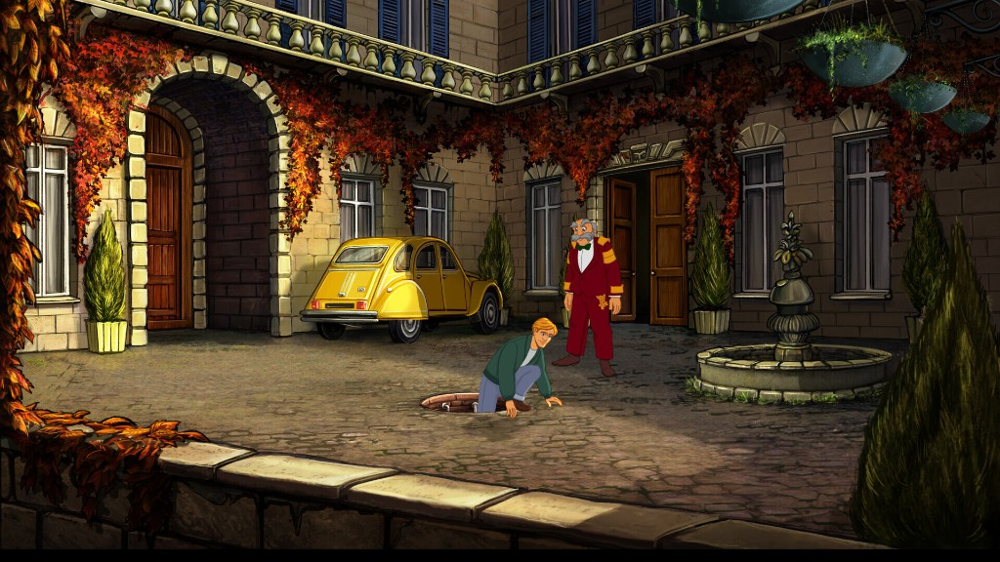
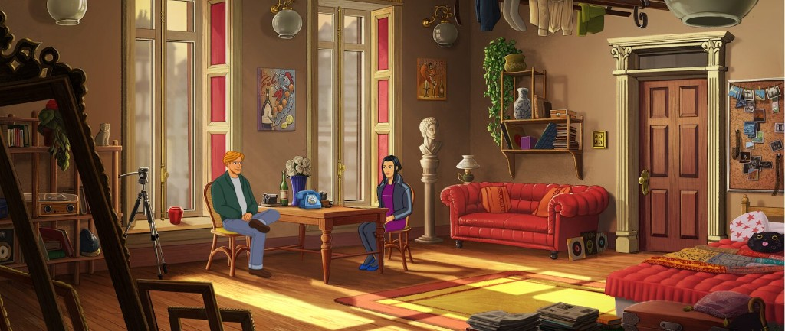
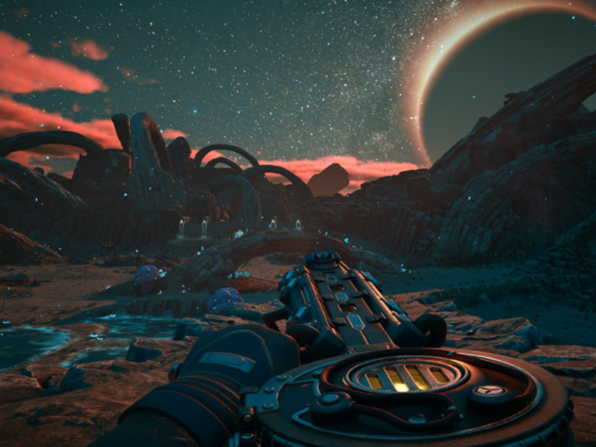
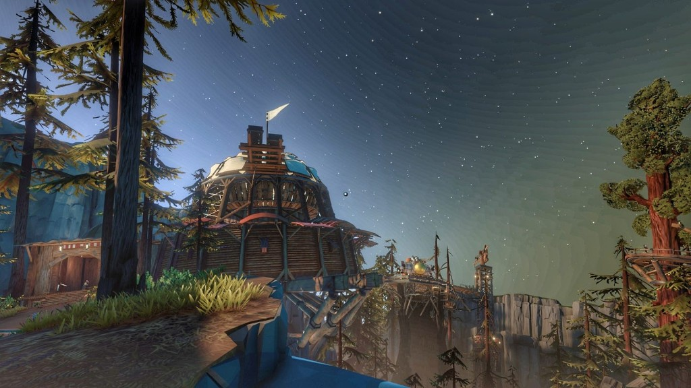
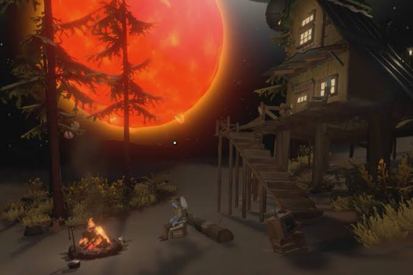
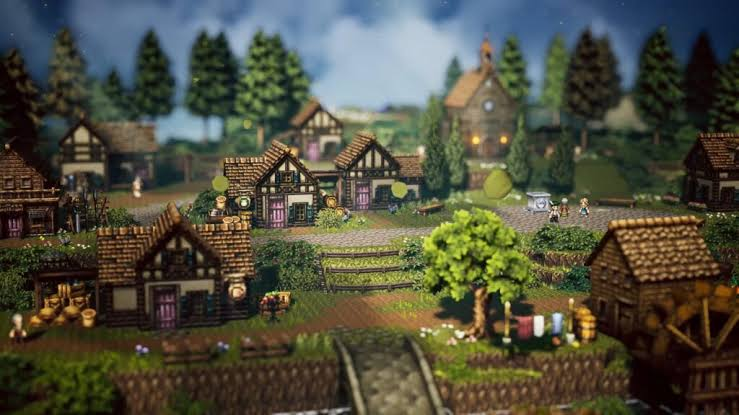
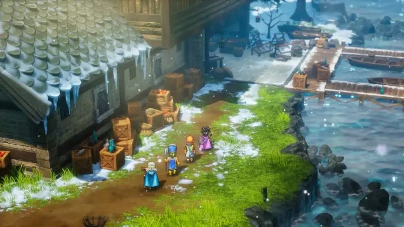
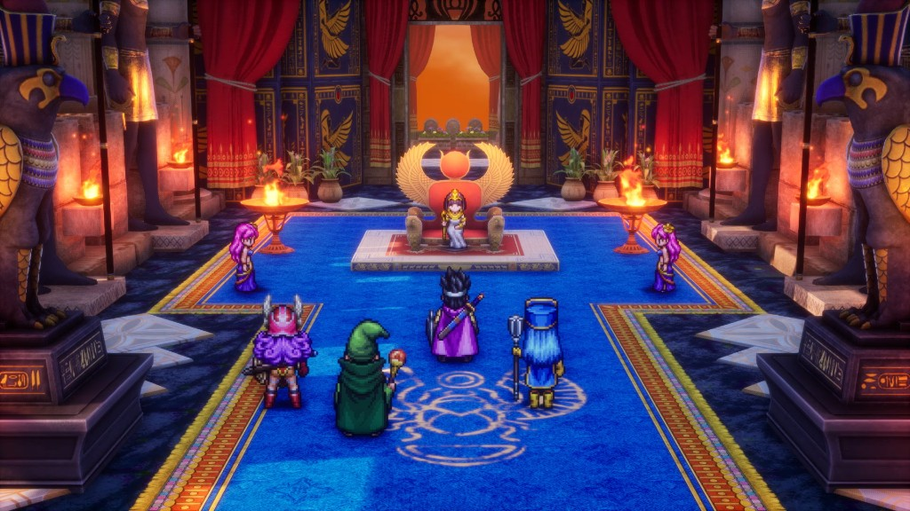
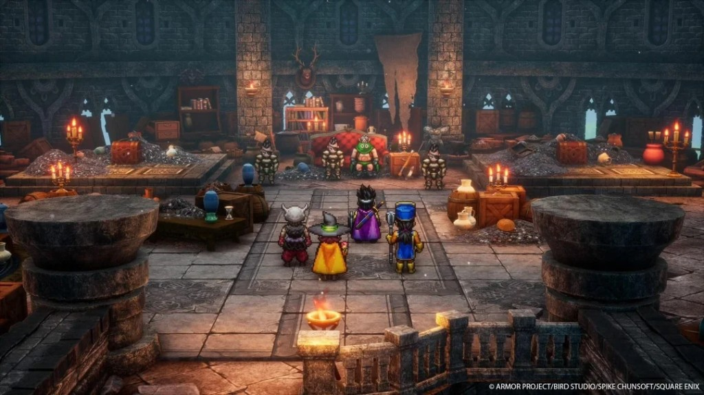

# Referencias y evidencia

## Aviso de procedencia

Las nueve imágenes fueron aportadas por Manuel como referencias visuales. Se copiaron a `refs/` para que el spike sea autocontenido. **No son arte original de Proyecto Roxana**, no se propone distribuirlas como assets del juego y su presencia no acredita derechos de reutilización comercial. Antes de cualquier uso más allá de investigación interna se debe identificar autor, obra y licencia.

## Lectura de las nueve imágenes

### 01 — Patio pintado

- Composición lateral clara, foreground que enmarca y profundidad sin ruido.
- Arquitectura detallada pero agrupada en masas.
- Personajes legibles por silueta y color.
- El patio invita a examinar suelo, puertas, fuente, vehículo y vegetación.
- Aporta el ideal de “cuadro explorable”, no una obligación de usar fondos fijos.

### 02 — Interior pintado y vivido

- El carácter del lugar surge de objetos cotidianos: ropa, libros, fotos, discos, plantas y muebles.
- Luz cálida que organiza la atención.
- Conversación integrada al espacio, sin escenario vacío.
- La lección para Ohmdal es que cada taller debe contar quién lo usa antes de que alguien hable.

### 03 — Paisaje nocturno con dispositivo

- La herramienta en primer plano convierte mirar en investigar.
- La escala y el cielo crean una pregunta antes que un objetivo textual.
- Contraste coral/cian muy fuerte y tecnología físicamente presente.
- Inspira el acercamiento de medición, no la estética futurista literal.

### 04 — Observatorio estilizado

- Arquitectura ensamblada, reparable y con silueta memorable.
- Geometría contenida que obtiene riqueza de luz, atmósfera y materiales.
- Camino, altura y landmark invitan a caminar.
- Es la evidencia visual más directa a favor de volumen estilizado sostenible.

### 05 — Fogata, casa y tecnología rústica

- Refugio íntimo frente a escala cósmica.
- Máquina y fogata conviven sin competir.
- La tecnología parece parte de una vida, no una interfaz flotante.
- La paleta nocturna concentra calidez en relaciones y uso.

### 06 — Aldea diorama

- Lectura inmediata de senderos, casas y agrupaciones.
- Escala de maqueta agradable y controlable.
- Vegetación y clutter construyen abundancia.
- Riesgo: figuras demasiado pequeñas para que manos e instrumentos enseñen.

### 07 — Muelles nevados

- Clima que transforma una paleta sin destruir legibilidad.
- Costas, cajas, muelles y edificios describen actividad.
- Profundidad suficiente para invitar a bordear y descubrir.
- Muestra cómo un territorio puede diferenciarse con estado ambiental, no con otro lenguaje artístico.

### 08 — Salón ceremonial

- Eje visual fuerte, simetría, color ritual y personajes separados del fondo.
- Monumentalidad contenida en un encuadre legible.
- Para Ohmdal sugiere espacios donde procedimiento y autoridad se ven en arquitectura.
- Riesgo: leer el proyecto como JRPG de grupo y combate; la dirección recomendada no adopta esa estructura.

### 09 — Salón de piedra y tesoro

- Calidez localizada dentro de piedra fría.
- Clutter material agrupado por función.
- El lugar se siente antiguo, usado y reparado.
- Inspira densidad selectiva y contraste de escalas, no acumulación de loot.

## Síntesis transversal

Lo común no es una técnica:

1. **Composición:** cada imagen tiene una lectura inicial clara y detalles secundarios.
2. **Diorama:** los lugares parecen completos pero acotados; se intuye cómo se habitan.
3. **Clutter con vida:** los objetos hablan de oficio, rutina y pasado.
4. **Luz narrativa:** calor/frío, actividad/silencio y refugio/misterio.
5. **Figura legible:** personajes y herramienta se separan del entorno.
6. **Tecnología incorporada:** observatorio, dispositivo y monitor pertenecen a sus lugares.
7. **Promesa de exploración:** puerta, sendero, horizonte, muelle, nivel superior o punto de luz.

Por eso la dirección propone una ilustración habitable en volumen, no un collage de rasgos.

## Fuentes de diseño

### Curiosidad y conocimiento como progresión

- Kelsey Beachum, **“Sparking Curiosity-Driven Exploration Through Narrative in Outer Wilds”**, GDC 2021: curiosidad como fuerza motriz, conocimiento como recompensa y preguntas físicas antes que texto.  
  https://gdcvault.com/play/1027008/Independent-Games-Summit-Sparking-Curiosity  
  Slides: https://ubm-twvideo01.s3.amazonaws.com/o1/vault/GDC+2021/beachum_gdc_2021(1).pdf
- Alex Beachum, tesis de *Outer Wilds*: puntos de interés como pistas espaciales y acceso posible por comprensión, no por propiedad de una llave.  
  https://sbekumod.github.io/Assets/OWtesi.pdf
- Game Developer, síntesis del talk: los procesos físicos memorables atraen primero; el texto profundiza cuando el jugador busca información.  
  https://www.gamedeveloper.com/business/explaining-the-value-of-show-don-t-tell-storytelling-in-i-outer-wilds-i-
- Andrew Shouldice sobre *Tunic*: una página misteriosa puede enseñar sin la intrusión de un tutorial modal; la información crítica recibe más claridad que los secretos opcionales.  
  https://www.gamedeveloper.com/business/how-tunic-weaves-wondrous-unknowable-worlds-inspired-by-inscrutable-nes-manuals
- GDC 2023, **“TUNIC: This Was Here the Whole Time”**: los secretos como cabos sueltos que sostienen curiosidad.  
  https://gdconf.com/article/unlock-the-secrets-of-tunic-in-this-gdc-2023-design-session/
- Billy Basso sobre *Animal Well*: capas de descubrimiento para perfiles distintos y cientos de hechos pequeños que construyen un mapa mental.  
  https://thinkygames.com/features/interview-how-animal-well-is-using-secrets-and-mysteries-to-be-a-different-kind-of-metroidvania/
- Game Developer sobre *Animal Well*: exploración y secretos sin depender de combate; las restricciones visuales se convierten en identidad.  
  https://www.gamedeveloper.com/design/why-animal-well-s-home-brewed-engine-was-key-to-its-success

**Aplicación a Ohmdal:** cada lugar necesita una pregunta visible, una recompensa de conocimiento y un “cabo suelto” hacia otra instalación. La Bitácora organiza lo descubierto; no reemplaza descubrir.

### Deducción, lenguaje y mundo coherente

- Jon Ingold sobre *Heaven’s Vault*: las inscripciones funcionan porque son puzzle y acto narrativo escrito por alguien con un propósito; el juego evita XP y une descubrimientos por coherencia.  
  https://archaeogaming.wordpress.com/2019/01/25/an-interview-with-jon-ingold-of-heavens-vault/
- Inkle, diseño del lenguaje de *Heaven’s Vault*: no confirmar enseguida evita fuerza bruta y obliga a leer el sistema completo.  
  https://www.gamedeveloper.com/business/road-to-the-igf-inkle-s-i-heaven-s-vault-i-
- Rundisc sobre *Chants of Sennaar*: lenguaje “vivo” aprendido observando hablantes y cultura; coherencia entre objetos, personajes y lugares.  
  https://berkeleyhistoricalsociety.org/chants-of-sennaar-creator/
- Entrevista a Rundisc: cada cultura se diseñó desde valores, arquitectura y relaciones antes de convertirla en lenguaje jugable.  
  https://www.pockettactics.com/chants-of-sennaar/interview
- Lucas Pope sobre *Return of the Obra Dinn*: una mecánica central rígida y simple puede sostener una deducción amplia; el libro se convirtió en herramienta de síntesis para complejidad no lineal.  
  https://www.gamedeveloper.com/design/for-lucas-pope-i-return-of-the-obra-dinn-i-was-a-bunch-of-appealing-design-problems
- Lucas Pope, Road to the IGF: estructurar información por descubrimiento y usar una metáfora familiar de libro para que el jugador organice hechos.  
  https://www.gamedeveloper.com/business/road-to-the-igf-lucas-pope-s-i-return-of-the-obra-dinn-i-

**Aplicación:** los rituales de Ohmdal deben proceder de usos y evidencias locales. La Bitácora registra hipótesis provisionalmente; la comunidad y la infraestructura son parte del contenido, no envoltorio.

### Enseñar reglas sin examen

- Comentarios de desarrollo de *Portal*: introducir conceptos en aislamiento, luego combinarlos; el playtest muestra dónde la señal visual no alcanza.  
  https://theportalwiki.com/wiki/Portal_developer_commentary
- Kim Swift y Jeep Barnett: entrenamiento deliberado y playtesting desde los primeros días para encontrar el momento donde el jugador “conecta” el concepto.  
  https://www.rockpapershotgun.com/rps-interview-portals-kim-swift-and-jeep-barnett
- Jonathan Blow sobre *The Witness*: el puzzle contiene la información necesaria y el conocimiento acumulado es la llave.  
  https://www.polygon.com/e3-2014/2014/6/11/5800968/the-witness-jonathan-blow-design-e3-2014/
- Arvi Teikari, *Baba Is You*: poner reglas en manos del jugador y diseñar alrededor de interacciones que producen sorpresa comprensible.  
  https://www.gamedeveloper.com/design/designing-i-baba-is-you-i-s-delightfully-innovative-rule-writing-system
- Zach Barth y Matthew Burns, *Opus Magnum*: toolset mínimo expresivo, objetivos por condición y soluciones que el equipo no anticipó; optimizar es opcional.  
  https://www.gamedeveloper.com/business/road-to-the-igf-zachtronics-i-opus-magnum-i-
- *Kerbal Space Program*: simplificar física lo suficiente para entrar sin abandonar fidelidad material; experimentar, fallar y volver a probar es el aprendizaje.  
  https://link.springer.com/chapter/10.1007/978-3-030-22602-2_24
- Steel Crate Games, *Keep Talking and Nobody Explodes*: una regla rectora (“promover comunicación interesante”) permitió cortar incluso features divertidas que desviaban el núcleo.  
  https://allenwp.com/blog/2023/03/01/cutting-features-that-were-too-fun-in-keep-talking-and-nobody-explodes/

**Aplicación:** la regla rectora es “promover investigación eléctrica interesante”. Todo sistema que no haga mirar, predecir, conectar, medir o comparar es secundario.

### Exploración no violenta y tendencia cozy

- Jenova Chen, **“Designing Journey”**, GDC 2013: diseñar un arco emocional sin depender de logros ni fantasía de poder; coherencia por sustracción.  
  https://gdcvault.com/play/1018751/Designing
- *Keeper* (2025): aventura breve sin combate, muerte, grind ni árbol de habilidades; misterio, paisaje y experimentación como impulso.  
  https://www.polygon.com/keeper-interview-double-fine-lee-petty/
- The Guardian (2025): crecimiento sostenido de la etiqueta cozy y ampliación más allá de granjas hacia experiencias no violentas y emocionalmente seguras.  
  https://www.theguardian.com/games/2025/jul/10/cosy-video-games-non-violent-cooking-farming-cozy

**Cautela:** “cozy” no debe convertir Ohmdal en una experiencia sin conflicto intelectual. Se toma baja presión, calidez y cuidado comunitario; se mantiene la fricción de hipótesis incompatibles y sistemas que exigen comprender.

### Dirección visual para equipos pequeños

- System Era, **The Art of Astroneer**: un equipo pequeño eligió baja complejidad para reducir overhead sin renunciar a una declaración visual fuerte.  
  https://blog.astroneer.space/p/the-art-of-astroneer-low-poly/
- Shedworks, GDC 2022 sobre *Sable*: estilo rápido de iterar y consistente; iluminación, niebla y líneas recuperan profundidad y legibilidad.  
  https://www.gamedeveloper.com/marketing/how-shedworks-refined-the-art-of-sable-in-pursuit-of-readability
- *Shumi Come Home*: subir el detalle de una pieza produce un efecto dominó; claridad y balance de detalle deben fijarse temprano.  
  https://www.gamedeveloper.com/art/deep-dive-cultivating-the-soft-art-of-shumi-come-home
- *Voyage*: el equipo prototipó el pipeline visual durante dos semanas para estimar coste y problemas antes de producir.  
  https://www.gamedeveloper.com/design/q-a-hand-painting-the-unfamiliar-and-unforgettable-world-of-i-voyage-i-
- *Candle*: cuatro años y un pipeline intensivo ilustran que “2D pintado” no equivale automáticamente a barato.  
  https://www.killscreen.com/making-candle-watercolor-adventure-game/
- Producción HD-2D de *Octopath Traveler*: la unión de sprites, volumen, iluminación y sombras exigió iteración específica incluso con un equipo técnico experimentado.  
  https://www.unrealengine.com/en-US/spotlights/octopath-traveler-s-hd-2d-art-style-and-story-make-for-a-jrpg-dream-come-true
- Entrevista de *Dragon Quest III HD-2D Remake* (2024): la profundidad de campo puede perjudicar legibilidad si se trata como firma automática.  
  https://blog.playstation.com/2024/11/08/dragon-quest-iii-hd-2d-remake-interview-how-the-classic-rpg-was-revamped-for-its-ps5-debut/

**Aplicación:** elegir restricciones antes que “calidad máxima”, probar el pipeline con un lugar real y medir el segundo lugar, donde la reutilización demuestra o refuta la apuesta.

### Interfaz y herramientas diegéticas

- Game Developer, diegesis: una interfaz del mundo aumenta inmersión cuando coincide con ficción y conserva usabilidad.  
  https://www.gamedeveloper.com/design/diegesis-and-designing-for-immersion
- Dino Ignacio sobre *Dead Space*: la interfaz diegética puede estructurar personaje, cámara y presentación, pero exige compromisos de diseño.  
  https://www.polygon.com/2013/3/31/4166250/dead-space-user-interface-gdc-2013/

**Aplicación:** Ohm como instrumento visible une personaje, medición y ficción. La accesibilidad tiene prioridad: ampliación, subtítulos y contraste no deben ocultarse por pureza diegética.

## Conclusión de la investigación

Los referentes convergen en cinco patrones:

1. La curiosidad necesita preguntas físicas y cabos sueltos, no sólo libertad de movimiento.
2. El conocimiento progresa mejor cuando modifica cómo se lee un lugar.
3. La enseñanza eficaz aísla una relación, permite experimentar y luego exige transferencia.
4. Una herramienta diegética puede unir interfaz, personaje y acción si sigue siendo legible.
5. Para un equipo pequeño, la consistencia nace de restricciones y pipeline validado; la técnica “nostálgica” o “simple” también puede ser cara.

La dirección recomendada se deriva de esos patrones y de la síntesis visual, no de una preferencia tecnológica previa.

