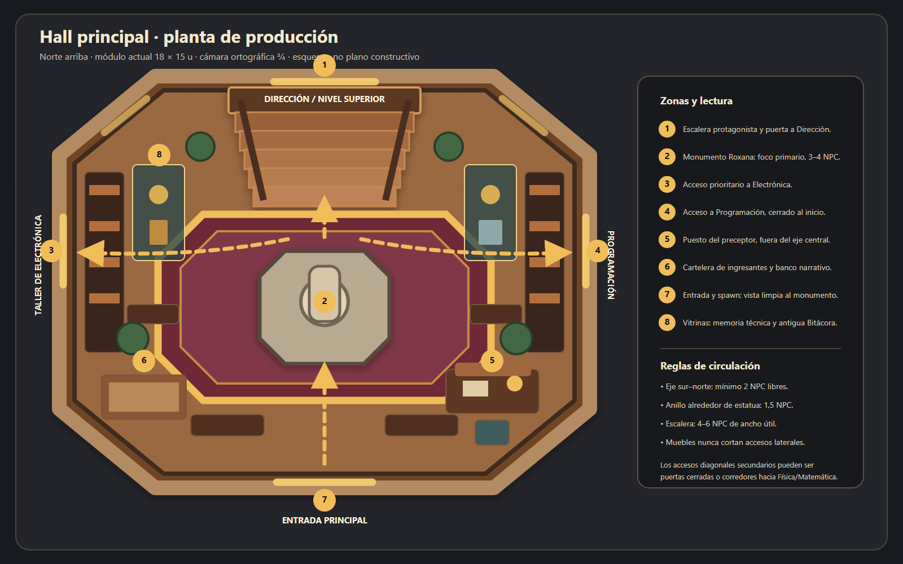
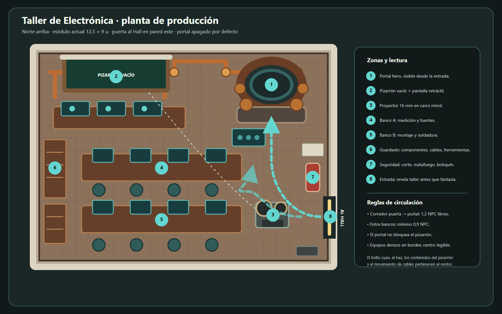

# Instituto Roxana — Hall y Taller de Electrónica

**Estado:** producción P3 — planta modular validada y salas hero  
**Fecha:** 2026-07-26  
**Referencia visual:** diorama escolar provisto por Dirección  
**Fuente de planta:** `scripts/blender/school_plan.py`  
**Fuente 3D actual:** `scripts/blender/build_school.py`  
**Escala de referencia:** 1 NPC adulto ≈ 1,75 unidades Blender

## Estado de producción — lote P1

**Implementado el 2026-07-25** en el generador Blender y exportado al runtime:

- Hall: umbrales laterales, vitrinas técnicas, murales, apliques, cartelera,
  bancos, puesto del preceptor, papelería, llaves y flor seca del monumento.
- Taller: bancos desplazados, ocho banquetas, instrumentos, placas de práctica,
  frascos, armarios, herramientas, red de cobre, seguridad, proyector 16 mm,
  consola y portal compuesto.
- Estado: el portal queda quieto y atenuado para una partida sin progreso; se
  anima en el runtime cuando Electrónica está en curso o completada.
- Salidas: `assets/school3d/instituto-roxana.blend`,
  `assets/school3d/instituto-roxana.glb`, `school-preview.png`,
  `hall-production-preview.png` y `electronics-production-preview.png`.

Este lote cubre arquitectura, hero props y mobiliario identitario. El clutter
fino que no cambia la lectura queda para P2 después de aprobación visual.

## Corrección estructural — lote P2

La primera exportación conservaba una grilla de campus de cuatro filas y dos
escalas no uniformes en el runtime. Eso achataba los muros y convertía las
salas en franjas. La composición vigente reemplaza esa base:

- Hall ortogonal de **20 × 22 u**, con medallón octogonal interior.
- Ocho masas principales: Matemática, Dirección, Física, Electrónica, Hall,
  Programación, Preceptoría y Visitantes.
- Audiovisual, Biblioteca y Logros pasan a umbrales interiores navegables del
  Hall; no agregan tres cajas al contorno.
- Preceptoría se traslada al pabellón inferior izquierdo y se libera el eje
  **entrada → estatua → escalera → Dirección**.
- Planta completa sobre grilla absoluta de **0,5 m**, sin solapes de piso y con
  una sola instancia por pared compartida.
- Muros más altos, campos de color interiores, parquet/piso técnico, fachada
  norte del Hall, arco de acceso y encuadre de cámara menos cenital.
- Electrónica queda encastrada al oeste del Hall y mantiene su corredor libre
  hacia el portal.

## Decisión espacial

La imagen de referencia define ahora la planta visible: un núcleo radial
simétrico con seis alas principales y una torre central. Las salas secundarias
siguen disponibles desde la navegación, pero se integran como anexos:

```text
             MATEMÁTICA ↖ DIRECCIÓN ↗ FÍSICA
                        ↑
        ELECTRÓNICA ← HALL CENTRAL → PROGRAMACIÓN
             PRECEPTORÍA ↖   ↓   ↗ VISITANTES
                          ENTRADA
```

El Hall se lee sobre el eje **entrada → estatua de Roxana → escalera →
Dirección**. El Taller se lee, desde su puerta, como **aula técnica real →
instrumentos → portal latente**. El portal no debe ser la primera ni la única
cosa que explique la sala.

Planos:

- [Planta cenital maestra de la escuela](./plano-cenital-maestro.svg)
- [Hall — planta](./hall-layout.svg)
- [Taller de Electrónica — planta](./taller-electronica-layout.svg)





## Convención de producción

Cada fila de los inventarios representa un asset que merece identidad propia.
La cantidad indica instancias; no obliga a duplicar malla.

Cobertura de esta entrega: **39 piezas arquitectónicas/integradas, 91 assets de
prop, 14 estados FX y 6 personajes/variantes de población**.

| Clase | Uso |
|---|---|
| `integrado` | Arquitectura o pieza cuyo contacto, oclusión o perspectiva depende de la sala. |
| `hero` | Objeto narrativo o interactivo que debe sobrevivir al encuadre general. |
| `prop` | Asset desmontable y reutilizable. |
| `set` | Varios objetos pequeños que se autoran y optimizan como una unidad lógica. |
| `FX` | Estado del motor; no se hornea como una malla nueva. |
| `personaje` | Producción separada de los props y con posibilidad de animación. |

No se cuentan tornillos, bisagras, clavos, patas repetidas ni cada libro como
assets independientes. Sí se cuentan por separado los objetos que pueden
cambiar de estado, recibir interacción o aparecer en otra composición.

---

# 1. Hall principal

## 1.1. Medidas y circulación

- Volumen vigente: rectángulo modular de **20 × 22 u**; el octógono de
  **14,6 × 11,3 u** corresponde únicamente al medallón central.
- Monumento completo: **3–4 NPC** de altura; el actual mide 3,21 NPC.
- Escalera: **4–6 NPC** de ancho útil; el actual mide 4–4,24 NPC.
- Barandas: **0,6 NPC** de alto.
- Eje principal libre: **2 NPC** de ancho desde la entrada hasta el pie de la
  escalera.
- Anillo caminable alrededor del monumento: **1,5 NPC** como mínimo.
- El puesto del preceptor queda en el cuadrante sudeste y nunca intercepta el
  eje principal.
- Cartelera y banco narrativo quedan al sudoeste, cerca del spawn.
- Vitrinas y bibliotecas ocupan los laterales y funcionan como bordes, no como
  islas de colisión.

## 1.2. Zonas

| Zona | Ubicación | Función visual y narrativa |
|---|---|---|
| H0 — Umbral | Sur | Spawn, puerta principal y primera vista limpia del monumento. |
| H1 — Plataforma central | Centro | Estatua, placa, flor seca y medallón institucional. |
| H2 — Ascenso | Norte | Escalera, retratos de promociones, reloj y puerta de Dirección. |
| H3 — Ala oeste | Oeste | Acceso prioritario al Taller de Electrónica. |
| H4 — Ala este | Este | Programación cerrada al inicio; simetría con Electrónica. |
| H5 — Memoria | Laterales | Vitrinas, murales, bibliotecas y objetos técnicos antiguos. |
| H6 — Preceptor | Sudeste | Escritorio operativo, llaves, registros y lámpara. |
| H7 — Ingresantes | Sudoeste | Cartelera, banco escrito y pista hacia Preceptoría. |

## 1.3. Arquitectura y piezas integradas

| ID | Asset | Cant. | Clase | Observación |
|---|---|---:|---|---|
| `hall_shell_octogonal` | Zócalo y volumen octogonal | 1 | integrado | Conserva el recorte de casa de muñecas. |
| `hall_floor_parquet` | Piso de madera institucional | 1 | integrado | Desgaste concentrado en recorridos. |
| `hall_floor_medallion` | Medallón/alfombra octogonal | 1 | integrado | No debe competir con la estatua. |
| `hall_wall_wainscot_straight` | Boiserie recta modular | 6 | integrado | Variante corta y larga por lados. |
| `hall_wall_wainscot_chamfer` | Boiserie para ochavas | 4 | integrado | Encaje específico del octógono. |
| `hall_stair_8_step` | Escalera principal de ocho peldaños | 1 | integrado | Contrahuellas bajas y losas finas. |
| `hall_stair_landing` | Descanso superior | 1 | integrado | Recibe la puerta de Dirección. |
| `hall_stair_rail_left` | Baranda y pasamanos izquierdo | 1 | integrado | Altura 0,6 NPC. |
| `hall_stair_rail_right` | Baranda y pasamanos derecho | 1 | integrado | Espejada, misma jerarquía. |
| `hall_gallery_west` | Galería/baranda lateral oeste | 1 | integrado | Enmarca acceso a Electrónica. |
| `hall_gallery_east` | Galería/baranda lateral este | 1 | integrado | Enmarca acceso a Programación. |
| `hall_door_main_double` | Puerta doble de entrada | 1 | integrado | Estado abierta/cerrada con hojas separadas. |
| `hall_door_direccion_double` | Puerta doble de Dirección | 1 | integrado | Centro del nivel superior. |
| `hall_door_electronica` | Puerta del Taller | 1 | integrado | Debe admitir luz y zumbido por el marco. |
| `hall_door_programacion` | Puerta de Programación | 1 | integrado | Cerrada al inicio. |
| `hall_door_matematica` | Puerta/corredor de Matemática | 1 | integrado | Puede vivir en una ochava secundaria. |
| `hall_door_fisica` | Puerta/corredor de Física | 1 | integrado | Puede vivir en una ochava secundaria. |
| `hall_window_tall` | Ventanal alto de madera | 4 | integrado | Luz natural pálida, no cyan. |
| `hall_mural_transmission` | Mural de torres/transmisión | 1 | integrado | Imagen sin texto legible. |
| `hall_mural_motor` | Mural de motor/generador | 1 | integrado | Imagen sin texto legible. |
| `hall_clock_facade` | Reloj institucional sobre Dirección | 1 | integrado | Quieto o con animación mínima. |
| `hall_banner_gear` | Estandarte del Instituto | 2 | integrado | Motivo gráfico, sin texto. |
| `hall_room_sign_plate` | Soporte físico de cartel de sala | 5 | integrado | El nombre visible lo monta el DOM. |

## 1.4. Props individuales

| ID | Prop | Cant. | Clase | Variantes/estado |
|---|---|---:|---|---|
| `prop_roxana_statue` | Estatua de Roxana con libro | 1 | hero | Malla final ya existe; piedra apagada. |
| `prop_roxana_pedestal` | Pedestal arquitectónico escalonado | 1 | hero | Separado de la figura para sustituirla. |
| `prop_roxana_plaque` | Placa frontal gastada | 1 | hero | Texto real por overlay o textura curada. |
| `prop_roxana_dry_flower` | Flor seca en la base | 1 | prop | Pista narrativa pequeña pero deliberada. |
| `prop_preceptor_desk` | Escritorio del preceptor | 1 | hero | 0,8 NPC de alto. |
| `prop_preceptor_chair` | Silla de trabajo antigua | 1 | prop | Fuera del paso al interactuar. |
| `prop_desk_lamp_green` | Lámpara de escritorio verde | 1 | prop | Apagada/encendida por material. |
| `prop_register_open` | Libro de ingresos abierto | 1 | prop | Páginas sin texto horneado. |
| `prop_paper_stack` | Pila irregular de formularios | 2 | set | Una limpia y una envejecida. |
| `prop_inbox_trays` | Bandejas de entrada/salida | 1 | set | Dos niveles. |
| `prop_pen_cup` | Portalápices | 1 | set | Lápices agrupados. |
| `prop_key_ring` | Manojo de llaves escolares | 1 | prop | Puede colgar o quedar sobre mesa. |
| `prop_key_board` | Tablero mural de llaves | 1 | prop | Casilleros sin texto legible. |
| `prop_noticeboard_large` | Cartelera de ingresantes | 1 | hero | Superficie vacía para contenido DOM. |
| `prop_noticeboard_pins` | Chinchetas y esquinas de papel | 1 | set | Decoración fija mínima. |
| `prop_hall_bench` | Banco de madera escrito | 4 | prop | Una variante con marcas, tres limpias. |
| `prop_display_case_large` | Vitrina alta de memoria escolar | 2 | hero | Vidrio, madera y luz interior tenue. |
| `prop_trophy_cup_old` | Copa antigua | 2 | prop | Oro apagado y plata oxidada. |
| `prop_medal_plaque` | Placa con medallas | 2 | prop | Sin nombres legibles. |
| `prop_class_photo_frame` | Foto de promoción enmarcada | 3 | prop | Imágenes curadas, no texto IA. |
| `prop_motor_cutaway` | Modelo didáctico de motor | 1 | prop | Dentro de vitrina. |
| `prop_generator_model` | Maqueta de generador | 1 | prop | Dentro de vitrina. |
| `prop_ceramic_insulator` | Aislador cerámico antiguo | 2 | prop | Reutilizable en Electrónica. |
| `prop_analog_meter_old` | Medidor analógico antiguo | 1 | prop | Aguja fija. |
| `prop_bookcase_hall` | Biblioteca lateral alta | 2 | prop | 1,8 NPC de alto. |
| `prop_shelf_books_warm` | Llenado de libros y carpetas | 6 | set | Tres variaciones de color/altura. |
| `prop_side_table_hall` | Mesa auxiliar angosta | 2 | prop | Para lámpara, foto o planta. |
| `prop_potted_plant_hall` | Planta institucional en maceta | 4 | prop | Dos siluetas espejables. |
| `prop_wall_sconce_school` | Aplique cálido de pared | 8 | prop | Encendido, apagado y titilante. |
| `prop_pendant_lamp_school` | Lámpara colgante del Hall | 2 | prop | Sobre laterales, no sobre la estatua. |
| `prop_portrait_frame_promotion` | Retrato/foto de promoción | 6 | prop | Acompañan la subida. |
| `prop_dust_cover_folded` | Funda de tela doblada | 1 | prop | Detalle de institución cuidada. |
| `prop_floor_runner_worn` | Corredor de alfombra | 2 | prop | Sólo si no compite con el medallón. |

## 1.5. Personajes y estados del motor

| ID | Elemento | Cant. | Clase | Regla |
|---|---|---:|---|---|
| `npc_preceptor` | Preceptor | 1 | personaje | Único adulto visible al inicio. |
| `npc_student_hall_a` | Estudiante curioso/incómodo | 1 | personaje | Aparece después de la Bitácora. |
| `npc_student_hall_b` | Estudiante rumbo al Taller | 1 | personaje | Opcional; nunca bloquea el paso. |
| `fx_hall_dust` | Polvo suspendido | 1 | FX | Muy sutil en haces de ventana. |
| `fx_hall_sconce_flicker` | Titileo selectivo | 1 | FX | No animar todas las luces a la vez. |
| `fx_electro_door_hum` | Luz/sonido del marco de Electrónica | 1 | FX | Se activa tras recibir la Bitácora. |
| `fx_statue_shadow_shift` | Cambio leve de sombra | 1 | FX | Evento ambiental, no glow mágico. |

## 1.6. Estados narrativos del Hall

| Estado | Luces | Personajes | Puerta de Electrónica | Monumento |
|---|---|---|---|---|
| `primer_ingreso` | Apliques mínimos, ventanas pálidas | Preceptor | Cerrada, muda | Inerte |
| `regreso_bitacora` | Una luz de escalera titila | Preceptor + 1 estudiante | Zumbido muy bajo | Sombra levemente distinta |
| `curso_asignado` | Sendero cálido discreto hacia oeste | Preceptor + 1/2 estudiantes | Marco apenas encendido | Inerte |
| `arco_restaurado` | Más luminarias recuperadas | Actividad moderada | Luz estable | Sin hablar ni emitir magia |

---

# 2. Taller de Electrónica

## 2.1. Medidas y circulación

- Volumen vigente: rectángulo de **12,5 × 9 u**.
- La puerta del Hall está en el muro este.
- El portal queda al noreste, en el mismo cuadrante que el modelo vigente y la
  referencia visual.
- Los dos bancos se desplazan al oeste para liberar un corredor de **1,2 NPC**
  desde la puerta hasta el portal.
- Separación libre entre bancos: **0,9 NPC**.
- El pizarrón y la pantalla retráctil ocupan el fondo noroeste.
- El proyector queda en carro móvil al sudeste, sin bloquear la entrada.
- Los armarios se concentran en la pared oeste y la seguridad junto a la puerta.

## 2.2. Zonas

| Zona | Ubicación | Función visual y narrativa |
|---|---|---|
| E0 — Entrada | Este-sur | Primero revela un taller real: bancos, polvo e instrumentos. |
| E1 — Pizarrón | Norte-oeste | Progreso del curso; superficie siempre vacía en el asset. |
| E2 — Diagnóstico | Norte-centro | Mesa del docente con fuentes, medidores y paneles. |
| E3 — Portal | Norte-este | Pieza hero, apagada al entrar; acceso a Ohmdal. |
| E4 — Banco A | Centro-oeste | Medición: osciloscopios, fuentes y generador. |
| E5 — Banco B | Sur-oeste | Montaje: soldadura, protoboards y componentes. |
| E6 — Archivo técnico | Oeste | Armarios, cajoneras, libros, cables y herramientas. |
| E7 — Proyector | Sudeste | Cinemática institucional y módulos entre unidades. |
| E8 — Seguridad | Este | Corte general, matafuego, botiquín y cartel. |

## 2.3. Arquitectura y piezas integradas

| ID | Asset | Cant. | Clase | Observación |
|---|---|---:|---|---|
| `electro_floor_tile` | Piso técnico desgastado | 1 | integrado | No parece laboratorio futurista. |
| `electro_floor_cable_trough` | Canaleta de piso con tapa | 2 | integrado | Conecta bancos sin cables en el paso. |
| `electro_back_wall` | Muro norte con boiserie | 1 | integrado | Recibe tablero, tubos y portal. |
| `electro_west_wall` | Muro oeste de guardado | 1 | integrado | Pared visible del diorama. |
| `electro_front_curb` | Borde de corte frontal | 1 | integrado | Bajo; no tapa mesas. |
| `electro_door_hall` | Puerta y marco al Hall | 1 | integrado | Hoja separada para abrir. |
| `electro_window_high` | Ventana alta de taller | 2 | integrado | Luz tenue y polvo. |
| `electro_board_frame` | Marco y bandeja del pizarrón | 1 | integrado | El contenido dinámico se superpone. |
| `electro_projection_screen_case` | Carcasa de pantalla retráctil | 1 | integrado | Pantalla sube/baja. |
| `electro_copper_conduit_straight` | Tramo recto de tubo de cobre | 10 | integrado | Kit modular, varias longitudes. |
| `electro_copper_conduit_elbow` | Codo de 90° | 6 | integrado | Misma sección que los tramos. |
| `electro_copper_conduit_tee` | Unión en T | 2 | integrado | Puntos de lectura visual. |
| `electro_copper_junction_box` | Caja mural de derivación | 4 | integrado | Tapas separadas sólo si se abren. |
| `electro_conduit_clamp_set` | Abrazaderas y aisladores | 1 | set | Se instancia; no se autoran uno por uno. |
| `electro_wall_status_mount` | Bastidor de paneles de estado | 1 | integrado | Contiene tres pantallas. |
| `electro_portal_wall_anchor` | Anclaje posterior del portal | 1 | integrado | Da contacto y peso al hero asset. |

## 2.4. Portal y objetos narrativos

| ID | Prop | Cant. | Clase | Variantes/estado |
|---|---|---:|---|---|
| `prop_portal_base_octagonal` | Basamento octogonal | 1 | hero | Integrado visualmente al piso. |
| `prop_portal_frame_outer` | Bastidor exterior de cobre | 1 | hero | Quieto; sostiene anillos y bobinas. |
| `prop_portal_ring_main` | Anillo principal | 1 | hero | Rotación o pulso muy leve al activarse. |
| `prop_portal_ring_inner` | Anillo interior segmentado | 1 | hero | Animación independiente. |
| `prop_portal_coil` | Bobina de excitación | 4 | hero | Instancias alrededor del anillo. |
| `prop_portal_insulator` | Aislador cerámico grande | 6 | prop | Une bobinas con el bastidor. |
| `prop_portal_control_panel` | Consola V/I/R | 1 | hero | Pantalla y símbolos dinámicos. |
| `prop_portal_analog_gauge` | Medidor de aguja | 1 | hero | Aguja animable. |
| `prop_portal_cable_harness` | Mazo de cables del portal | 1 | set | Geometría quieta; movimiento mínimo por rig. |
| `prop_portal_service_step` | Escalón/plataforma de acceso | 1 | prop | No invade corredor. |
| `prop_chalkboard_surface` | Superficie verde del pizarrón | 1 | hero | Siempre vacía en la malla/textura base. |
| `prop_projection_screen` | Lienzo enrollable blanco | 1 | hero | Arriba/abajo; imagen por material. |
| `prop_projector_16mm` | Proyector institucional | 1 | hero | Motor y obturador animables. |
| `prop_projector_cart` | Carro metálico con ruedas | 1 | prop | Asset separado del proyector. |
| `prop_film_reel_full` | Rollo de película lleno | 1 | prop | Gira al reproducir. |
| `prop_film_reel_takeup` | Rollo receptor | 1 | prop | Gira al reproducir. |
| `prop_projector_power_cable` | Cable de alimentación | 1 | prop | Termina en canaleta, no cruza el paso. |
| `prop_ohmdal_model_panel` | Maqueta/panel antiguo de Ohmdal | 1 | hero | Sin texto legible; worldbuilding previo. |

## 2.5. Mobiliario y guardado

| ID | Prop | Cant. | Clase | Variantes/estado |
|---|---|---:|---|---|
| `prop_electro_workbench` | Banco largo de trabajo | 2 | prop | Misma malla, desgaste alternado. |
| `prop_electro_instructor_bench` | Mesa de diagnóstico/docente | 1 | prop | Menor que los bancos centrales. |
| `prop_electro_stool` | Banqueta alta | 8 | prop | Dos posiciones de rotación. |
| `prop_electro_teacher_chair` | Silla de docente | 1 | prop | Junto a mesa de diagnóstico. |
| `prop_component_cabinet_tall` | Armario alto de componentes | 2 | prop | Puertas cerradas. |
| `prop_component_drawers` | Cajonera de gavetas pequeñas | 2 | prop | Etiquetas sin texto legible. |
| `prop_electro_bookcase` | Biblioteca técnica | 1 | prop | Libros y manuales como set separado. |
| `prop_manuals_and_binders` | Manuales y carpetas | 3 | set | Variaciones de lomo y altura. |
| `prop_rolling_toolbox` | Caja de herramientas rodante | 1 | prop | Bajo la mesa o contra pared. |
| `prop_wall_toolboard` | Panel perforado de herramientas | 1 | prop | Silueta clara sobre muro. |
| `prop_hand_tools` | Pinza, alicate, pelacables y destornilladores | 2 | set | Un set mural y uno de mesa. |
| `prop_wire_spool_rack` | Soporte para carretes | 1 | prop | Seis ejes. |
| `prop_wire_spool` | Carrete de cable | 6 | prop | Tres colores, dos tamaños. |
| `prop_coiled_cable` | Rollo de cable grueso | 3 | prop | Variar radio y color. |
| `prop_patch_leads` | Cables de prueba con bananas/cocodrilos | 4 | set | Agrupados por estación. |
| `prop_electro_waste_bin` | Cesto metálico | 1 | prop | Cerca de montaje, fuera del paso. |

## 2.6. Instrumentos y materiales de banco

| ID | Prop | Cant. | Clase | Variantes/estado |
|---|---|---:|---|---|
| `prop_oscilloscope_analog` | Osciloscopio analógico | 3 | prop | Pantalla apagada/activa por material. |
| `prop_bench_power_supply` | Fuente regulable de banco | 3 | prop | Perillas y medidores legibles por forma. |
| `prop_analog_multimeter` | Multímetro analógico | 2 | prop | Aguja fija o animable. |
| `prop_signal_generator` | Generador de señales | 1 | prop | Estación de diagnóstico. |
| `prop_soldering_station` | Estación de soldadura | 2 | prop | Cautín en soporte. |
| `prop_helping_hands` | Soporte con pinzas y lupa | 2 | prop | Silueta delgada pero reconocible. |
| `prop_breadboard` | Protoboard | 2 | prop | Sin circuito textual. |
| `prop_training_pcb` | Placa de práctica | 4 | prop | Dos trazados geométricos. |
| `prop_resistor_jar` | Frasco de resistencias | 4 | prop | Bandas de color visibles. |
| `prop_component_tray` | Bandeja de componentes | 2 | set | Resistencias, capacitores y diodos. |
| `prop_motor_demo` | Motor didáctico abierto | 1 | prop | Pieza histórica reutilizable en vitrina. |
| `prop_transformer_demo` | Transformador/bobina didáctica | 1 | prop | Cobre visible. |
| `prop_small_coil` | Bobina de práctica | 8 | prop | Reemplaza los cilindros genéricos actuales. |
| `prop_ceramic_insulator_small` | Aislador cerámico de mesa | 4 | prop | Reutiliza lenguaje del Hall/portal. |
| `prop_bench_lamp_jointed` | Lámpara articulada de banco | 4 | prop | Una se recupera tras U1. |
| `prop_lab_notebook` | Cuaderno de prácticas | 2 | prop | Páginas sin texto horneado. |
| `prop_safety_glasses` | Anteojos de seguridad | 2 | prop | Sobre Banco B. |
| `prop_solder_spool` | Rollo de estaño | 2 | prop | Junto a estación de soldadura. |
| `prop_fume_extractor_small` | Extractor de humo de soldadura | 1 | prop | Apagado al inicio. |

## 2.7. Seguridad, señalética y personajes

| ID | Elemento | Cant. | Clase | Regla |
|---|---|---:|---|---|
| `prop_master_cutoff` | Interruptor general rojo | 1 | hero | Cerca de la puerta; estado visible. |
| `prop_fire_extinguisher` | Matafuego | 1 | prop | Montado, no apoyado en el paso. |
| `prop_first_aid_kit` | Botiquín | 1 | prop | Geometría simple y reconocible. |
| `prop_electrical_safety_poster` | Póster de seguridad | 1 | prop | Arte sin texto legible; texto por overlay si hace falta. |
| `prop_lab_wall_clock` | Reloj de taller | 1 | prop | Puede estar detenido. |
| `npc_electro_student` | Estudiante del Taller | 1 | personaje | Ausente en el primer ingreso; opcional después. |
| `npc_edda_visitor` | Edda en el Instituto | 1 | personaje | Sólo tras el arco que justifique el cruce. |
| `npc_ohm_visitor` | Ohm en el Instituto | 1 | personaje | Sólo después de ser reactivado. |

## 2.8. Estados del motor

| ID | Estado | Clase | Implementación |
|---|---|---|---|
| `fx_portal_glow` | Halo cyan del portal | FX | Material emisivo + luz puntual limitada. |
| `fx_portal_ring_motion` | Pulso/rotación de anillos | FX | Transform de submallas; no escalar todo el portal. |
| `fx_portal_arc` | Arcos eléctricos | FX | Partículas o líneas temporales. |
| `fx_projector_beam` | Haz con polvo | FX | Volumen transparente, sólo al reproducir. |
| `fx_projector_frame` | Película proyectada | FX | Material/video; nunca textura con texto IA. |
| `fx_status_screens` | Contenido de tres paneles | FX | CanvasTexture o material intercambiable. |
| `fx_board_progress` | Plan del curso | FX | DOM/CanvasTexture accesible y traducible. |
| `fx_cable_twitch` | Movimiento mínimo de cables | FX | Huesos o desplazamiento leve al abrir portal. |
| `fx_electro_dust` | Polvo del taller | FX | Menor densidad que el haz del proyector. |
| `fx_lamp_restore` | Recuperación de lámparas | FX | Cambios por flags de unidad. |

## 2.9. Estados narrativos del Taller

| Estado | Portal | Proyector | Bancos/paneles | Población |
|---|---|---|---|---|
| `off` | Oscuro e inerte | Polvoriento y apagado | Todo apagado | Vacío |
| `intro_ohmdal` | Panel V/I/R responde al final | Encendido, película en marcha | Luces parciales bajan | Jugador |
| `portal_open` | Anillos activos, interior cyan | Haz residual | Cables se mueven apenas | Jugador |
| `return_u1` | Estable en reposo | Preparado para siguiente módulo | Una lámpara recuperada | Jugador; Ohm/Edda sólo si el guion lo habilita |
| `arc_complete` | Acceso estable | Archivo disponible | Varias estaciones vivas | Actividad moderada |

---

# 3. Lo que no debe hornearse

- Nombres de aulas y texto de carteles.
- Contenido del pizarrón y progreso de unidades.
- Fotogramas de la proyección.
- Glow, chispas, polvo, haz y parpadeo.
- Sombras que deban reaccionar a eventos.
- Estado encendido/apagado de pantallas e instrumentos.
- Texto V/I/R si necesita localización o nitidez de interfaz.

# 4. Delta contra el generador actual

## Hall

Ya existen: medallón, monumento, estatua, escalera, barandas, galerías,
bibliotecas laterales, cuatro plantas y dos NPC de escala.

Faltan para alcanzar este plano:

1. Puertas y transiciones físicas legibles.
2. Puesto completo del preceptor.
3. Cartelera, bancos y vitrinas narrativas.
4. Murales, ventanales, reloj, estandartes y retratos.
5. Estados narrativos de iluminación y aparición de estudiantes.

## Taller de Electrónica

Ya existen: tablero, red simple de cobre, tres paneles, dos bancos, ocho bobinas,
portal, base y dos NPC.

Faltan o requieren corrección:

1. Desplazar bancos al oeste para liberar el corredor al portal.
2. Modelar el portal como conjunto hero articulado, no como un solo toro.
3. Incorporar proyector, carro, pantalla y carretes.
4. Agregar instrumentos de medición, soldadura, componentes y guardado.
5. Agregar seguridad eléctrica y corte general.
6. Hacer que el primer estado sea vacío y apagado; los NPC visitantes dependen
   del progreso.

# 5. Orden recomendado de modelado

1. **Arquitectura y recorridos:** puertas, escalera, galerías, canaletas y
   posiciones finales de bancos.
2. **Hero assets:** monumento, puesto del preceptor, vitrinas, portal, pizarrón y
   proyector.
3. **Mobiliario identitario:** bancos, armarios, bibliotecas, cartelera y
   luminarias.
4. **Instrumentos y contenido:** equipos de banco y piezas de memoria escolar.
5. **Estados:** luces, materiales, proyección, portal y población por progreso.
6. **Clutter final:** papeles, cables, herramientas y polvo, después de validar
   que la circulación siga limpia.

# 6. Criterios de aceptación visual

- A tamaño de vista general se distinguen estatua, escalera, puerta de
  Electrónica, pizarrón, proyector y portal.
- El Hall no parece una sala de trono ni una academia mágica.
- El Taller parece una escuela técnica antigua incluso con el portal apagado.
- La estatua domina el Hall sin que los NPC o muebles compitan con ella.
- Desde la entrada del Taller se ven primero bancos e instrumentos y luego el
  portal.
- Ningún prop corta los corredores mínimos definidos.
- El estado `off` sigue teniendo luz natural y lectura espacial; apagado
  eléctrico no significa negro absoluto.
- Pizarrón, pantalla, placas y carteles no contienen texto generado dentro de
  las texturas base.
