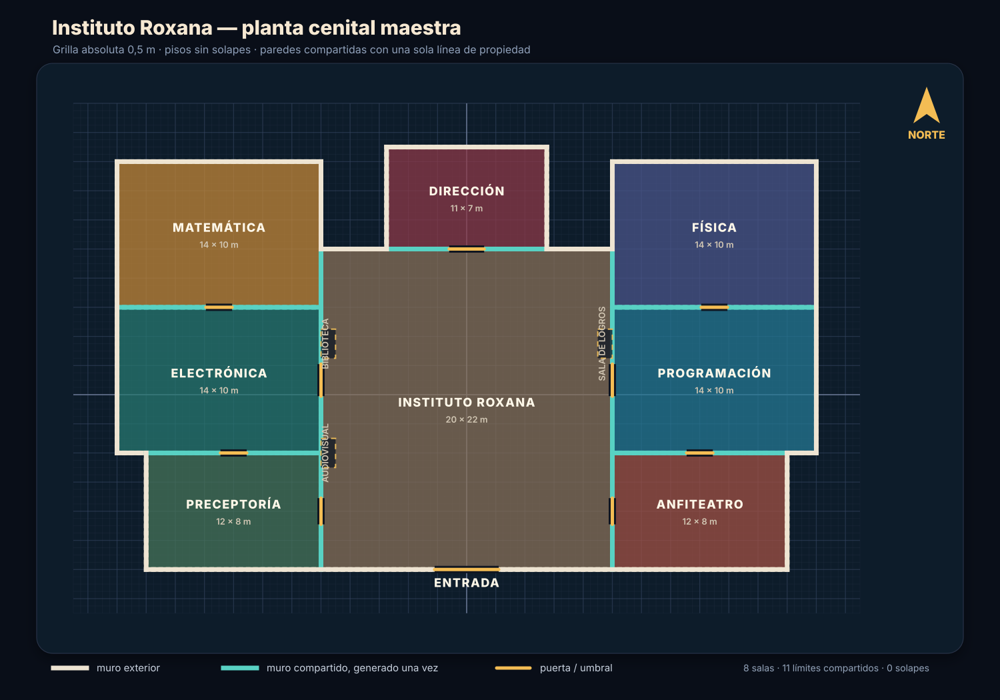

# Planta cenital maestra

Este plano reemplaza el montaje por superposición del primer prototipo.

## Sistema

- Grilla mundial absoluta de **0,5 m**.
- Cada sala principal es un rectángulo definido por límites `x0, y0, x1, y1`.
- Dos pisos pueden tocarse, pero nunca tener intersección con área positiva.
- Un límite compartido se deriva de ambos rectángulos y se genera una sola vez.
- La pared norte de la sala ubicada al sur es propietaria de las divisiones
  horizontales. La sala del norte no agrega un segundo zócalo sobre esa pared.
- Hall, alas y pabellones conservan raíces semánticas independientes para
  selección, progreso y cámara.

La fuente de verdad es `scripts/blender/school_plan.py`. El diagrama y el informe
de validación se regeneran con:

```powershell
python scripts/validate_school_plan.py
python scripts/generate_school_plan_diagram.py
```

## Base técnica

El método usa *absolute grid snapping*: todas las coordenadas se alinean a la
misma grilla mundial, no a incrementos relativos. Es la misma distinción que
documentan Blender, Unity y Unreal para construcción modular:

- https://docs.blender.org/manual/en/latest/editors/3dview/controls/snapping.html
- https://docs.unity3d.com/Manual/GridSnapping.html
- https://dev.epicgames.com/documentation/unreal-engine/actor-snapping-in-unreal-engine



