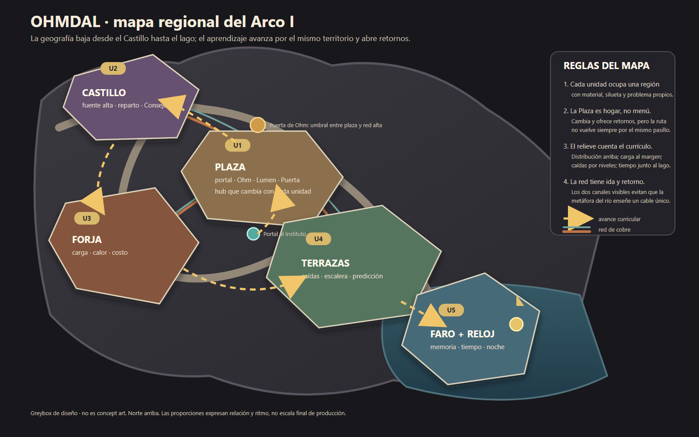
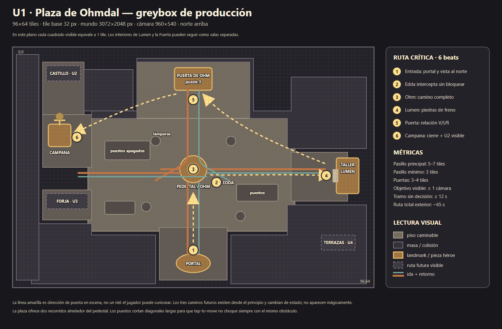

# Mapa de Ohmdal — fundamento espacial + greybox de producción

**Estado:** propuesta lista para probar, no canon implementado.  
**Escala:** Arco I completo + detalle de U1.  
**Objetivo:** separar diseño de nivel de producción de arte. El tileset viste decisiones ya tomadas; no decide recorridos, jerarquías ni ritmo.

## Los dos planos

[Mapa regional editable](../assets/greybox/ohmdal-regiones.svg)

[Greybox U1 editable](../assets/greybox/ohmdal-u1-plaza.svg)

El mapa regional fija la geografía de las cinco unidades. El greybox de U1 baja esa tesis a una grilla real de **96×64 tiles**, con tile base de **32 px**: mundo de 3072×2048 px para una cámara lógica de 960×540.

## Tesis del lugar

Ohmdal no es una colección de salas eléctricas. Es un reino construido alrededor de una red visible que dejó de entender.

- El **Castillo** ocupa la cota alta: distribuye y decide qué ramal recibe el río.
- La **Plaza** está debajo: es el primer lugar donde la red vuelve a tener efecto social —luz, trabajo, campana, gente.
- La **Forja** vive al margen del casco: es la carga grande, caliente y costosa que no conviene esconder detrás de una puerta cívica.
- Las **Terrazas** descienden por el valle: permiten caminar caídas, repartos y una escalera resistiva sin convertirlos en texto.
- El **Faro y el Reloj** están junto al lago: el recorrido deja de ser solo espacial y empieza a ser temporal. El cierre nocturno permite ver todo lo restaurado.

La progresión general desciende por el terreno, pero los canales de cobre se muestran **siempre de a pares**. La metáfora del río ayuda, pero un único cauce visible enseñaría una idea falsa: la corriente necesita ida y retorno.

## Topología jugable del Arco I

La plaza es un hogar que cambia, no una pantalla de selección. Cada unidad abre un trayecto que tiene al menos un retorno distinto del camino de entrada.

| Unidad | Entrada y promesa visual | Forma del recorrido | Retorno / recompensa espacial |
|---|---|---|---|
| U1 · Plaza | Desde el portal se ven pedestal, Puerta y campana | Lazo corto: centro → este → norte → oeste | La campana devuelve al jugador frente al camino del Castillo |
| U2 · Castillo | Siempre visible por encima de la Puerta | Ascenso y tres cámaras encadenadas | Balcón/ascensor de carga baja a la ruta de la Forja |
| U3 · Forja | Humo bajo y canales tibios desde la plaza | Herradura alrededor de la nave mayor | Canal de servicio abre un cruce hacia las Terrazas |
| U4 · Terrazas | El destino se ve abajo desde casi cada nivel | Descenso por escalones, con atajos que se abren detrás | El último escalón desemboca en el lago, sin volver a subir todo |
| U5 · Faro | Faro visible durante U4; ahora se alcanza | Espiral vertical: sala, reloj, linterna | Una barca/ferry devuelve a la plaza para el cierre nocturno |

Esto hace tres cosas: anticipa el próximo objetivo, evita volver cinco veces por el mismo pasillo y convierte cada resolución en una modificación física del mundo.

## U1 — recorrido minuto a minuto

### 1. Portal: orientación antes de texto

El jugador aparece en el atrio sur. La composición debe mostrar en una sola mirada:

- el pedestal apagado en el centro;
- la silueta de la Puerta al norte, todavía lejana;
- luz o movimiento humano a la derecha, donde está Edda y luego Lumen;
- la campana a la izquierda, visible pero todavía sin función.

No hay tres carteles ni tres flechas. Hay tres siluetas y una red de cobre en el suelo.

### 2. Edda: intercepción blanda

Edda queda apenas a la derecha de la ruta central. El jugador pasa cerca de ella, pero puede rodearla. La conversación explica el problema inmediato sin convertirla en molinete narrativo.

### 3. Ohm: el centro tiene una razón

El pedestal es también el nudo visual de los canales. El puzzle de camino completo ocurre exactamente donde el espacio ya mostró líneas cortadas. Al despertar Ohm, las líneas no se encienden todas: solo un pulso débil llega al Taller y a dos lámparas. El mundo responde con precisión al conocimiento adquirido.

### 4. Taller de Lumen: excursión lateral

Está al este porque es una desviación controlada, no el destino monumental. Los puestos forman dos rutas alrededor del pedestal y evitan una diagonal vacía de treinta tiles. El interior puede mantenerse como sala de cámara fija; solo su fachada y su umbral pertenecen al exterior continuo.

### 5. Puerta de Ohm: ascenso y evento mayor

Al salir del Taller, la Puerta vuelve a entrar en cuadro siguiendo el canal principal. La aproximación norte se estrecha de siete a cuatro tiles para aumentar tensión sin producir un cuello incómodo. La Puerta ocupa una pantalla propia o un patio de transición, según el costo técnico que se quiera asumir.

Al resolverla:

- el cobre se enciende desde el norte hacia la plaza;
- las lámparas cambian de estado por oleadas cortas;
- aparece gente en bordes antes vacíos;
- la ruta a la campana se vuelve la línea de mayor contraste.

### 6. Campana: cierre que ya encuadra U2

La campana está en una terraza oeste, junto al camino lacrado del Castillo. El cierre de U1 no termina mirando una UI: termina mirando el próximo territorio. Después del sonido, el sello del Castillo reacciona pero todavía no abre hasta el beat correspondiente de U2.

## Ritmo y métricas

- Cámara: 30×16,875 tiles lógicos (960×540 a 32 px).
- Exterior U1: 96×64 tiles, aproximadamente 3,2×3,8 cámaras.
- Camino principal: 5–7 tiles de ancho.
- Cuello mínimo: 3 tiles; nunca usarlo cerca de un NPC sólido.
- Puerta legible: 3–4 tiles de ancho.
- Interactable importante: aproximación libre de 3×3 tiles como mínimo.
- Tramo sin decisión, vista nueva o reacción: máximo aproximado de 12 segundos.
- Tiempo caminando de la ruta exterior completa: ~65 segundos, sin contar diálogos ni puzzles.
- Dos rutas alrededor del pedestal; ninguna decoración puede cerrar ambas.

Estas medidas contemplan al personaje de ~32×48 px, interacción a corta distancia y el tap-to-move actual sin pathfinding.

## Capas para construirlo en Tiled o Phaser

Orden recomendado:

1. `ground_base` — adoquín repetible.
2. `ground_variation` — desgaste, grietas, musgo; baja densidad y sin colisión.
3. `edges_and_steps` — bordes, veredas, desniveles.
4. `channels_off` — cobre apagado, siempre visible.
5. `channels_on` — overlay emisivo o claro, activado por flags.
6. `structures` — edificios, Puerta, campana, portal.
7. `props_below_player` — puestos, cajas, bancos, macetas.
8. `collision` — polígonos simples, jamás derivados automáticamente del dibujo.
9. `triggers` — puertas, diálogos, cambios de zona y vistas.
10. `props_above_player` — toldos, arcos, partes altas.
11. `lighting` — viñeta, luces y estados restaurados; no hornearlos en cada tile.

Los flags existentes (`ohmAwake`, `frenoDone`, `puertaDone`, restauraciones de unidades) deberían cambiar capas/props, no cargar cinco mapas casi idénticos.

## Lista de compra del tileset

### Estructura imprescindible

- 1 piso base de adoquín + 4 variantes discretas.
- Bordes rectos y esquinas para vereda elevada; conviene construirlos o corregirlos a mano, porque son la parte que peor resuelve una generación automática.
- Escalón norte/sur y dos terminaciones laterales.
- Muro/fachada modular en tramos de 1, 2 y 4 tiles.
- Arco de 3–4 tiles y puerta de taller.
- Sombra de contacto separada.

### Red de cobre

- Recta horizontal/vertical.
- Curvas de cuatro orientaciones.
- T de cuatro orientaciones, cruce y terminal.
- El mismo set para ida y retorno o, mejor, una pieza doble ya espaciada de forma constante.
- Estado apagado, tenue y activo como overlay; no tres pisos completos.

### Piezas héroe, no tiles genéricos

- Puerta de Ohm.
- Pedestal/antigua fuente técnica de Ohm.
- Campana y soporte.
- Portal al Instituto.
- Fachada y cartel sin texto del Taller de Lumen.

Estas piezas pueden venir de GPT como props grandes con transparencia. El piso, los bordes y los canales necesitan repetibilidad real; si se encuentran en internet con una licencia compatible, es mejor partir de una estructura probada y repintarla que pedirle a una IA una hoja autotile completa.

### Props secundarios

- Puesto apagado/activo, caja, banco, farol, barril cerámico, herramientas.
- Dos o tres macetas/vegetación seca y restaurada.
- Variantes de ciudadanos y toldos solo después de aprobar escala y navegación.

## Reglas de arte que protegen el gameplay

- Nada importante comparte silueta con un prop decorativo.
- El cobre es guía de navegación, no filigrana aleatoria.
- Los caminos futuros existen desde la primera visita y cambian de bloqueo; no aparecen de la nada.
- El estado apagado sigue siendo legible: menos saturación y luz, no pantalla negra.
- La restauración aumenta contraste cerca de rutas y objetivos, no ruido uniforme en toda la escena.
- Puerta, pedestal, Taller y campana deben reconocerse en miniatura al 25 %.
- La plaza necesita zonas de calma visual. Un tileset con detalle en todos los cuadrados destruye jerarquía.

## Cómo encaja con el greybox actual

No hace falta reescribir puzzles ni flags. La migración segura sería:

1. Conservar `plaza`, `taller` y `puerta` como IDs lógicos.
2. Convertir solo el exterior de `plaza` en mundo continuo con cámara.
3. Mantener Taller y Puerta como interiores/cámaras separadas durante el primer pase.
4. Mover coordenadas de puertas, `things` y spawns contra este plano.
5. Recién entonces reemplazar formas por capas de tiles y props.
6. Validar navegación con rectángulos antes de producir variantes restauradas.

El mapa regional no exige que todo Ohmdal sea una sola escena gigante. Exige que las transiciones respeten una geografía comprensible y que cada salida muestre de dónde viene y adónde lleva.

## Prueba de aceptación antes de buscar arte

El greybox está listo para vestirse si una persona que no leyó el guion puede:

- entrar y señalar cuál parece ser el problema central;
- encontrar a Ohm y luego el Taller sin marcador de misión;
- volver del Taller y reconocer la Puerta como próximo objetivo;
- llegar a la campana al ver encenderse la red;
- nombrar al menos dos regiones futuras solo por su silueta y posición;
- recorrer todo con teclado y tap-to-move sin quedar enganchada en puestos o NPCs.

Si una de esas pruebas falla, se mueve geometría. No se arregla agregando un cartel, una flecha o más brillo.
