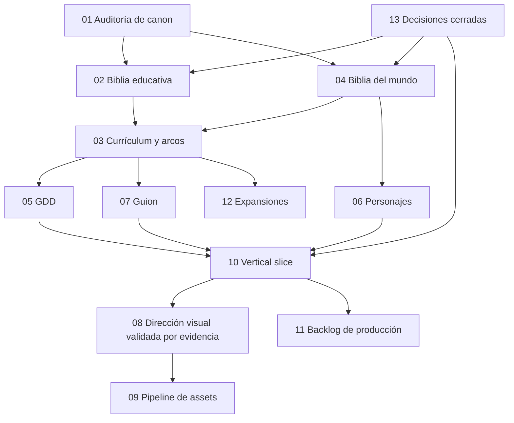

# Ohmdal — Índice maestro de redefinición

**Estado:** CANÓNICO — decisiones de dirección aprobadas
**Fecha:** 2026-08-01
**Autoridad:** fuente de verdad de Ohmdal; `docs/START_HERE.md` conserva la autoridad global
**Alcance:** dirección completa y contratos documentales. Sin código, assets ni migración de runtime.

## Norte fijado por el encargo

Ohmdal será un RPG narrativo educativo de exploración y diagnóstico. Su conflicto no es una fuerza maligna: el mundo perdió la comprensión técnica de manera gradual al abandonar la curiosidad, la educación, la documentación y la comunicación. El jugador no vence enemigos; observa fenómenos, formula hipótesis, mide, reconstruye circuitos y devuelve a las comunidades la capacidad de explicar lo que hacen.

La referencia permanente es **DRAGON QUEST III HD-2D REMAKE**: igual coherencia de composición,
luz, materiales, sprites, audio, respuesta y pulido en una escala menor. Ohmdal usa entornos 3D de
diorama, personajes pixel art, cámara controlada, iluminación, niebla, partículas, agua y
posprocesado. Es un quality bar, no una licencia para copiar personajes, mapas, música, interfaz,
composición ni assets de ninguna propiedad intelectual. La referencia oficial se registra desde
[Square Enix](https://dragonquest.square-enix-games.com/games/es-xl/dragon-quest-3-hd2d-remake/).

> «Ohmdal no fue conquistado por la oscuridad. Fue apagándose cuando sus habitantes dejaron de preguntarse por qué había luz.»

## Cómo leer este paquete

Etiquetas de autoridad:

- **CONFIRMADO:** decidido expresamente por el encargo y compatible con la base estable.
- **PRESERVAR:** material anterior valioso que la nueva biblia debe conservar o adaptar.
- **DECIDIDO:** aprobado durante la entrevista de dirección y obligatorio para documentos nuevos.
- **VALIDAR:** hipótesis que requiere evidencia técnica, educativa o visual; no una preferencia abierta.
- **HISTÓRICO:** evidencia o implementación útil, pero no autoridad para la nueva dirección.
- **OBSOLETO PARA FUTURO:** no se elimina; deja de prescribir la futura presentación de Ohmdal.

## Estructura documental definitiva

| Documento | Responsabilidad única | Estado |
|---|---|---|
| `00_MASTER_INDEX.md` | Autoridad, dependencias, orden de lectura y fases | Completo |
| `01_CANON_AUDIT.md` | Inventario, continuidad, contradicciones y riesgos | Completo |
| `02_EDUCATIONAL_CONTENT_BIBLE.md` | Doctrina, competencias, validación y ficha de contenidos | Completo |
| `03_CURRICULUM_AND_ARCS.md` | Trayectoria técnica, campaña base y expansiones | Completo |
| `04_WORLD_BIBLE.md` | Historia, reglas del mundo y geografía productiva | Completo |
| `05_GAME_DESIGN_DOCUMENT.md` | Loop, sistemas, progresión, UX y accesibilidad | Completo |
| `06_CHARACTER_BIBLE.md` | Función, arco, voz y requisitos por personaje | Completo |
| `07_NARRATIVE_AND_GAME_SCRIPT.md` | Arquitectura dramática y guion jugable | Completo como contrato autoral |
| `08_VISUAL_DIRECTION_BIBLE.md` | Gramática visual, cámara, materiales, luz y gates | Completo; hipótesis medibles señaladas |
| `09_AI_ASSET_PIPELINE.md` | Trazabilidad, rutas de producción, manifests y QA | Completo; generación no autorizada |
| `10_VERTICAL_SLICE.md` | Contrato Portal–Plaza–Ohm–Lumen–Puerta–Manantial | Completo; ejecución no autorizada |
| `11_PRODUCTION_BACKLOG.md` | Hitos, ownership, dependencias y criterios de cierre | Completo como backlog de autorización |
| `12_EXPANSIONS_AND_DLC.md` | Juego base, acceso y ampliaciones | Completo |
| `13_OPEN_QUESTIONS_AND_DECISIONS.md` | Decisiones cerradas y riesgos verificables | Completo |
| `14_GLOSSARY.md` | Vocabulario narrativo, pedagógico, eléctrico y productivo | Completo para preproducción |
| `15_DQ3_HD2D_RESEARCH_AND_APPLICATION.md` | Investigación primaria, principios aplicables y auditoría de pipeline | Completo |
| `16_ARC1_JIRA_BACKLOG.md` | Jira serie del Arco I, WIP 1 y Definition of Done | Preparado; ejecución no autorizada |

## Dependencias y orden de aprobación

La numeración expresa biblioteca, no orden de ejecución. La documentación está cerrada para
preproducción. El orden futuro es: validar fichas del slice; abrir contratos; ejecutar el spike
visual; emitir ADR; producir sólo después de un veredicto favorable.

## Separación entre juego, currículum y metáfora

La documentación mantendrá tres capas visibles:

1. **Modelo técnico:** lo que ocurre físicamente y puede medirse.
2. **Modelo pedagógico:** la secuencia con la que el estudiante lo descubre.
3. **Metáfora diegética:** cómo Ohmdal lo recuerda y lo comunica.

Una metáfora puede simplificar la entrada, pero nunca contradecir el modelo técnico ni reemplazarlo. La Bitácora conecta las tres capas y conserva evidencia, hipótesis, medición, explicación y transferencia.

## Fases documentales

### Fase 1 — completada

Autoridad, conflicto, alcance educativo/comercial, territorio y slice quedaron decididos.

### Fase 2 — completada con condición

Instanciar fichas V0–V2 del slice y contratos de producción desde esta Biblia. Los agentes validan de forma autónoma
fuentes, cálculos y tests; escalan contradicciones, seguridad o incertidumbre real.

La ejecución partió de `12d6f88d2a366da89ed91008013f42ba6295e42d` y cerró con veredicto
`avanzar`: cámara casi ortográfica, estudiante de cuatro direcciones y Ohm sprite. Android físico
medio 2022 permanece `not-run`, por lo que el cierre es condicional. No se extiende a H3.

### Fase 3 — preproducción del slice completo, bloqueada por gate humano y autorización

El desglose ejecutable vive en `16_ARC1_JIRA_BACKLOG.md`. `ARC1-001` espera aprobación visual
humana de la corrección de cámara y todas las tareas posteriores permanecen bloqueadas. Cada puzzle
declara fenómeno, hipótesis, medición, consecuencia y transferencia. El desglose no reabre
decisiones de producto ni autoriza producción.

### Fase 4 — prueba visual y técnica

Construir un laboratorio aislado, sin alterar `/jugar`, y comparar la gramática recomendada con el prototipo Phaser existente. La aprobación exige capturas desktop/mobile, cámara real, métricas y revisión de accesibilidad.

### Fase 5 — producción

Sólo después del veredicto del slice: backlog productivo calendarizable, manifests, assets,
estimaciones, ramas y ownership. El documento 11 conserva únicamente la secuencia de autorización.
No se autoriza Meshy ni producción masiva desde este paquete.

## Gate para abrir ejecución

Las decisiones de producto están cerradas. Abrir ejecución exige `brief.md`, `visual-contract.md`,
`tasks.json` con `executionAuthorized: true`, `baseCommit`, ownership exclusivo, presupuesto y
criterios de cierre. Para Arco I rige WIP global uno: ningún sucesor comienza hasta que el anterior
esté `DONE`. La base estable conserva prioridad hasta el ADR de migración.
